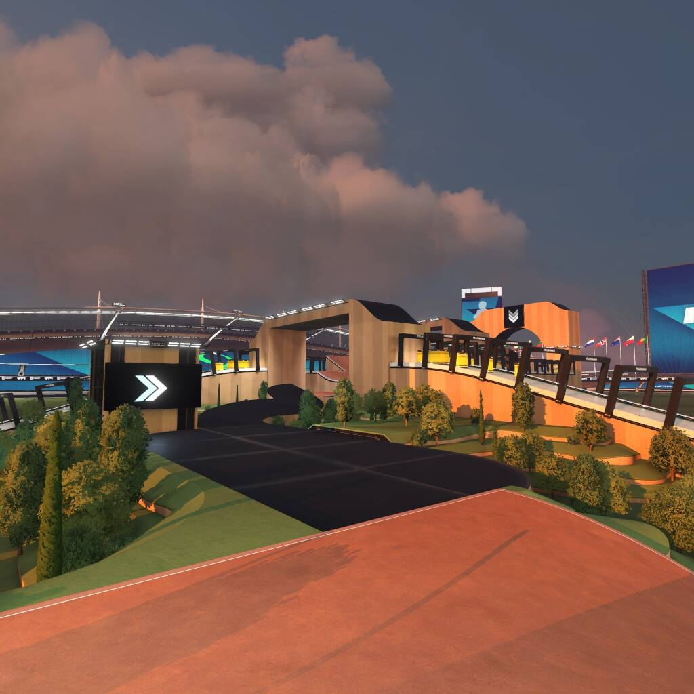
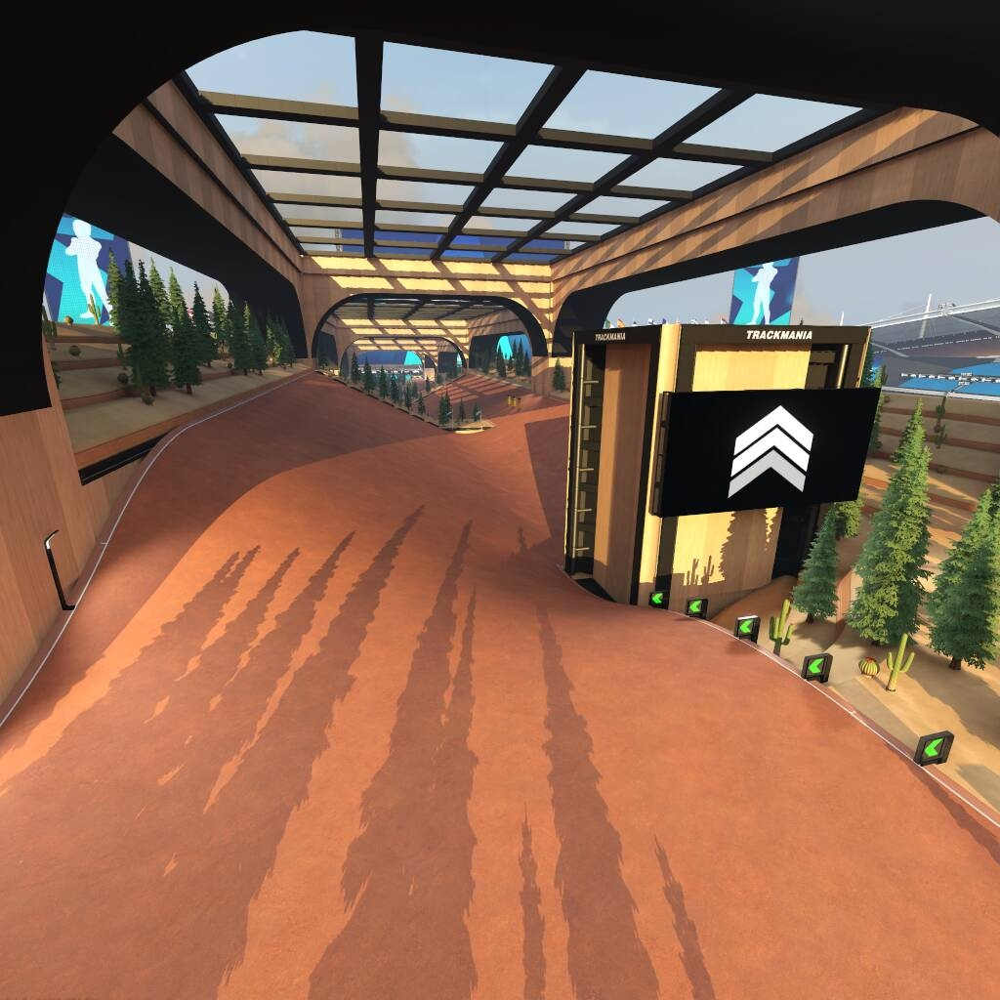

"10 Second Dirt" is a campaign I created for the game Trackmania 2020 featuring 25 different dirt maps with author times below 10 seconds. You can play it by searching for "10 second dirt" in the in-game library.

I figured by focusing on short maps, I'd be more likely to get a full campaign of maps before moving on to the next thing that took my interest. Despite each map having a short length, it still took a couple of months to get the full set completed. Designing the driving route takes a lot of iteration, and then adding interesting scenery is just a grind which can consume as many hours as you want to put into it.

There are of course plenty of maps based on the common feature of dirt maps: smooth turns where you need to take a wide line and hug the edge of the curve. In addition I tried to include other types of dirt "blocks" to add variety and give some creative interest.

There are a few things I'd love to go back and fix now that it's complete:

- On one map players found a faster route than what I thought was possible.
- For some maps I'm not happy that the route is clear enough, or that the route needs to be driven quite precisely. Both of these can be a bit annoying for players when learning the map.
- Thee are a few small things I forgot to update before uploading, like some medal times and map thumbnails.

Now that players have set times, I can't alter the maps without impacting the leaderboards, so unfortunately these bugs will be there forever. Its useful to have this experience now though, and perhaps if I make something like this again I'll use a checklist to make sure I don't miss anything.

The rewarding part of making maps like this is seeing other people play them. As it stands I'm 3rd on the leaderboard for the campaign, there are some strong players that have set times I don't think I can beat.

This shows all the author times, which are the times I set on the map for other players to beat:

https://www.youtube.com/watch?v=Em9Tvm51j74
