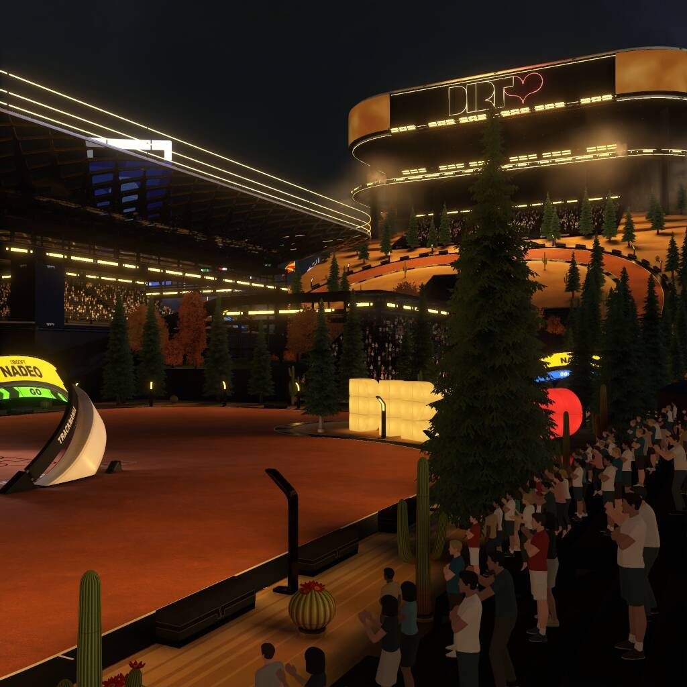

After finishing my earlier [10 second dirt](./10-second-dirt.html) project I was still in the mood to make some trackmania maps. For the next set of maps, I decided to push the boat out and increase the length of the tracks from 10 measly seconds to a face-melting _15 seconds_.

As mentioned in the last post, there were also some parts of the 10 second maps I thought I could improve on. To raise the quality bar a little higher this time, the first thing I did was make a checklist of all the small things I should do before considering each map finished. This included things like:

- Striking a better balance for the routes, with a good level of challenge without relying on frustrating or fiddly tricks to get right.
- Making sure the routes for the maps were as readable as possible, with no blind jumps and clearly signposted turns.
- Creating a short intro video for each map, with some simple camera pans and fades showing off the layout before you began driving it.
- Various small tick-box exercises, like generating high quality shadow maps and remembering to manually adjust the medal times for each map.

In addition to this checklist, I also spent some time up-front prototyping some different colour schemes, scenery styles and block combinations.

This didn't take long to do, but I think it was hugely valuable. Each map still has a distinct style and some unique flourishes, but now there is a consistent theme across the whole campaign that ties it together. It also made completing the scenery a quicker exercise, because I had some common elements I could use to fill any gaps between scenery elements on the maps.

To top off the aesthetic I created some simple SVG art to use as textures for the Trackmania "club", which ties in nicely with some of the scenery elements.

I think I'm much better now at the short dirt style of maps now that I've made 50 of them. I think the curves and racing lines are challenging, and I've managed to get some fairly smooth transitions between track sections.

One thing about these maps that I have found, is that even the bronze times I have set can be quite tricky for players not so fluent with dirt driving concepts like managing gears or maintaining full grip of the tires. On reflection I think I'm okay with this - I think in all likelyhood any players who seek out this map pack and spend time hunting it are probably fans of the dirt surface and happy with a bit of a challenge on such short maps.

The most rewarding part of creating these maps is thinking that people are having fun driving them. A couple of players were nice enough to leave reviews on the maps on [trackmania.exchange](https://trackmania.exchange/mappack/view/3064/15-second-dirt), giving me my first awards on the site.

If you want to get a feel for the maps, the video is a compilation of all my author time ghosts. To play for yourself, search for "15 second dirt" in the Trackmania campaign library.

https://www.youtube.com/watch?v=KDPnzowRnqo
