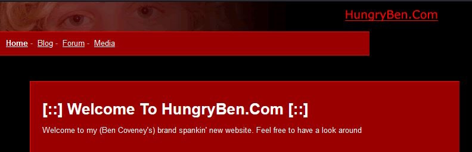
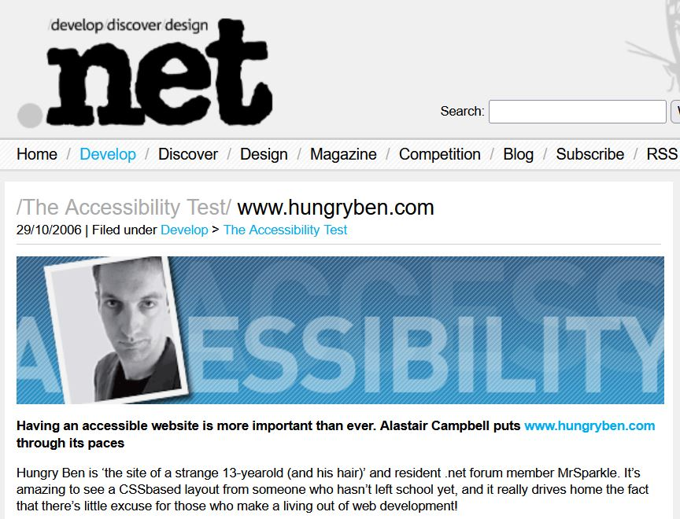

As you might guess from the site header, my name is Ben. Writing about yourself is difficult, so don't expect to find too much on this page, but take a look around the site if you want to see what kind of things I'm interested in.

## Websites

I learnt programming by messing around on the web. I still love making websites. I love how tactile it feels compared to other types of programming, how you can get quick visual results, and how the only thing you need to be able to share your creation is a link pointing to the hosting.

### Piczo

My first exposure to coding was Piczo - a social network of sorts - where you could build your own web pages using a handful of prebuilt components. If (like me) you wanted to end up with the coolest webpage out of everyone at school though, then there was a special component that you could use that would allow you to embed arbitrary JavaScript and HTML into the pages. I scoured online JavaScript resources, copy-and-pasting any cool script I could find, amassing a finely curated collection of obnoxious animated clocks, hit counters and other garbage to decorate each page with.

At some point I figured out how to cobble together some rudimentary scripts of my own. I didn't understand any of the syntax, I just figured out which lines I could safely duplicate, and which bits of the script I could safely change without breaking anything (mainly the strings). My pièce de résistance from this era was a piczo component that called the JavaScript `alert()` function 300 times in a row. At the time Internet Explorer's implementation of this alert would trap the user on the page, forcing them to click "OK" on 300 modal windows in a row before they could leave - an excellent trick to play on friends at school.

### HungryBen

Eventually the buzz at school around Piczo died out, but for me it was too late, and the thought of building websites had become deeply lodged in my brain. At some point I managed to get copies of HTML in Easy Steps and JavaScript in Easy Steps, and these gave me the tools to build my first website: HungryBen.com. It was ugly, and it was empty, but it was entirely my own creation.

 and JavaScript in Easy Steps (2nd edition). It is hard to find higher quality pictures of the covers at this point.")

### .Net Magazine

I would regularly try to get my hands on [".Net" magazine](<https://en.wikipedia.org/wiki/Net_(magazine)>), and eventually joined their online forum. Despite being completely oblivious about almost every topic, I somehow managed to amass thousands of posts in their forums under the username [MrSparkle](https://www.youtube.com/watch?v=ObnAgGjVDrc). Eventually, perhaps due to lack of submissions, the magazine decided to feature my hobby website in one of their regular "UX review" columns. You can read the full thing [here](https://web.archive.org/web/20061118185707/http://www.netmag.co.uk/zine/the-accessibility-test/www-hungryben-com).

### Domain Names

One of the habits of people interested in web design is to perpetually redesign (but only half-finish) your website. After many iterations I eventually abandoned hungryben.com and moved to potatochild.com - both domains are long gone at this point. Finally I just did the sensible thing and now here we are, on the timeless FirstNameLastName.com format of domain name.

This site itself has gone through a few iterations, but what I've settled on for the moment is a big pile of build-time JavaScript which takes markdown files as input, and outputs static HTML with some minimal CSS ready for hosting on GitHub pages. It's probably not the flashiest thing I could make, but it's not too ugly (I hope), and it takes the minimum effort to maintain while still letting me easily scrawl out content whenever I get the urge.

## Work Experience

This website isn't really intended to be an advertisment for a job. On the off-chance you want to hire me, here's some standard bits about my work experience, and you can find my most recent CV linked at the bottom of the page.

### Trainline

#### Senior Web Engineer _(April 2022 - Present)_

I'm currently working at Trainline as Senior Web Engineer.

### YouView TV Ltd

#### Lead Software Engineer, UI Architect _(October 2020 - April 2022)_

Technical Ownership of Android TV custom launcher project spanning multiple clusters, for one of our biggest customers.

- Interfaced with stakeholders and partners from other orgs.
- Facilitated defect prioritisation and triage.
- Achieved weekly release process, delivering frequent updates.
- Estimation of software delivery timelines and effort.
- Produced technical plans and documentation in collaboration with architecture team.
- Assisted coordination across teams as the number of contributors increased.

Facilitated fortnightly workshops for knowledge sharing within our teams.

Frequent involvement in interviewing, including creation of technical exercises.

One-off prototypes and proof-of-concepts with emerging technologies.

Day to day responsibilities including:

- Mentoring team members, through pairing and 1-1s.
- Helping facilitate SCRUM process.
- Development and testing (TypeScript, React, Kotlin).

#### Senior Software Engineer _(October 2019 - October 2020)_

Development effort on YouView’s first Android TV offering in partnership with a major TV manufacturer. Later took on technical ownership and saw completion and delivery.

Assisted team upskilling in AWS and cloud monitoring, including through outreach to SMEs within YouView.

Personal initiatives to rebuild our webpack and homegrown DI system, creating a more flexible build pipeline and faster builds for all developers.

#### Full-stack Developer _(September 2018 - October 2019)_

Delivery of features and bugfixes within YouView’s Web UI (TypeScript, React) within an agile process.

### Lighthouse Systems Ltd

Lighthouse software builds manufacturing execution software for factories, to track inventory, quality and more. This was an on-prem solution with a web UI accessible from operator terminals.

Throughout my time there I delivered features and bugfixes as part of an agile workflow using:

- C#, ASP.NET, WebAPI.
- Multiple databases (SQL Server, Oracle).
- Unit testing supported by Moq.
- Full system testing with Telerik Test Studio.
- Messaging using MSMQ
- Logging through Windows Event Log
- Dependency injection using Unity.
- Visual Studio, MSBuild, TFS.
- TypeScript, Bootstrap, JQuery.

#### Lead Developer _(April 2018 - September 2018)_

Created design for new dashboarding system, to increase flexibility of dashboard creation and reduce time/effort during system upgrades.

Adopted scrum master role and completed scrum training to enable agile delivery.

Participated in estimation and prioritisation of work.

#### Software Developer _(May 2014 - April 2018)_

Development effort migrating an aging .Net application to WebAPI and modern web technologies.

### The University of Hull, BSc Computer Science _(2011 - 2014)_

I achieved a 1st class (hons) degree in Computer science. I completed a final project using genetic algorithms to create finite-state machine based game AI.

### Ivybridge Community College

A Levels in Maths, Physics and Applied ICT, AS Level in Further Maths.
