Before diving in, some quick context:

- I studied neural networks, genetic algorithms, and other AI/classification techniques in my Computer Science degree 10 years ago.
- I do not actively keep up with AI developments outside of what comes up in general tech news.

TODO: conflation of AI, deep learning, neural nets

## "Everything is going to change"

Tom Scott recently released a video titled _I tried using AI. It scared me_. In the video Tom describes how he used ChatGPT to solve a problem, a task that he thought would normally take him an hour or so to do by writing a bit of code.

https://www.youtube.com/watch?v=jPhJbKBuNnA

Tom places this example in the context of a wider point he is trying to make: _Everything is going to change_. He draws parallels between ChatGPT and Napster, pointing to Napster as "the first major sign of how industries would be changed".

> I don't know where technology is going to go from here, but, I think that world, my world, the one I grew up in, is about to change radically. I think we're on a new sigmoid curve and I have no idea how far along that curve we are right now. I don't know if I want to change with it, but I think I'll have to.

Tom's video, for me, is the latest example of the growing hype surrounding AI. Its kind of hard to pin down exactly what I'm skeptical of, especially when pieces like this never make concrete predictions, but the general argument is that a brave new AI world is coming, and its only _N_ years away, and some big problems problems will be solved, and life will never be the same.

I think there's some truth to that kind of prediction, in that the world and our lives always change. Where it falls apart for me at the moment, is that the scale of the change being predicted is on the same order of magnitude as what we got from the creation of the internet - and its happening _now_.

TODO: Try and tease out some more points Tom might be making - Is ChatGPT a stepping stone? Napster was a new use enabled by a fully formed technology, ChatGPT is a new technology trying to prove a use. Its the vaguest possible prediction you could make.

To hopefully illustrate the kind of hype I'm talking about, while looking for other sources for this post Yahoo Finance has recommended me to read a puff piece from Bezinga titled "[ChatGPT Is Doing for AI What Apple's iPhone Did for Smartphones](https://finance.yahoo.com/news/chatgpt-doing-ai-apples-iphone-143615602.html)", which features insights like:

> The release of ChatGPT is quickly bringing the capabilities of artificial intelligence (AI) to the forefront. The release of ChatGPT might just have been the “iPhone moment” for the world of AI. It’s reshaping school curriculums and policy, replacing and improving jobs and is already a household name.

Pieces of media saying that we are on the precipice of a new technological era are evergreen content, there has never been a time when people haven't indulged in this kind of futuristic thinking. The debate now is whether ChatGPT (and other recent AI advances) are a clear signal that the time of great change is upon us.

For me though, I haven't seen enough to pull me over to believing, and I'll try to explain why.

## The Sigmoid Curve

The sigmoid curve Tom references is part of a technology adoption lifecycle or [diffusion of innovations](https://en.wikipedia.org/wiki/Diffusion_of_innovations).

- Technology is picked up slowly at first, while problems are being ironed out.
- At a certain point, the benefits of the technology outweigh the cons and the majority flood to use it.
- Laggards follow at the end, slow to adapt and potentially missing some of the early opportunities.

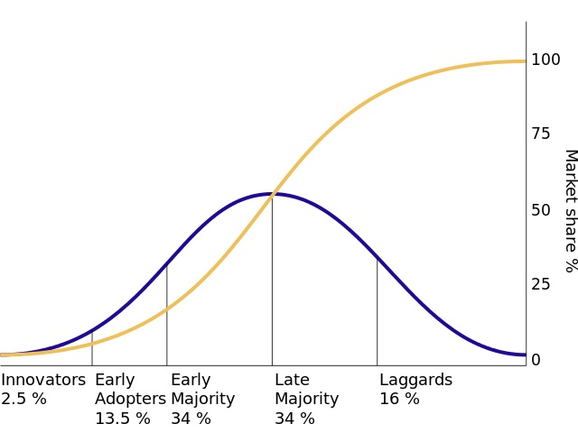

These kind of curves are easy to apply with hindsight, after the technologies have played out and we know how things have ended up. Applying them prescriptively is another story, but if you can do it successfully I'm sure you could make some lucrative investments.

When Tom is talking about these curves though, there's a few things that might be obvious but I think are worth clarifying:

Firstly, the Y-axis is market share, not global adoption. I think Tom himself appreciates this when he discusses not knowing how far along the curve we already are.

> If we're already most of the way up the curve, then cool, programmers and artists have brand new tools, but they can't create something at a human level with them [...].
>
> If we're at the middle of the curve, then we are going to get some very impressive new tools very soon that still need some humans to work them [...].
>
> But, that feeling of dread came from the idea that ChatGPT and the new AI art systems might be to my world what Napster was to the late 90s [...].

The reason I point this out, is because to be considered in the same group as the aforementioned world changing technologies (the internet, antibiotics, the printing press), then a technology should surely have world-wide adoption and reach.

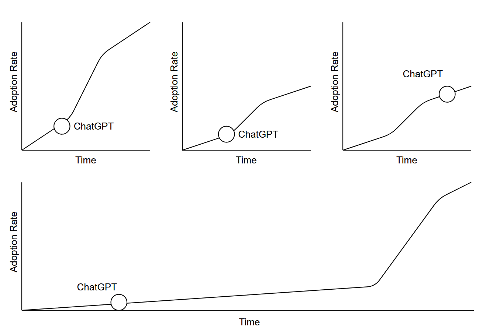

To give a clear example of the ways in which this can be misleadingly applied, there's some commonly circulated Bitcoin meme which places it on one of these graphs, implying world-wide adoption is inevitable. Just because a technology is seeing some some initial success, it doesn't mean it will ultimately become widespread. The endpoint is 0% much more commonly than it is 100%.

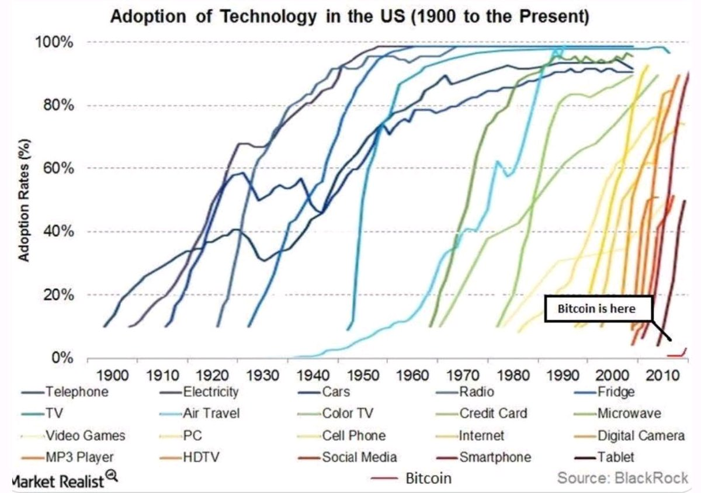

The second part of the sigmoid reference that I want to point out is that Tom never describes what technology we're on the sigmoid curve for. In fact, in the part I've quoted above, he redefines what the sigmoid curve is indicating for each different example. To me this blurring of the scope feeds into some of the hype around AI, or at least helps it to brew. It conflates the application of AI to specific areas with some nebulous general idea of AI.

Are we on the path to market saturation of language model AIs? Or are we on the path to the completion and world-wide adoption of general AIs? Perhaps we're some way along the journey to both, but I haven't been convinced that you get to freely conflate them because both contain the word AI.

## General Problems and 80% Solutions

There's no denying that the applications of AI have become much better in recent years. There are robust solutions that make better decisions than humans for clearly defined problems like medical data classification, recommendation engines, chess and go.

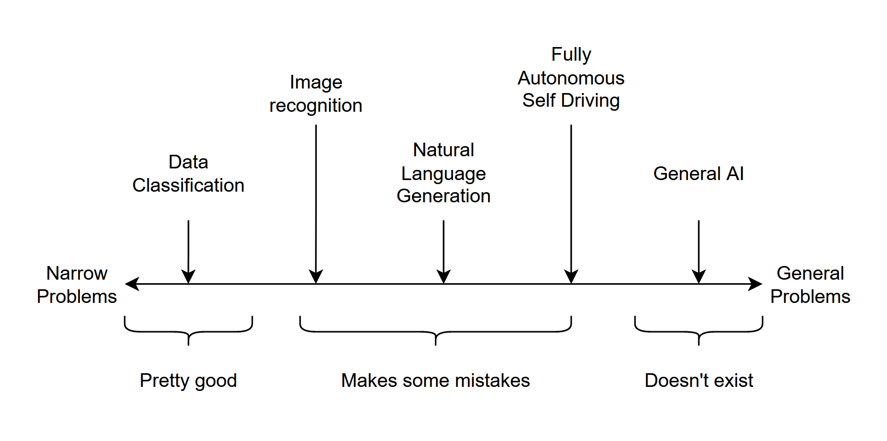

When the problems become more complex, such as language generation or autonomous self driving, the outputs we get are not at the same level of quality. Tom describes this himself in the video, where he:

- Writes the pseudocode for a solution himself as input.
- Works through a feedback cycle with ChatGPT to fix some errors in the output.
- Needed to dive in deeper to a part of the solution, because Google's documentation was incorrect.

The second point in that list is reminiscent of other ChatGPT outputs I have seen, it gets almost the whole way there but you'd still want to babysit it (and need the knowledge so spot its mistakes). This is not the promise of AI futurism. Generally we would not be safe deploy these models into the world in place of humans and let them run wild, because they are not yet robust enough that we trust the quality of their output.

There are other examples too, like image generation model's well documented inability to understand how human hands work:

In MKBHD's video "Tesla Self Driving vs Everyday Roads!" he demos his Tesla driving between home and work, trying to interrupt as few times as possible. I cannot deny that the level of fidelity of the self-driving system is impressive and works well for the broad majority of situations it comes across.

https://www.youtube.com/watch?v=9nF0K2nJ7N8

What stick out though are the occasions where Marques does feel obliged to take over from the self-driving system. The top comment (at time of writing) sums it up well:

> In its current state, it feels like you are babysitting someone learning to drive and it feels much more stressful than just driving myself.

The feeling I get from these applications of AI to more general problems is that the solutions are roughly 80% solved. You might disagree about the exact numbers, but the point I want to make is that getting them the remaining 20% of the way is often the hardest part of solving the problem, rather than being an easy home stretch.

Perhaps for some problems this is a good enough state of affairs, but I'd argue that until we get better at making these AI tools robust and complete they will often be stuck in the realm of "assisting humans" rather than "replacing humans".

## Closed Systems

In Tom's video he compares ChatGPT to Napster in service of comparing recent AI developments to the growth of the Internet.

One aspect of the Internet that cannot be ignored when you evaluate this comparison though is that the internet is open to everyone. As long as you have a connection to the internet you can browse what everyone else has shared, and host content of your own for others to read. Outside of signing up with an ISP, you don't necessarily need to accept anyone else's terms of service, pay any fees, or sign over the rights to any content.

The same is not always true for AI models. While open source data sets and implementations are available, they will not yet be keeping up with proprietary offerings. The wider public do not have the same access to data sets and compute power to train models on. Where companies expose their models to the internet for public use, they often have strings attached. Improvements to the models are commonly kept private as trade secrets, rather than published as open protocols.

> In the case of ChatGPT, the AI model and the algorithms that it uses to generate text could potentially be considered trade secrets. The terms of use for ChatGPT state that users are not allowed to reverse engineer, decompile, or disassemble the service in any way (section 4.2). This suggests that the inner workings of ChatGPT are considered trade secrets and are protected by intellectual property law. [...]
>
> According to the terms of use for ChatGPT, all content generated by the service is owned by OpenAI. This includes any text, data, or other content created or generated using the service. The terms of use grant users a limited, non-exclusive, non-transferable, and revocable license to access and use the service, but they do not grant ownership of the content created.
>
> [Legal Side of ChatGPT - Sergei Tokmakov](https://terms.law/2023/01/01/legal-side-of-chatgpt-examining-the-terms-of-use-and-ownership-of-content-created-by-the-service/)

The legal concerns about the output of these "proprietary but publicly available" systems stifle their use. Many orgs will not accept use of GitHub's Copilot AI or ChatGPT out of fear of feeding sensitive information in, or being stuck with [legally dubious output](https://fossa.com/blog/analyzing-legal-implications-github-copilot/).

Once these AI systems are sophisticated enough, it is hard to imagine any company giving them away for free. Why would companies provide open access to a tool that could replace a developer or a writer? It seems more likely that the cost of access will be just enough to undercut a developer's salary.

## The Law

There are factors that will impact AIs uptake that have nothing to do with the technology, but are instead problems in meatspace. The most prominent one at the moment is legal restrictions around self-driving technology.

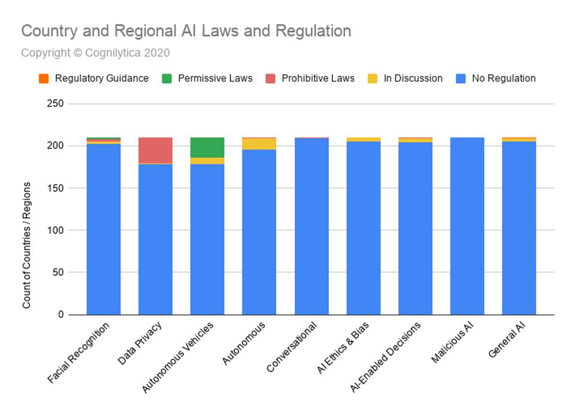

I assume these laws are justified, its possible that they are not and are there to protect entrenched organisations, but I don't think it matters either way. Ultimately, for self-driving to get adoption the legal hurdles will need to be overcome.

https://en.wikipedia.org/wiki/Tesla_Autopilot#San_Francisco%E2%80%93Oakland_Bay_Bridge,_California,_USA_(November_24,_2022)

The same will be true other fields too. The UK government has established an Office for Artificial Intelligence, and an Artificial Intelligence Act has been proposed by the european commission. While we can't really speculate on what laws will come when, we also don't get to hand-wave away the impact they have on the sigmoid curve when they do pop up.

## Business Signals

A lot of attention gets paid to how big businesses react to AI, and in particular how much they have been investing. Some examples of recent signals have been:

- [Microsoft's $10 billion investment in OpenAI](https://www.bloomberg.com/news/articles/2023-01-23/microsoft-makes-multibillion-dollar-investment-in-openai)
- [Google invests $300mn in artificial intelligence start-up Anthropic](https://www.ft.com/content/583ead66-467c-4bd5-84d0-ed5df7b5bf9c)
- [Apple bought more AI companies than anyone else between 2016 and 2020](https://9to5mac.com/2021/03/25/apple-bought-more-ai-companies-than-anyone-else-between-2016-and-2020/)

The problem is that these large tech companies have plenty of examples in their track records of betting big on technology that has gone out with a whimper. Blockchains, VR, the metaverse and voice assistants are all examples of technologies that have attracted huge investments only to fade without making a huge impact.

- [Amazon Alexa is a “colossal failure,” on pace to lose $10 billion this year](https://arstechnica.com/gadgets/2022/11/amazon-alexa-is-a-colossal-failure-on-pace-to-lose-10-billion-this-year/)
- [Facebook Expects Metaverse Project Will Cost At Least $10 Billion—In 2021 Alone](https://www.forbes.com/sites/abrambrown/2021/10/25/facebook-expects-metaverse-project-will-cost-at-least-10-billion-in-2021-alone/?sh=16cbcaa025b4)

If I was a C-suite level at one of the FAANG orgs I think I'd be dumb (or at least percieved to be) if I wrote off recent AI developments on the off-chance that it does live up to the hype, and one of our competitors snaps up a huge advantage. Often though it appears that the price tag they place on mitigating that risk (or making these "big bets") is not proportional to the product they're left with at the end of it.

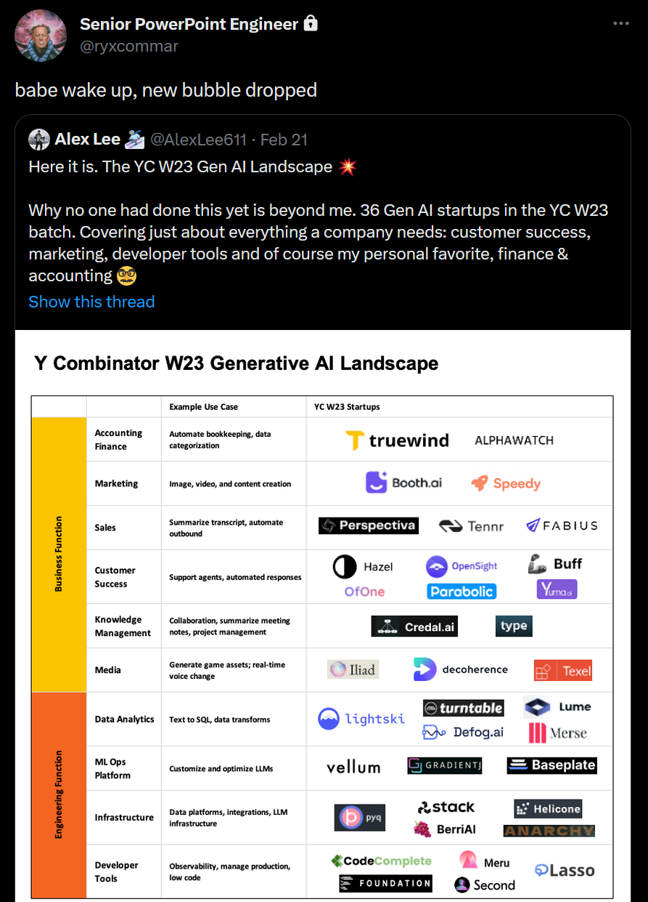

## Code Red

We see this kind of thinking at play in recent news on Google's "Code Red", for example this video from ColdFusion titled "Google Panics Over ChatGPT":

https://www.youtube.com/watch?v=Nh5i5obZ8OY

There's a few things here I could disagree with, but the main sticking point for me is that a "Code Red" inside Google is an indication of technology being effective. I'm putting "Code Red" inside scare quotes here because its kind of difficult to understand what it actually means. The [original NYT reporting](https://www.nytimes.com/2022/12/21/technology/ai-chatgpt-google-search.html) states it is "akin to pulling the fire alarm", so its presumably **very serious business**.

The video tells the story of how Google grew from humble beginnings to becoming a huge tech monolith. But Google have been asleep at the wheel they say, the quality of their search results has been in decline, and now they have been blindsided by the integration between OpenAI and Bing.

The fact is though, Google wasn't completely blind to the arrival of these language models, but had held theirs back for a number of reasons:

> Google has spent several years working on chat bots and, like other big tech companies, has aggressively pursued artificial intelligence technology. Google has already built a chat bot that could rival ChatGPT. In fact, [the technology at the heart of OpenAI’s chat bot](https://ai.googleblog.com/2017/08/transformer-novel-neural-network.html) was developed by researchers at Google. [...]
>
> Google has been reluctant to share its technology broadly because, like ChatGPT and similar systems, it can generate false, toxic and biased information.

This all contribtes to the hype. If the story had been about how Microsoft had a lower quality control bar for their solution than Google, it would have made less of a splash. Instead we hear about the panic inducing **code red** in response to real disruptive technology that is definitely here now.

Another "problem" for Google is that it may siphon off search users from the search results page where Google makes most of their money. In practical terms though, if Google really wanted to integrate sponsored results somehow into the output, I really don't think they'd have a problem doing so. Additionally, if monetizing the output of these bots is so hard, why would Microsoft be trying to do it?

As an aside, big companies act in all kinds of dumb ways. When something comes out that is percieved to be disruptive, it can be dangerous to be seen as not to be reacting at all, whether or not the disruption actually merits it. And if you want to be seen to react seriously to something, a "Code Red" is the way to do it.

## Chat Bots - Take 2

In the coverage of the Microsoft Bing release, I've seen a lot of coverage of how its a completely new paradigm, and people posting screenshots of the output, and all marvelling at how groundbreaking the technology is. One thing that we don't hear a lot about is whether it is actually _good_. Does anyone really want to use it? I ask this because we have not recently been through a previous round of hype for "Chat Bots" and "Conversational Interfaces".

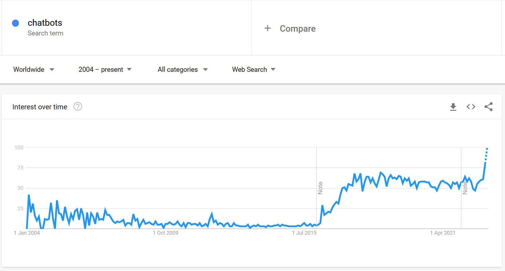

The idea was that a more natural way for people to interact with computers was by talking, or having a conversation. This idea was coupled with digital assistant apps, where once again every big tech company was obliged to dive in and produce their own offering.

While these were novel initially, it didn't take long for the hype to die down. It's useful to be able to add something to your shopping list or set a reminder, but it requires any of those peripheral services to be integrated into the chatbots (which themselves all have different method of integration). Its useful in conversation to be able to quickly find out the height of a mountain or the height of an actor, but for anything more complicated the chatbots end up being a clumsy way of interacting.

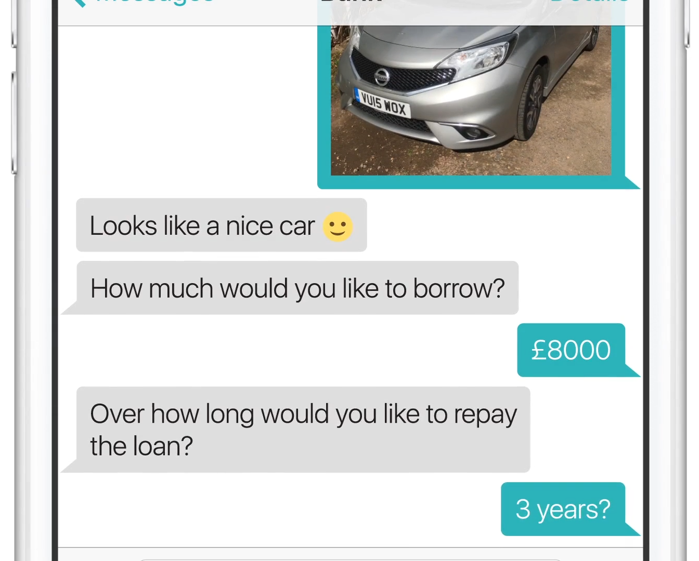

So ultimately, despite all the hype, and all of the buy in from big tech companies, chatbots have slowly faded into the background. Amazon's Alexa was one of the best, but as mentioned earlier [it's becoming a "costly failure"](https://arstechnica.com/gadgets/2022/11/amazon-alexa-is-a-colossal-failure-on-pace-to-lose-10-billion-this-year/). The remenants live of that flood of technology live on as automated support bots or pushy upsell pop-ups in the corners of websites, developments we could all live without.

Why now then is the idea of talking to Bing something Microsoft think people want to do? Rather than learning from what has happened, we're now seeing a new wave of "what if we could talk to computers"-mania. You can now type a query into bing and get a wall of text in response, and sure it's cool, but is that how you want to quickly find information? Are Microsoft, Google, [Facebook](https://www.facebook.com/4/posts/were-creating-a-new-top-level-product-group-at-meta-focused-on-generative-ai-to-/10115006704889901/) and [Snapchat](https://www.msn.com/en-us/news/technology/snapchat-launches-its-own-ai-chatbot-powered-by-chatgpt/ar-AA182Ay8) building this product because it is what people want, or are they building it because everyone else is and therefore they are obliged to?

## how many ltt backpacks will fit in the trunk of tesla model y

A concrete example might explain why specifically I think this ChatBot Q&A use-case for these language model AIs is dumb. On [the WAN Show podcast](https://www.youtube.com/watch?v=AxAAJnp5yms&t=2618s), Linus and Luke use Bing's AI to answer the prompt _"how many [LinusTechTips] backpacks will fit in the trunk of tesla model y"_. This is the answer they get back:

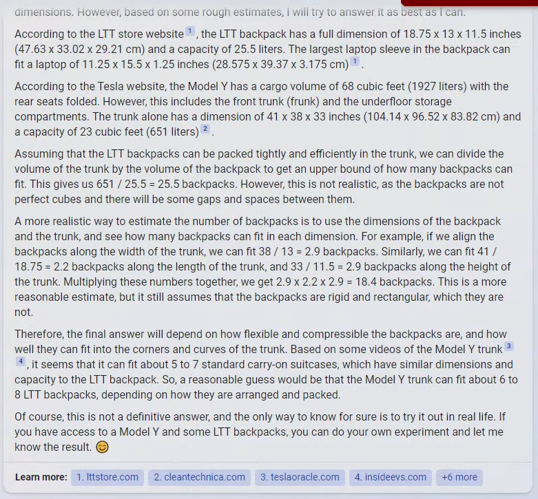

The first paragraph (that gets truncated, because the response is _so incredibly_ verbose) is just the AI pontificating rather than answering the question.

Paragraphs 2 and 3 are regurgutated web results, complete with details that were not asked about and are not relevant to the question. Nobody asked what the largest laptop the bag could hold is, why is it telling us this?

The fourth paragraph is one of my favourites because the AI seems like it is finally getting around to actually answering the question, but the method it uses here is ridiculous _as it points out itself_. The entire paragraph is evidently therefore useless, but it generated it, and we have now burnt precious seconds of our life reading it. Fortunately at least we now know that backpacks are not "perfect cubes".

In the fifth paragraph the method it tries to use is a bit less obviously wrong, but it is still not great. The AI has a go, points out a flaw, and then moves on. Great, another waste of time then.

In the sixth paragraph we get the AI's best-and-final solution. Having tried and failed with two different mathematical methods it appears that the AI uses some scraped information to make an informed guess.

To cap it off at the end, there's a seventh paragraph which is ultimately just noise. While we're here though I'll fire some shots at the annoying smiley emoji that the AI appends to each of its responses, which I assume is supposed to be endearing but just gives me the impression of insincerity and patronisation.

Taking stock, we have now been given 3 answers:

- A "not realistic" 25.5 backpacks.
- A "reasonable estimate" of 18.4 backpacks.
- A "reasonable guess" of 6 to 8 backpacks.

The values here cover an impressive range of ground, yet it is not confident enough in any of them to avoid using weasely language. I'll gloss over the fact that I'm unlikely to want to know about 0.4 of a backpack.

At this point, seeing what has been spewed out infront of them, the hosts are awed.

)

They have asked what could be considered a pretty straightforward question and been given a reading exercise in response, and nowhere hidden in there is a confident answer. Perhaps their response is influenced by the fact that the computer has made a large quantity of reasonable sentences, which is something they haven't been strong at in the past, but I really cannot understand why anyone would actually want to use this.

Imagine if the AI had instead run some space-filling algorithm and printed out a single number, perhaps accompanied with a diagram showing how the backpacks should be packed in. For me that would be ideal output for a tool designed to answer these kinds of prompts, but notice that that response wouldn't actually need any language-generation capability which is the main selling point of the Bing AI.

## ChatGPT Woo

There is a concept associated with quantum mechanics called [Quantum Woo](https://en.wikipedia.org/wiki/Quantum_mysticism). The idea is that the underlying concepts and implications behind quantum mechanics are so complex and poorly understood by laypeople that these misunderstandings can then be extrapolated and used to give ligitimacy to any number of mystical spiritial beliefs.

The technology powering recent AI developments comes with similar complexities and misunderstandings. When you don't know how something works, it becomes easier to be convinced that it can do _anything_.

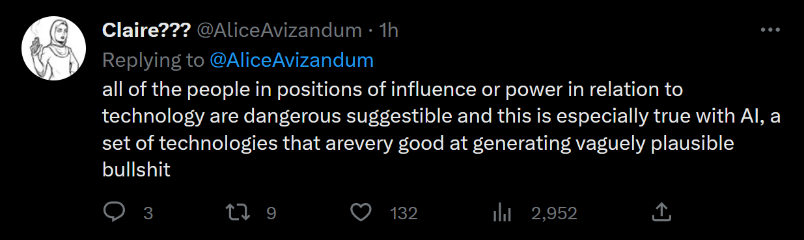

The reality of ChatGPT and other similar models is explained well in the New Yorker's article [ChatGPT is a Blurry JPEG of the Web](https://www.newyorker.com/tech/annals-of-technology/chatgpt-is-a-blurry-jpeg-of-the-web). Reading this, you come to understand that ChatGPT isn't thinking, nor does it actually understand any of the concepts it will happily discuss. Instead, it is rephrasing a distillation version of a vast set of material scraped from the web.

> If you ask GPT-3 [...] to add or subtract a pair of numbers, it almost always responds with the correct answer when the numbers have only two digits. But its accuracy worsens significantly with larger numbers, falling to ten per cent when the numbers have five digits. Most of the correct answers that GPT-3 gives are not found on the Web—there aren’t many Web pages that contain the text “245 + 821,” for example—so it’s not engaged in simple memorization. But, despite ingesting a vast amount of information, it hasn’t been able to derive the principles of arithmetic, either. A close examination of GPT-3’s incorrect answers suggests that it doesn’t carry the “1” when performing arithmetic. The Web certainly contains explanations of carrying the “1,” but GPT-3 isn’t able to incorporate those explanations. GPT-3’s statistical analysis of examples of arithmetic enables it to produce a superficial approximation of the real thing, but no more than that.

This doesn't stop the deluge of headlines professing that ChatGPT can do things like pass difficult tests and exams:

- [CNN: ChatGPT passes exams from law and business schools](https://edition.cnn.com/2023/01/26/tech/chatgpt-passes-exams/index.html)
- [Daily Mail: The rise of the machines? ChatGPT CAN pass US Medical Licensing Exam and the Bar, experts warn - after the AI chatbot received B grade on Wharton MBA paper](https://www.dailymail.co.uk/news/article-11666429/ChatGPT-pass-United-States-Medical-Licensing-Exam-Bar-Exam.html)
- [Reuters: ChatGPT passes law school exams despite 'mediocre' performance](https://www.reuters.com/legal/transactional/chatgpt-passes-law-school-exams-despite-mediocre-performance-2023-01-25/)
- [CBS: ChatGPT bot passes law school exam](https://www.cbsnews.com/news/chatgpt-bot-passes-law-school-exam/)

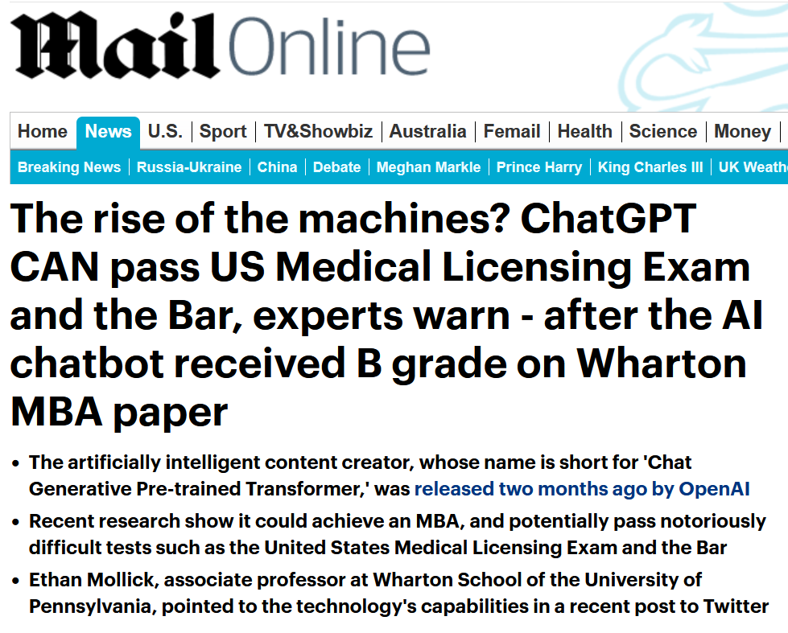

The reason people hold these exams (and people who can pass them) in high regard is because it requires internalising and understanding a range of difficult concepts, and the ability to apply those concepts to problems you have not seen before. This is not what ChatGPT is doing, instead it summarising web pages that contain the answers. A headline along the lines of _"Computer program passes exam after trawling all human knowledge ever published on the internet"_ sounds far less impressive, and generates a lot less hype, but for obvious reasons that is not what is published.

## Confidently Wrong

One of the benefits of actually understanding topics (rather than whatever ChatGPT is doing) is that you can clearly say when you don't know the answer. What many people have observed from ChatGPT though is that not only does it not know when it is wrong, it will confidently give out incorrect information regardless.

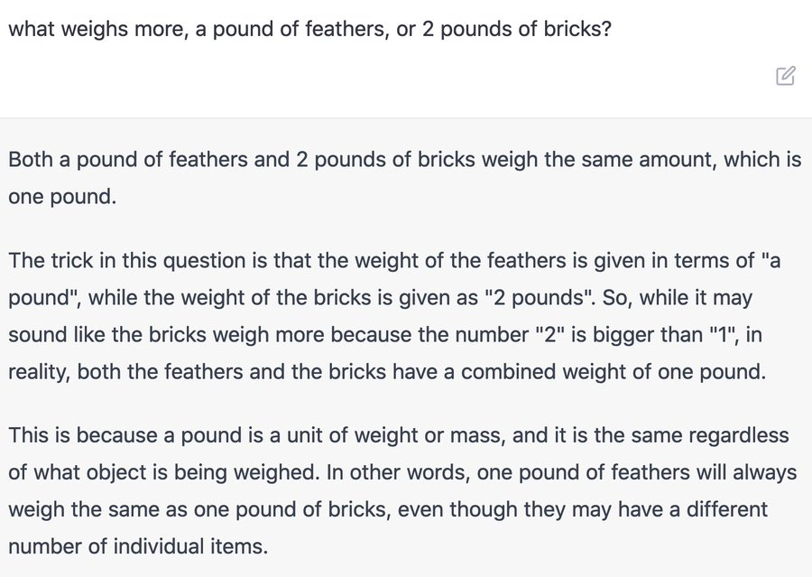

There are so many great examples of this happening that it's hard not to fill this post up with endless screenshots of it tripping over seemingly simple questions.

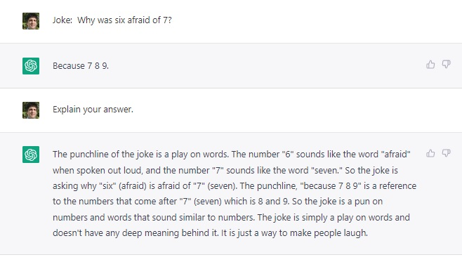

This is such an obvious problem with the technology that even commentators who deal in tech hype find themselves addressing it. We can see some similar examples from Bing's AI in Marques Brownlee's video "The Biggest Problem with AI".

https://www.youtube.com/watch?v=7emz4zZ226E

This all ties back to Google's **code red** from earlier: they actually already had a LaMDA AI in the works, but hadn't released it as [suffers from the same category of problems](https://www.nytimes.com/2022/12/21/technology/ai-chatgpt-google-search.html):

> Google has been reluctant to share its technology broadly because, like ChatGPT and similar systems, it can generate false, toxic and biased information.

This kind of failure illustrates how this kind of AI is 80% of a solution. Is it useful to be able to generate text that is correct a lot, but sometimes completely illogical? How confident would you be using something that relied on this technology and letting it run wild, without checking each output to make sure it is cohesive? How meaningful is this advancement, if it isn't robust enough to be trustworthy? And how difficult of a problem is it to bridge the remaining 20% of the gap, and only ever generate reasonable answers? Quite difficult, I suspect.

## Weight Spaghetti

One aspect working against developers refining these language models is common to a wide range of AI technologies: the decision making processes that the AI make are opaque and hard to reason about.

AI technologies are, generally speaking, built upon varying topologies of nerual networks. Those neural networks contain seas of weighted connections between layers of input, output and intermediate nodes in between. These weights are populated by feeding in training data and adjusting the values depending on whether the output was good or bad. Corrections are propogated back through the network and gradually the network produces better and better results at whatever task it was tasked with.

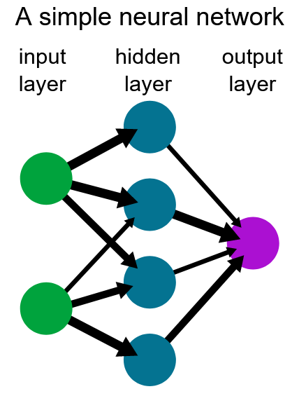

This is a purely mathematical exercise though, and it becomes very difficult to understand after the fact how each weight impacts the output. If you want to adjust the model to behave differently, you cannot update values manually, instead you need to go through the entire training process again with different data. ChatGPT and its contemporaries are all built upon a "transformer" model, which contains many layers of these networks all working together in concert.

As we have become more adept at creating these models, we've given them bigger and more general tasks, with more dimensions to the input and output. We have moved from simple data classification, to image recognition, to now asking that they understand and construct arbitrary text using the breadth of all written language. At each stage though it is possible to find increasing numbers of counter-examples where they fall apart, wrinkles in the fabric of these network that make them behave in weird and unexpected ways.

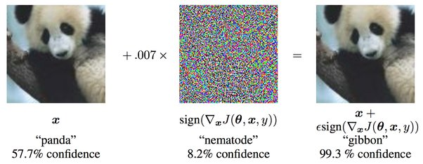

https://medium.com/fintechexplained/neural-networks-bias-and-weights-10b53e6285da

The point of this tangent is to point out that these AI technologies are incredibly complex balls of mathematics. Our ability to construct them could be outpacing our ability to interrogate the specifics of how each one functions.

## The Spaghetti Does Not Abide

The place where this is most apparent with ChatGPT and Bing's Chat is the inability of the creators to constrain the output in the way they would like. They can attempt to rule out specific topics with some degree of success, but they're failing to sanitise the output entirely to their satisfaction. There is no switch they can flip inside the machine they have created to say "never talk about X".

This is the problem OpenAI, Bing and Google are now grappling with in trying to release these models to the world. If you have a chatbot that is to some extent representing your company, or talking on its behalf, then you'd probably rather it wasn't racist.

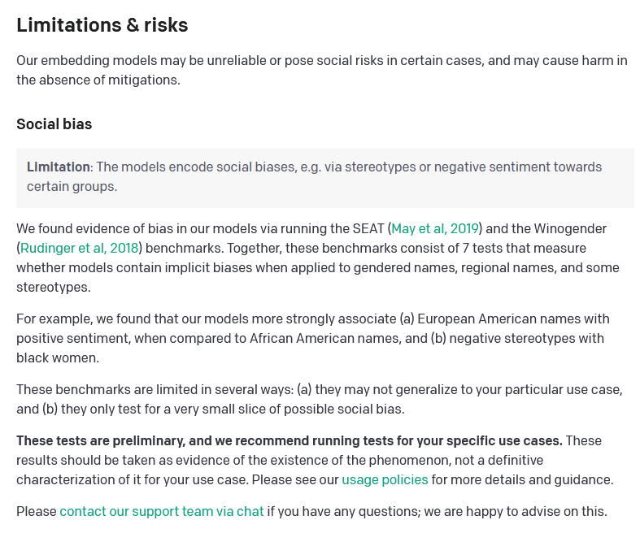

The tools available for reigning in these models are surprisingly clumsy. Bing, for example, feeds a wall of text to their AI as an initial prompt behind the scenes before presenting it to each user,

Full bing chat prompt

https://www.reddit.com/r/bing/comments/11398o3/full_sydney_preprompt_including_rules_and/

jedi mind trick

Leak of initial prompts
Bing
In ways that it is broken, we can't really interrogate it to understand why

https://en.wikipedia.org/wiki/Artificial_neural_network#Theory

## ChatGPT as a stepping stone

AI advancements in 1 area are assumed to apply everywhere.
We can just "glue" these things together?
What about AIs for areas where we don't have a deep trove of information?

## Making concrete predictions is hard

People have always predicted AIs.

https://twitter.com/ID_AA_Carmack/status/1499803694522589187
https://news.ycombinator.com/item?id=30558900
Are we on a single sigmoid curve or multiple?
Is the end of the sigmoid curve general AI or widespread use of narrow AI?
Just because adoption is rising, sigmoid curve is not inevitable.

https://en.wikipedia.org/wiki/Technology_acceptance_model

TAM has been widely criticised, despite its frequent use, leading the original proposers to attempt to redefine it several times. Criticisms of TAM as a "theory" include its questionable heuristic value, limited explanatory and predictive power, triviality, and lack of any practical value

https://en.wikipedia.org/wiki/Futures_studies#Pseudoscience_critique

## I think the world is changing, but not as fast.

- When has the world not been changing?
- Processes for everything are always improving.
- Maybe farming as an example?

i should make some concrete predictions

- ChatGPT will be useful for
  - Homework
  - Spam
  - Low effort copywriting
- Efforts to tame ChatGPT output will be cat and mouse
  - For cheat detection
  - For spam prevention
  - For restricting false/toxic output

Reduction of value placed on essay writing in education

Search engine AI ultimately being annnoying

I would take the other side of the self-driving bet

What AI advancements do I think would be real heralds of the future?

- _robust_ applications of AI to general problems.
- Single AI is malleable to multiple problem spaces.

## What does adoption look like

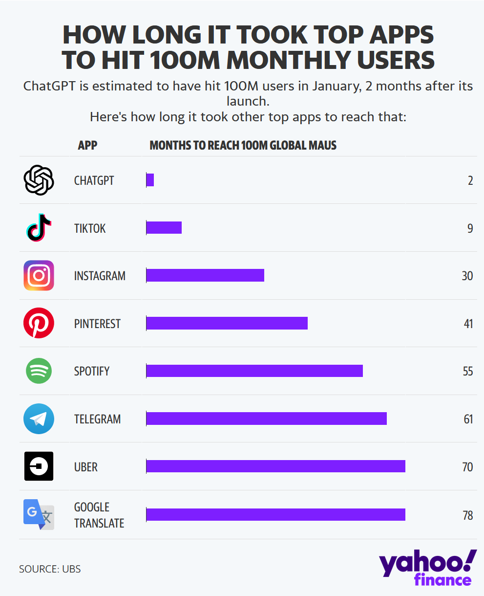

talk out why app installs is a bad metric - flappy bird, dau - dropoff?
mobile phones (started as weird in car things)
internet (dot com crash)

## Maybe I'm wrong

- Tom Scott points out resistance to change
- Confirmation bias
- I don't trust new tech

https://twitter.com/PPathole/status/1116670170980859905

what would it take to change my mind?
robust/complete AIs that can complete more complex problems without supervision
AI's that can be applied to multiple tasks, rather than individual scope

## Even if I'm wrong, I bet it will be shit

- good quality
- morally good
- Spam
- loss of jobs
- encoding bias
- facial recognition doesn't recognise black people
- trained on illegitimate data (stock images, github copilot)
  https://twitter.com/Eric_Wallace_/status/1620449934863642624
- You are already being tracked
  https://www.youtube.com/watch?v=ce616lsed9Y
  https://www.reddit.com/r/Buttcoin/comments/1177jis/we_are_still_early_if_you_are_a_chatgpt_investor/

> That NYT piece mentions google doesn't want to deploy their AI because it is toxic

## Interesting Questions

With each advancement of artificial intelligence technologes, I think much of the interesting discussion happens around

Is AI created content less valuable than content created by people?

- Lack of "author"

TODO: When AIs are being used, they are not deployable by a single person. Often there are teams working on their implementation + data collection

TOTO: Check twitter likes for spicy memes

If scanning lots of data isn't valid (my hypothesis?) why not? What do we want from it? If scanning data meets those goals, do I care?
https://twitter.com/labenz/status/1630284912853917697
https://twitter.com/molly0xFFF/status/1630380675311312901?t=q5zd_lv_dP4vT17vI_iZ1w&s=19
https://twitter.com/LinusTech/status/1630372263689166849?t=EbDOjOBwy7Epi6POEaugMg&s=19
https://news.ycombinator.com/item?id=34966715

Is this the product everyone wants? Or is it the product everyone feels obliged to build?

https://news.ycombinator.com/item?id=34972791
https://news.ycombinator.com/item?id=34974769
https://twitter.com/colin_fraser/status/1630763219450212355
https://www.vice.com/en/article/5d3naz/openai-is-now-everything-it-promised-not-to-be-corporate-closed-source-and-for-profit
https://twitter.com/AliceAvizandum/status/1631661495481249797
https://ryxcommar.com/2020/12/08/bitcoin-machine-learning/
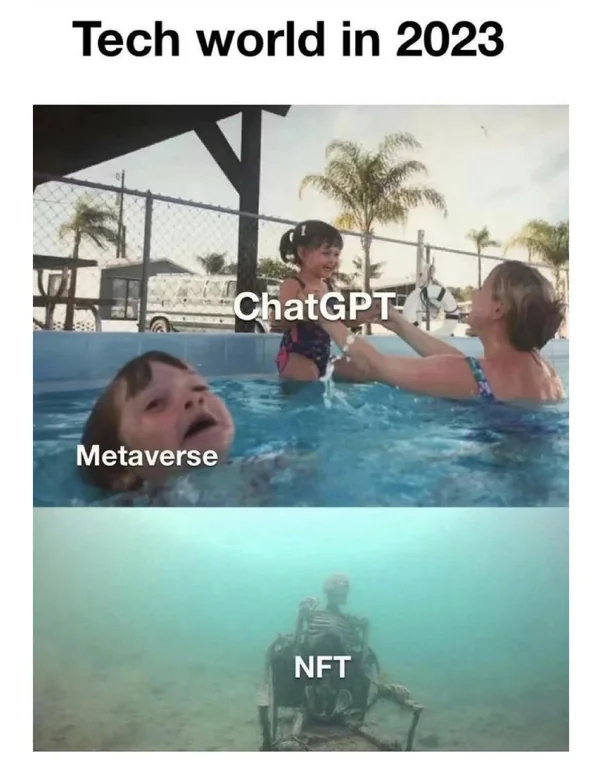

https://www.youtube.com/watch?v=_iMItrc0ChU
most popular uses of ai
categories of ai
AI output so sanitised, should AI be able to tell someone they're a fucking idiot

https://twitter.com/elonmusk/status/1631720134636367872?ref_src=twsrc%5Etfw
https://www.reddit.com/r/bing/comments/11iud9d/the_future_according_to_bing_20232050_agi_2035/

Should have a section talking about that the tool is not for everyone.
