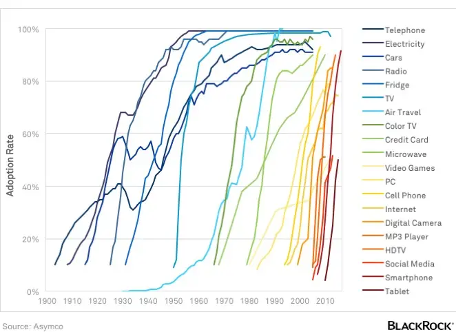

Before diving in, some quick context:

- I studied neural networks, genetic algorithms, and other AI/classification techniques in my Computer Science degree 10 years ago.
- I do not actively keep up with AI development outside of what comes up in general tech news.

## "Everything is going to change"

Tom Scott recently released a video titled _I tried using AI. It scared me_. In the video Tom describes how he used ChatGPT to solve a problem, a task that he thought would normally take him an hour or so to do by writing a bit of code.

https://www.youtube.com/watch?v=jPhJbKBuNnA

Tom places this example in the context of a wider point he is trying to make: _Everything is going to change_. He draws parallels between ChatGPT and Napster, pointing to Napster as "the first major sign of how industries would be changed".

> I don't know where technology is going to go from here, but, I think that world, my world, the one I grew up in, is about to change radically. I think we're on a new sigmoid curve and I have no idea how far along that curve we are right now. I don't know if I want to change with it, but I think I'll have to.

Tom's video, for me, is the latest example of the growing hype surrounding AI. Its kind of hard to pin down exactly what I'm skeptical of, especially when pieces like this never make concrete predictions, but the general argument is that a brave new AI world is coming, and its only _N_ years away, and some big problems problems will be solved, and life will never be the same.

I think there's some truth to that kind of prediction, in that the world and our lives always change. Where it falls apart for me at the moment, is that the scale of the change being predicted is on the same order of magnitude as what we got from the creation of the internet (or perhaps the printing press, penicillin, or the transistor) - and its happening _now_.

TODO: Try and tease out some more points Tom might be making - Is ChatGPT a stepping stone? Napster was a new use enabled by a fully formed technology, ChatGPT is a new technology trying to prove a use.

To hopefully illustrate the kind of hype I'm talking about, while looking for other sources for this post Yahoo Finance has recommended me to read a puff piece from Bezinga titled "[ChatGPT Is Doing for AI What Apple's iPhone Did for Smartphones](https://finance.yahoo.com/news/chatgpt-doing-ai-apples-iphone-143615602.html)", which features insights like:

> The release of ChatGPT is quickly bringing the capabilities of artificial intelligence (AI) to the forefront. The release of ChatGPT might just have been the “iPhone moment” for the world of AI. It’s reshaping school curriculums and policy, replacing and improving jobs and is already a household name.

Pieces of media saying that we are on the precipice of a new technological era are evergreen content, there has never been a time when people haven't indulged in this kind of futuristic thinking. The debate now is whether ChatGPT (and other recent AI advances) are a clear signal that the time of great change is upon us.

For me though, I haven't seen enough to pull me over to believing, and I'll try to explain why.

## The Sigmoid Curve

The sigmoid curve Tom references is part of a technology adoption lifecycle or [diffusion of innovations](https://en.wikipedia.org/wiki/Diffusion_of_innovations).

- Technology is picked up slowly at first, while problems are being ironed out.
- At a certain point, the benefits of the technology outweigh the cons and the majority flood to use it.
- Laggards follow at the end, slow to adapt and potentially missing some of the early opportunities.

These kind of curves are trivial to apply to history, now that the technologies have played out and we know how things have ended up. Applying them prescriptively is another story, but if you can do it successfully I'm sure you could make some lucrative investments.

When Tom is talking about these curves though, there's a few things that might be obvious but I think are worth clarifying:

Firstly, the Y-axis is market share, not global adoption. I think Tom himself appreciates this when he discusses not knowing how far along the curve we already are.

> If we're already most of the way up the curve, then cool, programmers and artists have brand new tools, but they can't create something at a human level with them [...].
>
> If we're at the middle of the curve, then we are going to get some very impressive new tools very soon that still need some humans to work them [...].
>
> But, that feeling of dread came from the idea that ChatGPT and the new AI art systems might be to my world what Napster was to the late 90s [...].

The reason I point this out, is because to be considered in the same group as the aforementioned world changing technologies (the internet, antibiotics, the printing press), then a technology should surely have world-wide adoption and reach.

TODO: Sigmoid interpretations - what sigmoids would fit Tom's argument?

To give a clear example of the ways in which this can be misleadingly applied, there's some commonly circulated Bitcoin meme which places it on one of these graphs, implying world-wide adoption is inevitable. Just because a technology is seeing some some initial success, it doesn't mean it will ultimately become widespread. The endpoint is 0% much more commonly than it is 100%.

The second part of the sigmoid reference that I want to point out is that Tom never describes what technology we're on the sigmoid curve for. In fact, in the part I've quoted above, he redefines what the sigmoid curve is indicating for each different example. To me this blurring of the scope feeds into some of the hype around AI, or at least helps it to brew. It conflates the application of AI to specific areas with some nebulous general idea of AI.

Are we on the path to market saturation of language model AIs? Or are we on the path to the completion and world-wide adoption of general AIs? Perhaps we're some way along the journey to both, but I haven't been convinced that you get to freely conflate them because both contain the word AI.

## General Problems and 80% Solutions

There's no denying that the applications of AI have become much better in recent years. There are robust solutions that make better decisions than humans for clearly defined problems like medical data classification, recommendation engines, chess and go.

When the problems become more complex, such as language generation or autonomous self driving, the outputs we get are not at the same level of quality. Tom describes this himself in the video, where he:

- Writes the pseudocode for a solution himself as input.
- Works through a feedback cycle with ChatGPT to fix some errors in the output.
- Needed to dive in deeper to a part of the solution, because Google's documentation was incorrect.

The second point in that list is reminiscent of other ChatGPT outputs I have seen, it gets almost the whole way there but you'd still want to babysit it (and need the knowledge so spot its mistakes). This is not the promise of AI futurism. Generally we would not be safe deploy these models into the world in place of humans and let them run wild, because they are not yet robust enough that we trust the quality of their output.

There are other examples too, like image generation model's well documented inability to understand how human hands work:

In MKBHD's video "Tesla Self Driving vs Everyday Roads!" he demos his Tesla driving between home and work, trying to interrupt as few times as possible. I cannot deny that the level of fidelity of the self-driving system is impressive and works well for the broad majority of situations it comes across.

https://www.youtube.com/watch?v=9nF0K2nJ7N8

What stick out though are the occasions where Marques does feel obliged to take over from the self-driving system. The top comment (at time of writing) sums it up well:

> In its current state, it feels like you are babysitting someone learning to drive and it feels much more stressful than just driving myself.

The feeling I get from these applications of AI to more general problems is that the solutions are roughly 80% solved. You might disagree about the exact numbers, but the point I want to make is that getting them the remaining 20% of the way is often the hardest part of solving the problem, rather than being an easy home stretch.

Perhaps for some problems this is a good enough state of affairs, but I'd argue that until we get better at making these AI tools robust and complete they will often be stuck in the realm of "assisting humans" rather than "replacing humans".

## Closed Systems

In Tom's video he compares ChatGPT to Napster in service of comparing AI to the Internet.

One aspect of the Internet that cannot be ignored when you evaluate this comparison though is that the internet is open to everyone. As long as you have a connection to the internet you can browse what everyone else has shared, and host content of your own for others to read. Outside of signing up with an ISP, you don't necessarily need to accept anyone else's terms of service, pay any fees, or sign over the rights to any content.

The same is not always true for AI models. While open source data sets and implementations are available, they will not yet be keeping up with proprietary offerings. The wider public do not have the same access to data sets and compute power to train models on. Where companies expose their models to the internet for public use, they often have strings attached. Improvements to the models are commonly kept private as trade secrets, rather than published as open protocols.

> In the case of ChatGPT, the AI model and the algorithms that it uses to generate text could potentially be considered trade secrets. The terms of use for ChatGPT state that users are not allowed to reverse engineer, decompile, or disassemble the service in any way (section 4.2). This suggests that the inner workings of ChatGPT are considered trade secrets and are protected by intellectual property law. [...]
>
> According to the terms of use for ChatGPT, all content generated by the service is owned by OpenAI. This includes any text, data, or other content created or generated using the service. The terms of use grant users a limited, non-exclusive, non-transferable, and revocable license to access and use the service, but they do not grant ownership of the content created.
>
> [Legal Side of ChatGPT - Sergei Tokmakov](https://terms.law/2023/01/01/legal-side-of-chatgpt-examining-the-terms-of-use-and-ownership-of-content-created-by-the-service/)

The legal concerns about the output of these "proprietary but publicly available" systems stifle their use. Many orgs will not accept use of GitHub's Copilot AI or ChatGPT out of fear of feeding sensitive information in, or being stuck with [legally dubious output](https://fossa.com/blog/analyzing-legal-implications-github-copilot/).

Once these AI systems are sophisticated enough, it is hard to imagine any company giving them away for free. Why would companies provide open access to a tool that could replace a developer or a writer? It seems more likely that the cost of access will be just enough to undercut a developer's salary.

## The Law

There are factors that will impact AIs uptake that have nothing to do with the technology, but are instead problems in meatspace. The most prominent one at the moment is legal restrictions around self-driving technology.

I assume these laws are justified, its possible that they are not and are there to protect entrenched organisations, but I don't think it matters either way. Ultimately, for self-driving to get adoption the legal hurdles will need to be overcome.

The same will be true other fields too. The UK government has established an Office for Artificial Intelligence, and an Artificial Intelligence Act has been proposed by the european commission. While we can't really speculate on what laws will come when, we also don't get to hand-wave away the impact they have on the sigmoid curve when they do pop up.

## Business Signals

A lot of attention gets paid to how big businesses react to AI, and in particular how much they have been investing. Some examples of recent signals have been:

- [Microsoft's $10 billion investment in OpenAI](https://www.bloomberg.com/news/articles/2023-01-23/microsoft-makes-multibillion-dollar-investment-in-openai)
- [Google invests $300mn in artificial intelligence start-up Anthropic](https://www.ft.com/content/583ead66-467c-4bd5-84d0-ed5df7b5bf9c)
- [Apple bought more AI companies than anyone else between 2016 and 2020](https://9to5mac.com/2021/03/25/apple-bought-more-ai-companies-than-anyone-else-between-2016-and-2020/)

The problem is that these large tech companies have plenty of examples in their track records of betting big on technology that has gone out with a whimper. Blockchains, VR, the metaverse and voice assistants are all examples of technologies that have attracted huge investments only to fade without making a huge impact.

- [Amazon Alexa is a “colossal failure,” on pace to lose $10 billion this year](https://arstechnica.com/gadgets/2022/11/amazon-alexa-is-a-colossal-failure-on-pace-to-lose-10-billion-this-year/)
- [Facebook Expects Metaverse Project Will Cost At Least $10 Billion—In 2021 Alone](https://www.forbes.com/sites/abrambrown/2021/10/25/facebook-expects-metaverse-project-will-cost-at-least-10-billion-in-2021-alone/?sh=16cbcaa025b4)

If I was a C-suite level at one of the FAANG orgs I think I'd be dumb (or at least percieved to be) if I wrote off recent AI developments on the off-chance that it does live up to the hype, and one of our competitors snaps up a huge advantage. Often though it appears that the price tag they place on mitigating that risk (or making these "big bets") is not proportional to the product they're left with at the end of it.

## Code Red

We see this kind of thinking at play in recent news on Google's "Code Red", for example this video from ColdFusion titled "Google Panics Over ChatGPT":

https://www.youtube.com/watch?v=Nh5i5obZ8OY

The video

https://www.quora.com/What-is-code-red-in-Google
https://www.nytimes.com/2022/12/21/technology/ai-chatgpt-google-search.html

Google's search has been declining, but not because of AI from other places.

Is it actually any good?
Does anyone actually want this?

We have done chatbots before and they were shit.

https://www.youtube.com/watch?v=d3LYlNqfuzI
https://www.smashingmagazine.com/2016/07/conversational-interfaces-where-are-we-today-where-are-we-heading/
https://en.wikipedia.org/wiki/Conversational_user_interface
https://trends.google.co.uk/trends/explore?date=all&q=chatbots
https://theappsolutions.com/blog/development/guide-to-conversational-user-interfaces/

https://www.reuters.com/technology/how-get-microsofts-new-ai-enhanced-bing-2023-02-07/

https://edition.cnn.com/2023/02/08/tech/microsoft-ai-bing-experience/index.html
https://www.cnbc.com/2023/02/16/microsofts-bing-ai-is-leading-to-creepy-experiences-for-users.html

## ChatGPT Whimsy

https://www.newyorker.com/tech/annals-of-technology/chatgpt-is-a-blurry-jpeg-of-the-web
It can think, it can write code
I'm in love with it
Its confidently wrong
https://www.youtube.com/watch?v=8DGgvE6hLAU

AI advancements in 1 area are assumed to apply everywhere.

## Making concrete predictions is hard

People have always predicted AIs.

https://twitter.com/ID_AA_Carmack/status/1499803694522589187
https://news.ycombinator.com/item?id=30558900
Are we on a single sigmoid curve or multiple?
Is the end of the sigmoid curve general AI or widespread use of narrow AI?
Just because adoption is rising, sigmoid curve is not inevitable.

https://en.wikipedia.org/wiki/Technology_acceptance_model

TAM has been widely criticised, despite its frequent use, leading the original proposers to attempt to redefine it several times. Criticisms of TAM as a "theory" include its questionable heuristic value, limited explanatory and predictive power, triviality, and lack of any practical value

https://en.wikipedia.org/wiki/Futures_studies#Pseudoscience_critique

## What does adoption look like

mobile phones (started as weird in car things)
internet (dot com crash)

## I think the world is changing, but not as fast.

- When has the world not been changing?
- Processes for everything are always improving.
- Maybe farming as an example?

## Maybe I'm wrong

- Tom Scott points out resistance to change
- Confirmation bias
- I don't trust new tech

https://twitter.com/PPathole/status/1116670170980859905

what would it take to change my mind?
robust/complete AIs that can complete more complex problems without supervision
AI's that can be applied to multiple tasks, rather than individual scope

## Even if I'm wrong, I bet it will be shit

- good quality
- morally good
- Spam
- loss of jobs
- encoding bias
- facial recognition doesn't recognise black people
- trained on illegitimate data (stock images, github copilot)
- You are already being tracked

## Interesting Questions

Is AI created content less valuable than content created by people?

- Lack of "author"
