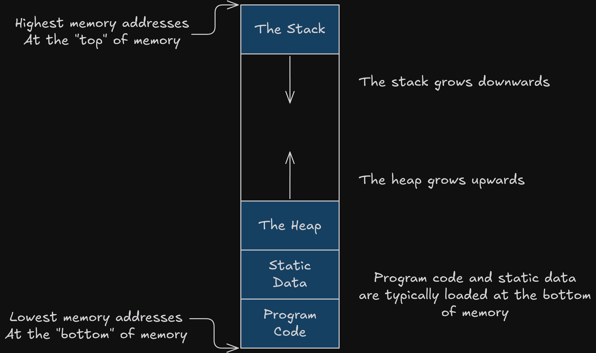
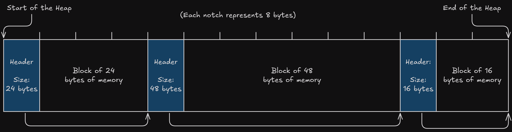
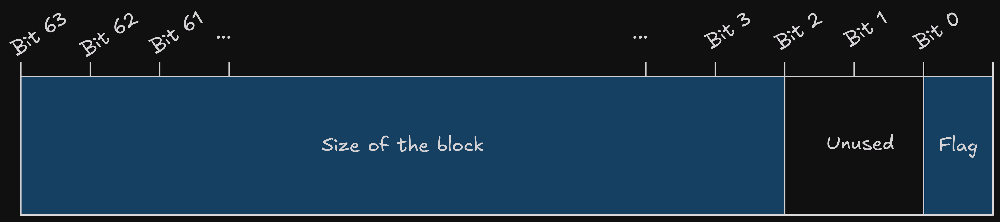
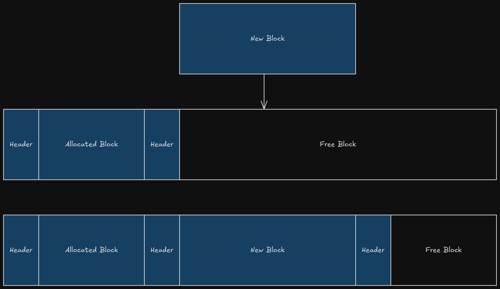
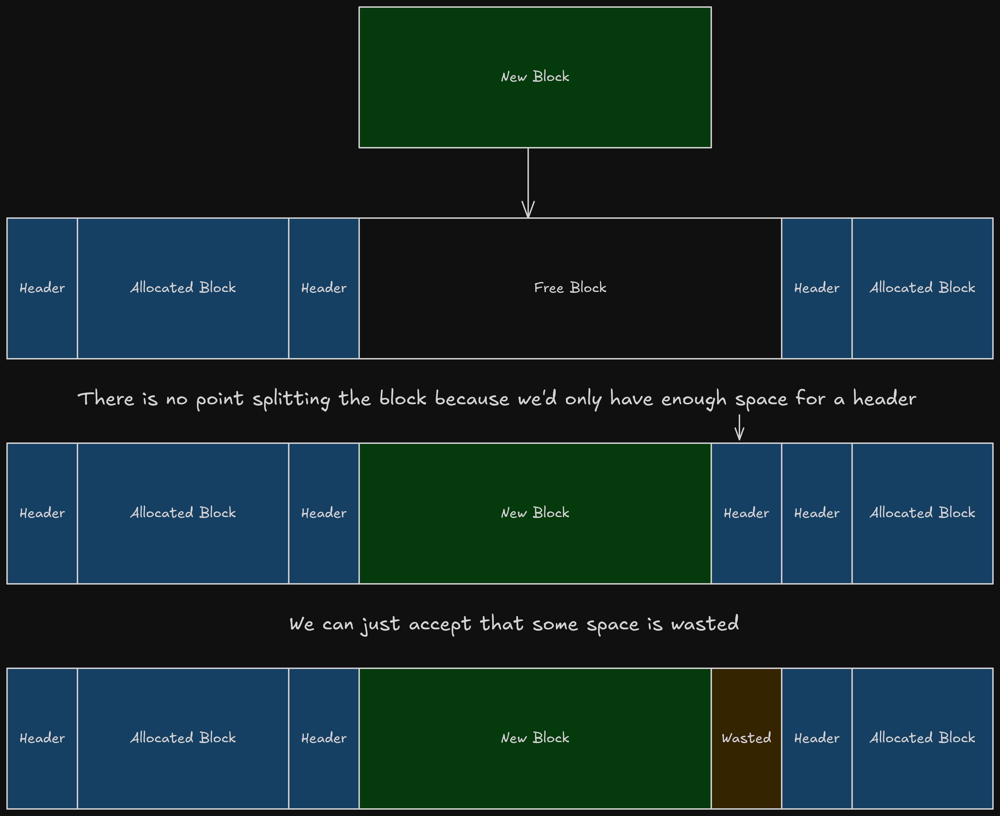
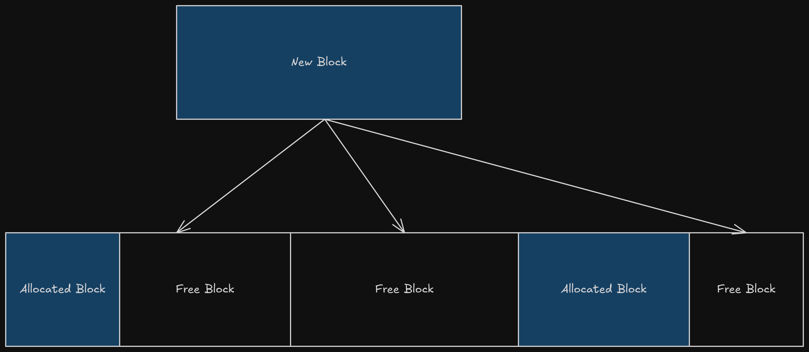
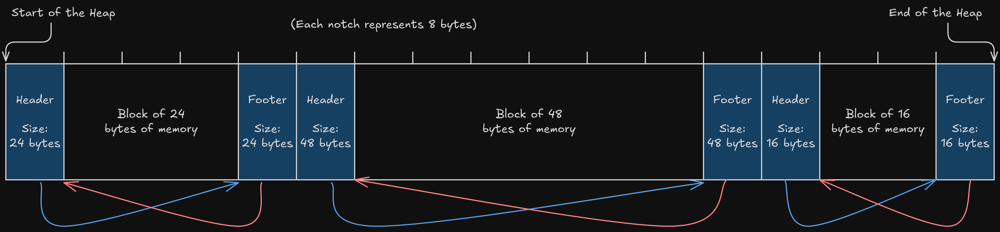

While programs are running, they need to store the data they are working on in memory. Often programmers do not need to think about how this happens; Allocating memory (reserving space to store data) is such a common operation that almost all programming languages or environments have this capability built in.

In low-level languages like C, all the programmer needs to do to allocate some memory is call the function `malloc(amountInBytes)`, passing the amount of memory they would like to reserve.

```C
// Allocating memory for an array of 1000 ints in C:
int *myArray = (int*)malloc(1000 * sizeof(int));
```

In higher-level languages like JavaScript and C#, the programmer may not be exposed to memory management at all. The runtime for these languages may silently allocate memory behind the scenes when the programmer uses constructs like the `new` keyword, but this detail is never really exposed to the programmer.

```JavaScript
// Creating an array of 1000 ints in JavaScript:
const myArray = new Array(1000);
```

Working with memory in an inefficient way can make or break the performance of your programs. Despite the best effort of programming languages to smooth over the details, neglecting how memory is being allocated can cause poor performance or result in system resources being hogged.

By the end of my [last post](./assembly.html) on Assembly programming, I had written a very rudimentary memory allocator. I wanted to get a bit better at programming in Assembly, but also to develop my allocator further into something which meets a reasonable minimum bar for functionality and efficiency.

In this post I'll describe a bit about the allocator I came up with, how it interfaces with the operating system, and where I can take it next. There are some code samples littered throughout the post, but you can find the full source code [here](https://github.com/bencoveney/learning-assembly/blob/main/projects/allocator/allocator.s).

## Getting Memory from the Operating System

When a computer starts, one of the jobs of the operating system is to manage memory the memory available on sticks of RAM, which involves tasks like:

- Taking stock of all the physical memory available and breaking it up into "pages", so that it can work with larger chunks of memory rather than individual addresses.
- Moving programs and data into, and out of, the physical memory while they are being used.
- Providing additional memory to programs when they request it.
- Reclaiming memory from programs once they have finished running.
- Maintaining a [page table](https://en.wikipedia.org/wiki/Page_table) to map from "virtual" memory addresses (used by your programs) to physical memory addresses (linked to the hardware).


The operating system I was targeting for my allocator was 64-bit Linux. Linux exposes a few different ways for programs to work with memory as "syscalls" (system calls), which are like functions the program can make a request to. Some example syscalls for memory management are:

- The `BRK` syscall asks the operating system to move the "program break", effectively growing or shrinking the heap. This is the method I used to implement my allocator, so it will be explained in more detail later on.
- The `MMAP` syscall asks the operating system to hand over entire pages of memory at a time. This is a more modern API with a lot more bells and whistles, which will be beyond the scope of this post.

## The Heap

The operating system will load programs into memory using a similar layout each time:

- Static and/or fixed data will be loaded at the bottom of memory (with the lowest memory addresses). This could be things like executable code, text strings, constant values, or assets which will be used while the program is executing.
- Above this is the heap, which will grow upwards. The top of the heap is known as the "program break", and the `BRK` syscall will move it up and down. Typically the heap is used for storing data which is larger, or needs to be retained for a longer period of time while the program is running.
- At the top of memory is the stack, which grows downwards. Typically the stack is where shorter-lived values are stored, like variables which are local to functions.



As a result, the heap and stack grow towards each other. If they ever meet then your program has run out of memory, and likely won't be able to continue running.

Memory allocators are typically managing content of the heap, allocating memory within it, and growing or shrinking it as-and-when required.

In practice, my memory allocator interfaces with the heap in 2 different ways:

Firstly, the location of the program break cannot be known ahead of time. The operating system can (and will) vary the location where programs are loaded into memory each time they are executed. This [address space layout randomization](https://en.wikipedia.org/wiki/Address_space_layout_randomization) gives security benefits but as a result we need to call the `BRK` syscall up-front, before we can make any allocations, so that we know where to expand it from.

Secondly, when the allocator determines that we do not have any space available to fit a memory allocation, we will expand the heap by calling the `BRK` syscall with a new desired location for the program break. This new location will be offset from the program break's initial location, hence why we needed to look it up initially.

## The Allocator API

Now that we've laid out the allocator's responsibilities, we can have a look at the API it exposes, which is conveniently just 2 functions.

```txt
allocate(sizeInBytes): memoryAddress

deallocate(memoryAddress): void
```

`allocate` will allocate a block of memory of _at least_ the given size, and return the address of the start of the block.

Your program is then free to use that block of memory however you see fit. In the event you no longer need the block of memory you can return it to the allocator, by calling `deallocate` and passing the same address. Once a block of memory has been deallocated, it can be reused by the allocator to satisfy another allocation request.

This recycling of memory is critical to prevent "Memory Leaks", where programs gradually consume more memory over time until all the system's resources have been consumed.

Recycling memory comes with a caveat though: `allocate` can potentially return memory which already contains data used by a previous allocation. In many cases this won't cause problems, because the first thing you'll do after allocating memory is free it, but it is worth bearing in mind.

If you've done any programming in C these functions might look familiar, they are normally named `malloc` and `free`.

## Making an Allocation

So what actually happens when we call `allocate`? This is probably best explained by running through an allocation, and seeing all the parts moving.

### 1: Initializing the Heap

Before we can allocate space on the heap, we need to know where it is. Address space layout randomization means we can't know where it is ahead of time, so we will need to call the `BRK` syscall to find out the address.

This only needs to be done once. Once we have found the starting address of the heap, we can keep a note of it, and skip this step the next time around.

```gas
# Initializes the heap.
# Param %rdi: The amount to allocate.
# Return %rax: The address of the allocation.
initialise:
.equ LOCAL_TARGET_SIZE, -8
.equ LOCAL_DESIRED_HEAP_SIZE, -16
  enter $16, $0

  movq %rdi, LOCAL_TARGET_SIZE(%rbp)

  # Call brk to work out where the heap begins.
  movq $0, %rdi
  call brk
  movq %rax, startOfHeap

  movq LOCAL_TARGET_SIZE(%rbp), %rdi
  movq %rax, %rsi
  call expandHeapFrom

  leave
  ret
```

### 2: Padding the Size

We allow an arbitrary number of bytes to be requested into the `allocate()` function, but this is a bit of a lie. Computers prefer memory addresses to be "aligned" to certain boundaries, and will be able to operate more efficiently when that is the case.

There are 8 bits to a byte, and my allocator targets 64 bit CPUs, so my memory addresses should stay aligned to 8-byte boundaries. One easy way to stay aligned is to make sure every block we allocate on the heap is rounded up to be a multiple of 8 bytes in size.

There's a tradeoff here. If the user asks for 1 byte, we will need to reserve at least 8, which might seem inefficient. There are some mitigating factors though:

- Often the user will already be allocating memory in 8-byte intervals, because that will be the most common denomination of data being worked with on a 64-bit CPU.
- This wasted space is more pronounced when allocations are small, but typically small allocations can be done on the stack rather than the heap.

```gas
# Determines how much memory we need to make an allocation of N bytes when the
# header and alignment are factored in.
# Param %rdi: The desired number of bytes.
# Return %rax: The value to store in the header.
getAllocationSize:
  enter $0, $0
  addq $HEADER_SIZE, %rdi
  addq $FOOTER_SIZE, %rdi
  movq $0x8, %rsi
  call roundUp
  # %rax will already have the result.
  leave
  ret
```

### 3: Finding a Home for the Block

At this point we know how much space we need to allocate for the block, and we know where the heap is. The next problem is to figure out where, within the heap, the allocation can be done.

To make good decisions here we will need to give the heap some structure, so that we can inspect it and work out which parts of it are empty and which are full.

For different types of memory allocator, this is where the algorithm will vary the most. Different strategies for structuring the heap will have different characteristics, like the time taken to find an empty spot, or the amount of extra data stored per allocation.

For my allocator, I chose to structure the heap as a linked list. In practice this means there is a small header alongside each allocation which tracks whether the block is allocated, and the size of the block. By adding the size to the address of the current block, we can find out where the next block begins.



This gives us enough information to walk through the heap and look at the blocks stored there, by going through these steps:

1. Use the memory address of the start of the heap as the jumping off point.
2. Read the header to find how big the block is.
3. Add that size to the current memory address to get the address of the next block. This is like following one of the arrows from one block to the next.
4. Check if we have reached the end of the heap.
5. If we haven't, then we can return to step 2 and repeat the process for the next block.

One problem you might notice is that we don't yet have a way to tell if each block is allocated or free. To solve that we will need to introduce a new allocated flag to the header too, signifying whether the block is free or in use.

When we are considering adding more data to the header, there is a caveat: Each piece of data we store will take up space for every single allocation we do. It is in our best interest to try to keep the header as small as possible. So is there any way we can squeeze a bit more data into the space we are already using?

At the moment, the header consists of a 64-bit (8 byte) size value. In 64 bits we can store any possible integer value in size from 0 up to 2^64. In reality we will not be using that many possible values, because we only allow sizes which are a multiple of 8.

This means that the smallest 3 bits (2^3 = 8) will effectively be unused, and could be used to store a flag indicating whether the block is free or in use. As a result, the 64 bits in the header are used as follows:

- Bit 0: Whether the block is free or in use.
- Bit 1 & 2: Unused.
- Bit 3 to 63: The size of the block.



To separate those two pieces of data when we inspect the header, we can use the `andq` Assembly instruction which performs a logical AND operation and acts as a mask.

```gas
# Reads the size of the block of memory, based on the header.
# Param %rdi: The value stored in the header.
# Return %rax: Whether the block is allocated.
readSizeFromFooter:
  enter $0, $0
  movq %rdi, %rax
  # Mask everything except the bottom 3 bits
  andq $0xfffffffffffffff8,%rax
  leave
  ret

# Reads whether the block of memory is allocated.
# Param %rdi: The value stored in the header.
# Return %rax: The size of the block.
readAllocatedFromHeader:
  enter $0, $0
  movq %rdi, %rax
  # The smallest bit has the allocated flag
  andq $0x1, %rax
  leave
  ret
```

### 4: Expanding the Heap

We now have everything we need to walk through the heap and find a block which can fit an allocation, but there's an extra scenario to consider: What happens if we walk all the way through the heap, inspecting each block, but cannot find one which is both free and can fit the allocation? The only solution in this case is to expand the heap.

Fortunately this is not too tricky, all we need to do is:

- Take the previous address for the end of the heap.
- Increase it by at least the amount we want to allocate, to find the new desired end of the heap.
- Send a request to the operating system, asking it to move the "program break" (using the BRK syscall described earlier).
- Create a block in the newly allocated region (including the header).
- Use that new block for the requested allocation.

I've used some slightly fuzzy language there for how much we would want to expand the heap by: "Increase it by at least the amount we want to allocate". We actually probably want to expand the heap by more than what we need to accommodate the allocation, for a few reasons:

- We need to add a bit of extra space for the header (8 bytes).
- Triggering syscalls has some overhead associated with it, so it is best if we can avoid doing it for most allocations. We can request some extra margin (I used 1024 bytes) and hope that it might be able to satisfy a future memory allocation without us needing to run the syscall again.
- The operating system will be managing memory in larger pages behind the scenes anyway, so we may as well round up to request entire pages at a time (often 4096 bytes, but it can vary), because they will be reserved for our program either way.

Taking all this into consideration, the amount of memory we request from the operating system could be a fair bit more than the amount we were asked to allocate, but a modern 64 bit system will take this in its stride.

Before we move on to the next section, one thing to note is we _always_ need to expand the heap for the very first allocation, because there won't be any space reserved yet. In that case we can jump straight from step 1 to step 4, but the logic for requesting some extra margin will remain the same.

```gas
# Expands the heap from a specified point to accommodate an allocation.
# Param %rdi: The amount to allocate.
# Param %rsi: The location to expand from
# Return %rax: The address of the allocation.
expandHeapFrom:
.equ LOCAL_TARGET_SIZE, -8
.equ LOCAL_GROW_FROM, -16
.equ LOCAL_DESIRED_HEAP_END, -24
  enter $32, $0

  movq %rdi, LOCAL_TARGET_SIZE(%rbp)
  movq %rsi, LOCAL_GROW_FROM(%rbp)

  # Calculate the new end of the heap.
  movq LOCAL_GROW_FROM(%rbp), %rdi
  addq LOCAL_TARGET_SIZE(%rbp), %rdi
  add $MARGIN, %rdi
  movq $PROGRAM_BREAK_ALIGNMENT, %rsi
  call roundUp
  movq %rax, LOCAL_DESIRED_HEAP_END(%rbp)

  # Grow the heap.
  movq LOCAL_DESIRED_HEAP_END(%rbp), %rdi
  call brk

  movq LOCAL_DESIRED_HEAP_END(%rbp), %rax
  movq %rax, endOfHeap

  // ...continued in the next section
```

### 5: Splitting Blocks

When we are finding a block which could be used for an allocation, we are unlikely to always find one which is the perfect size. This is definitely the case when the heap expands, because we will be creating a block which we know for a fact is larger than what we needed to allocate.

If the program asks to allocate 16 bytes, and we begin walking through the heap and find a candidate block which is 1024 bytes big, what should we do?

One option would be to say that using this block would be wasteful, and try to find a better one. This "best-fit" approach could work, but you have no assurance you would find a block of the perfect size, so eventually (depending on how long you decide to search) you may have to settle for something suboptimal anyway.

The approach I take in my allocator is to instead split the larger block into pieces, so that we only use the part of it that we need, and leave the rest available for another allocation. The benefit of this approach is that we can always use the first



When splitting blocks, there is one thing to take into consideration: A block can only be split if it can fit all of the following:

- The header of the newly allocated block.
- The content of that block (i.e. the size of the allocation).
- The header for the remaining free block.
- The content of the free block, which would be the minimum size your allocator allows (8 bytes in my case).



If a block doesn't meet these criteria to be split then it isn't the end of the world, because it means the block was roughly the right size anyway, and a little extra space being lost here won't hurt.

```gas
  // ...continued from the previous section

  # Write the allocated block.
  movq LOCAL_TARGET_SIZE(%rbp), %rdi
  movq $0x1, %rsi
  movq LOCAL_GROW_FROM(%rbp), %rdx
  call writeBlock

  # Write the remainder.
  movq endOfHeap, %rdi
  subq LOCAL_GROW_FROM(%rbp), %rdi
  subq LOCAL_TARGET_SIZE(%rbp), %rdi
  movq $0x0, %rsi
  movq endOfHeap, %rdx
  subq %rdi, %rdx
  call writeBlock

  # Return the allocated address.
  movq LOCAL_GROW_FROM(%rbp), %rax
  addq $HEADER_SIZE, %rax

  leave
  ret
```

## Deallocation

Fortunately, the process for freeing memory is a lot more straightforward than allocating it, especially now that we have laid out a lot of the structure of the heap. We can simply mark the block as free by toggling the flag stored in the header. The block can then be considered for future allocations and potentially re-used.

Surely there's no other problems we need to consider?

### Fragmentation

Unfortunately there's one other problem we need to consider.

You might've noticed above that we have a process for splitting larger blocks of memory up into smaller ones. If we only had this, then you can imagine that gradually the heap would get split into smaller and smaller blocks. Useful large blocks within the heap would become infrequent and spread out over time, making our memory use less efficient, and we would need to expand the heap much more often in order to create new larger blocks.



To balance this out, we can try to combine empty blocks together to counteract the splitting process. This is unlikely to give us 100% memory efficiency, we will still probably have gaps in the heap, but it should improve things enough to prevent the inefficiency becoming a serious problem.


To perform the merging of empty blocks, there's actually only 2 scenarios we need to consider:

- When we mark a block as free, look at the preceding block, and if it is also free then they can be merged together.
- When we mark a block as free, _also_ look at the subsequent block, and if it is also free then they can be merged together.

By following those two rules, we can ensure we never end up with 2 neighbouring blocks of available memory. One would be freed after the other, and at that point they would've been merged together.


As an alternative solution to this problem, you might be wondering why we can't periodically rearrange the heap, to squish all the used blocks together and leave a large free region at the end of the heap.

The main reason this isn't possible is because users of the memory can do whatever they want with it, including keeping pointers into it from other parts of the program. If we moved blocks around then we run the risk of invalidating those pointers, and leaving them pointing somewhere the program didn't expect.

 memory can cause problems.')

### Blocks, Interlinked

Alongside each block of memory we are storing a header which contains the size of the block, and allows us to treat the heap as a linked list of blocks which we can traverse from start to end in a forward direction.

There is something this doesn't allow though, which is to easily get ahold of the block just before a given one. Unfortunately this is exactly what we needed to do in the section above:

> _When we mark a block as free, look at the preceding block, and if it is also free then they can be merged together._

One option for solving this would be to walk through the heap all the way from the start in order to find the block just-prior to the one we are interested in. This could be quick when the heap is small but would become inefficient as it grows.

The option I implemented in my allocator was to instead add more links to the heap structure pointing in the other direction, making the list "doubly-linked".

Similar to the header, all we need to be able to know to work back to a previous block is how large it is. This 8 byte size value is stored in a footer at the end of the block, so that we can find it by looking just behind the header for the block in question.



The drawback to this approach is that we have doubled the overhead we need per-allocation from 8 bytes up to 16 bytes. We are trading off a bit of space efficiency for a gain in speed efficiency, and modern machines have plenty of space so this tradeoff is probably acceptable, but it is worth bearing in mind.

## Shortcomings

That just about wraps up the functionality I have implemented. If you're interested in seeing the full source code, you can check it out [here](https://github.com/bencoveney/learning-assembly/blob/main/projects/allocator/allocator.s).

For now, I am considering my allocator "good enough". With any project, by the time you reach the end you will have picked up plenty of knowledge about all the things you could have done better, if you were to do it again. In my case, that list looks something like this:

- My Assembly code is optimised for my ability to read it, rather than performance. There's probably plenty of places where I could optimise away some instructions or data movement, but it might make it a bit harder to work with.
- My allocator never shrinks the heap by returning memory to the operating system. This could be done if a large enough region at the end of the heap becomes free, but for now it will only ever grow.
- I could add some extra checks and error handling, in case users pass invalid values to the API functions, like a request to allocate 0 bytes of data or free a block which isn't on the heap.
- Other allocators will have more functions in their API, like ones which will ensure the blocks are empty (i.e. filled with zero values) before they are handed over.
- Searching for free blocks involves walking through the entire heap. It would be great to be able to find free blocks more efficiently.
- There are some use-cases like multithreading which my implementation has ignored entirely.

Throughout this post I've also pointed to a range of tradeoffs, like the choice to store a footer alongside each block, which can speed up deallocation at the cost of some extra memory-use per allocation. In fact, the entire doubly-linked-list design of the allocator is a tradeoff, and there are alternative heap structures you can use which will make better, more informed tradeoffs.

If you were undertaking this project for real, with stakes higher than "fun hobby project" then you'd probably also want to consider those alternative designs, and how they compare against the allocations made by real projects. If this is the kind of thing you are interested in, then there's plenty of great write-ups on better-designed allocators out there:

- [Microsoft's Mimalloc](https://github.com/microsoft/mimalloc), described in [this paper](https://www.microsoft.com/en-us/research/uploads/prod/2019/06/mimalloc-tr-v1.pdf).
- [Hoard](http://hoard.org/), described in [this paper](https://people.cs.umass.edu/~emery/pubs/berger-asplos2000.pdf).
- [Jemalloc](https://github.com/jemalloc/jemalloc/wiki/Background), an allocator used in Firefox, Redis, FreeBSD and Android.
- [Benchmarking Malloc with Doom 3](https://www.forrestthewoods.com/blog/benchmarking-malloc-with-doom3/).

## Wrapping Up

By the end of my [previous post](./assembly.html) I had learnt some Assembly language, written a very rudimentary memory allocator, and was thinking I might move on to a different hobby topic for a while. Writing Assembly was enjoyable but also quite taxing, it required a lot of concentration.

Some of this is inherent to Assembly itself: It doesn't help you much, so you often have to keep a big model in your head for how the program works.

Some of this was down to the way I was writing Assembly though: By trying to write a very optimal set of instructions you miss out on some techniques which can help keep the mental model down to a manageable size. To give some concrete examples:

- I was trying to move data around as little as possible. This meant I had to try and picture which registers contained specific values at specific times. Life is easier if you are a bit more eager to allocate local variables on the stack, because then you get clearly named values and don't have to worry about when they might get clobbered.
- I was trying to use clever control flow and jumps, to route execution around my code without the overhead of calling functions. This might have saved an instruction or two, but I am not certain it really saved much time, and using more functions would've helped me keep logic broken up in clean reusable chunks.

This project has helped me get better at writing Assembly, but it has also been a great jumping-off point for learning about memory management and the tradeoffs involved. I can't be sure that Assembly programming will keep my focus in the immediate future, but having my own allocator is a great building block to leverage in future projects.
