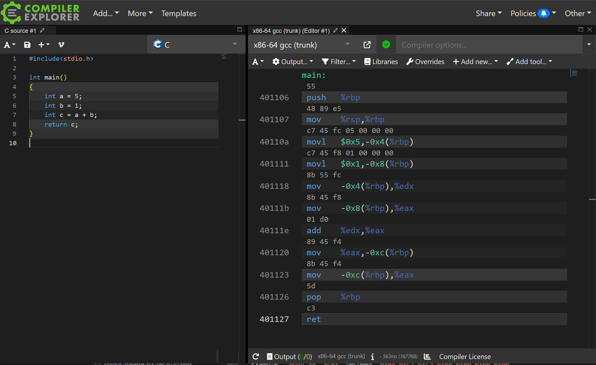

I have worked with a variety of programming languages in the 10 years I have been programming professionally, and I covered plenty of general computing topics at university, but I don't have as much experience working directly with the processor.

In the languages I've used the most (JavaScript, C# and Kotlin), the CPU is hidden behind abstractions and programmers are almost encouraged to not think about the mechanics of how their code actually runs.

Recently I got the urge to strip away all these layers and get a better understanding for what's happening under the hood, and see how the programming sausage gets made. To do this I decided to learn Assembly.

## What Even is Assembly?

To give an idea of where Assembly language fits on the totem pole of programming languages, we can look at a simple example. The following code sample is written in C (which is itself already quite "low level" by modern standards) and simply adds two numbers together:

```c
int main()
{
    // Store the number 5 in a variable
    int a = 5;
    // Store the number 1 in a variable
    int b = 1;
    // Add those two variables together
    int c = a + b;
    // Return the result to the caller of the function
    return c;
}
```

Next we can take a look at how the same code (compiled using [Godbolt](https://godbolt.org/)) would be transformed into Assembly:

```gas
main:
    push   %rbp
    mov    %rsp,%rbp

    # Store the number 5 in a variable
    movl   $0x5,-0x4(%rbp)

    # Store the number 1 in a variable
    movl   $0x1,-0x8(%rbp)

    # Add those two variables together
    mov    -0x4(%rbp),%edx
    mov    -0x8(%rbp),%eax
    add    %edx,%eax
    mov    %eax,-0xc(%rbp)

    # Return the result to the caller of the function
    mov    -0xc(%rbp),%eax
    pop    %rbp
    ret
```

There's some inefficiency in that example because values are being moved around a bit more than necessary, but it hopefully gives you an appreciation of how small and atomic the operations are that are available in Assembly language. The actual addition happens in a single instruction (`add %edx,%eax`) but there are a lot of extra steps involved just moving data around.

These operations are very close to what a processor actually receives and runs in practice. The final step is to "assemble" the Assembly instructions into their numeric equivalents, known as machine code, which is the native language the CPU operates on. The `add` instruction becomes `01 d0` (in base 16, or hexidecimal), but in practice it will be sent to the processor as the binary equivalent: `000111010000`.



## Learning to Program with Assembly

After a couple of false starts with free resources I found online, I decided to pick up the book Learn to Program with Assembly by Jonathan Bartlett.


Before I endorse this book too strongly, I do have a couple of gripes to raise.

Johnathan Bartlett had previously released a freely available 32-bit Assembly book called [Programming from the Ground Up](https://download-mirror.savannah.gnu.org/releases/pgubook/ProgrammingGroundUp-1-0-booksize.pdf), which I had tried out before realising I would have a smoother time on my computer with the more recent 64-bit Assembly book.

Having worked through the first few chapters of both, one thing I can say is that the latest book is quite slow to start. Both books broadly cover similar topics, and Learn to Program with Assembly is probably deeper and more thorough, but I felt it spent a lot of time up-front enumerating all the possible basic instructions, and took a while to get to some more "fun" topics like function calls or memory allocation.

Another roadbump is that the book has loads of accompanying code samples, or it _should_ have accompanying code samples. The start of the book has a URL which turns out to be dead, and when you eventually find [the correct repository](https://github.com/Apress/learn-to-program-w-assembly) there are a huge number of code samples missing.

The samples are also printed in the book, but there are a couple with bugs or problems which you need to dive in and debug. People have been raising issues listing the problems and suggesting errata (myself included) on Github, but there doesn't seem to be much activity from the author or publisher on that repository.


In a strange way, it was actually useful to have flaws to work around, because it was a good motivator to understand the code in detail, open the debugger, and get familiar with some of the tooling. GDB (GNU Debugger) is incredibly powerful, but a bit arcane if you're used to modern graphical tools, so it is helpful to build up some muscle memory navigating around.


On the whole though, my experience with the book was pretty positive. I haven't worked through a programming book cover-to-cover like this since I was a teenager - which has to count for something. The content is broad and well explained, and you leave with a good understanding of topics like:

- Functions, calling conventions, foreign code, and system calls.
- The stack, the heap, memory allocators and how to get more memory from the operating system.
- How higher level concepts from other programming languages can be translated into Assembly.
- A relatively extensive set of instructions, including things like SIMD (Single Instruction, Multiple Data).


The book covers x86-64 Assembly running on a Linux machine. I ran all the samples on Windows within WSL, which worked without any real problems. If you're using a different system for development you might want to look for a more relevant book, because instuction sets and function calling conventions will vary.

One pro for learning on Linux is that the operating system is very open and doesn't hide anything from developers. As an example, Linux publishes documentation on the available syscalls, whereas windows does not and expects you to use their wrapper DLLs. If you'd like to get some exposure to interactions between programs and the operating system then this is a big plus.

## Assembly is Simple but Difficult

Assembly code has a reputation among some programmers for being difficult to understand or work with. In some ways that isn't true, the footprint of the language (in terms of the core concepts the language provides, or the suite of instructions available) is actually quite small.

For each line of code there is no magic happening behind the scenes, hidden behind abstract constructs provided by the language. The processor does exactly the instructions you write, no more and no less, and in that regard Assembly is actually incredibly simple.

### Writing a Log Function

The fact that Assembly does so little for you is also what makes it difficult though. Lets say, for example, you want to log a debug message to the console during your program's execution. One method of implementing this in pure Assembly code would involve:

- Allocating the memory to hold the string which you want to print, because there is no built in string allocator. You can often work around this by using strings declared within the data section of an executable, if you know the string you want to print at compile time.
- If the debug message contains any decimal values, you will need to convert these yourself. There is no tool already available which can output the ASCII characters for a base-10 number given a binary value as input.
- If the debug message contains multiple parts (e.g. a template string and decimal value), you will need to concatenate or format the string yourself.
  - This will probably involve more memory allocation for the complete string.
  - Assembly itself doesn't even really define the concept of a string, that is something you have to figure out or design yourself.
- Once you have fully assembled your debug message, you'll need to pass it on to the operating system using syscalls. In the case of printing a string to the console, you will probably want to call the `write` syscall, passing the file descriptors for `stdout` or `stderr`.

There is a simpler solution, which involves calling out to code in a library (often written in a higher level language like C). On the other hand, working through the steps above at least once does give you some really good perspective and appreciation for how much work is happening when you do even some of the most basic operations in other programming languages.

### Keeping Track of Variables

One other aspect of writing Assembly which is more difficult than I was expecting is simply keeping track of data local to a given function, or what other languages would call variables.

There are no variables in Assembly unless you create them yourself by either manually allocating space for them on the stack, or leaving a value in a register so that you can refer to it later.

The former (stack allocation) is probably the most reliable, but involves more manual movement of values to and from the stack. This can be seen earlier as seen in the earlier example converted from C, with the references like `-0x8(%rbp)`.


Leaving values in registers is appealing on the surface because it involves fewer instructions, but I found it means you have to keep a much larger mental model of which values are in which register at which time, and which may be clobbered by function calls. I'm sure this method will be much more error-prone in the long run, unless you can have a compiler track the register use for you.

## Where to go Next

At this point I feed relatively confident reading and understanding Assembly, I have written a couple of thousand lines of code and have debugged a handful of broken samples.

I have also tried my hand at writing a memory allocator from scratch myself in Assembly. It can allocate and free blocks of memory by moving the system break, but the feature set beyond that leaves a lot to be desired. On the other hand, it was a useful exercise in terms of problem solving using the tools I'd learnt from the book.

I will probably take a little break from Assembly for now, but I have a couple of other ideas for where to take this next when I return:

- I have been thinking that some coding challenges like the annual Advent of Code event would be a good opportunity to put my Assembly knowledge through its paces.
- I'd love to take the next step down towards the CPU, and build something which utilises machine code rather than Assembly. There's something appealing about the idea of crafting a binary executable where I have calculated every single byte myself.
- I don't have a grand idea for the design of a programming language, but I would like to experiment with creating a simple compiler, to push my knowledge upwards towards higher level languages and explore compiler design.
- My experience with Assembly so far has primarily been with the x86-64 instruction set, but there are some other modern compiler targets like Arm or WASM which would help get a broader view of lower level programming.
