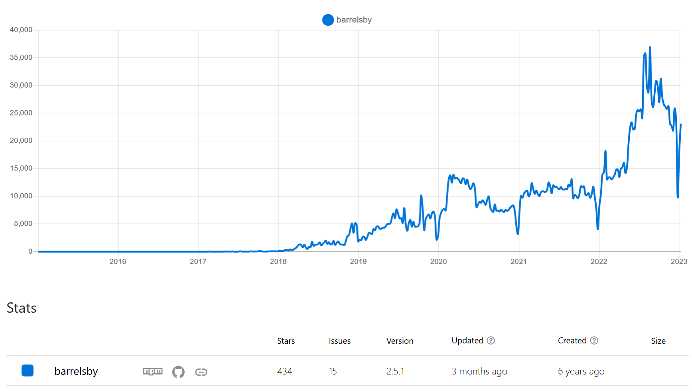

Barrelsby is a node.js utility that will automatically generate `index.ts` files for TypeScript codebases.

A barrel file looks like this:

```TypeScript
export * from "./DropDown";
export * from "./TextBox";
export * from "./CheckBox";
export * from "./DateTimePicker";
export * from "./Slider";
```

It can help you go from messy imports like this:

```TypeScript
import {DropDown} from "./src/controls/DropDown";
import {TextBox} from "./src/controls/TextBox";
import {CheckBox} from "./src/controls/CheckBox";
import {DateTimePicker} from "./src/controls/DateTimePicker";
import {Slider} from "./src/controls/Slider";
```

...to something tidier like this:

```TypeScript
import {DropDown, TextBox, CheckBox, DateTimePicker, Slider} from "./src/controls";
```

...or even this:

```TypeScript
import * as Controls from "./src/controls/index";
```

I originally created Barrelsby for a Backbone.js codebase at work. We had big directories of view and model files and, after reading about the concept of barrel files (sometimes known as auto-index files) in the Angular 2 documentation. I couldn't find a library I liked to do the job, so I created one.


Barrelsby has ended up as one of my most successful programming projects, at the time of writing it has:

- 2,565,542 lifetime downloads from NPM
- 434 stars
- Commit contributions from 10 other developer, including 1 maintainer!



While I don't use Barrelsby as much as I'd like personally, it feels great knowing I've made something people are finding useful.
