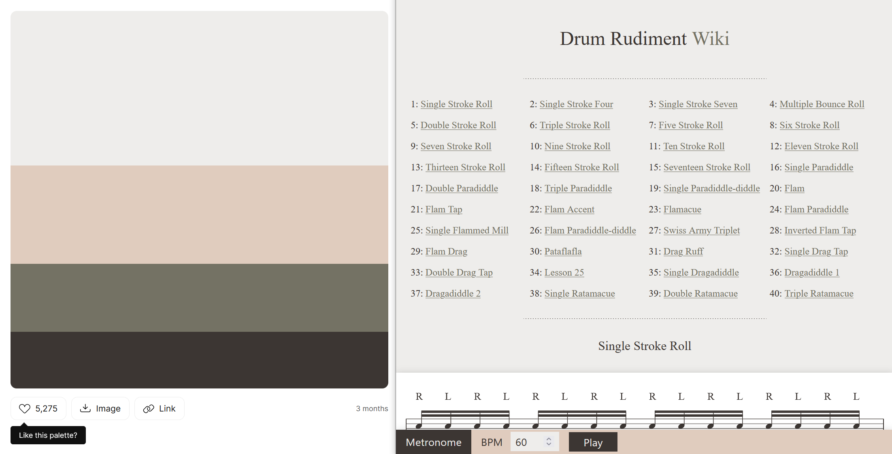
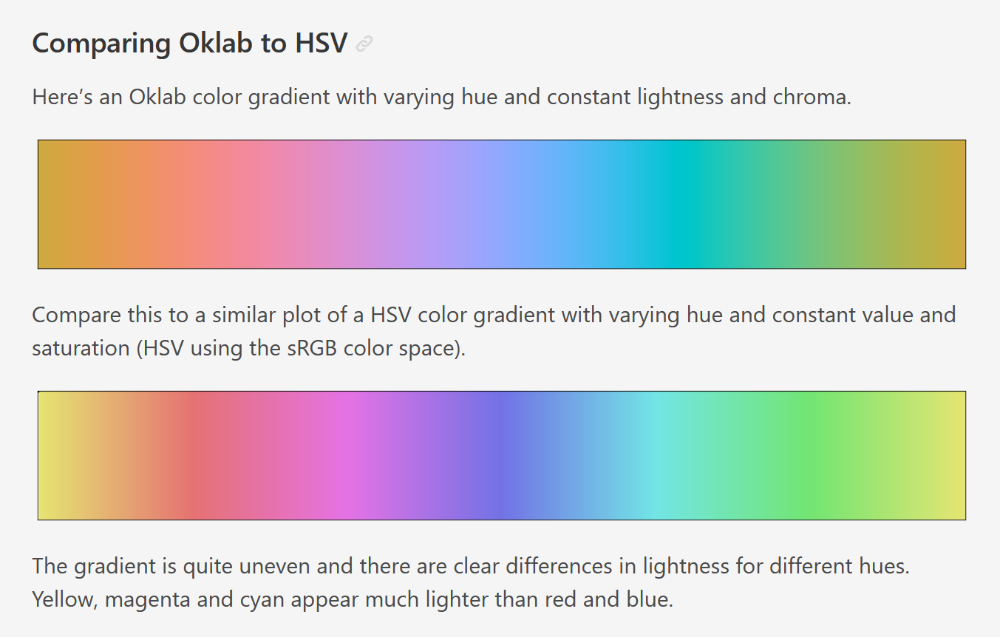

If you've taken a look at some of my other posts you might've noticed that I have accumulated a pile of small projects, often with a visual component to them like websites and games. For these projects I typically just search online for colour palettes and pick one I think fits. I used [this ColorHunt palette](https://colorhunt.co/palette/eeedebe0ccbe7472643c3633) on my recent [Drum Rudiment Wiki](https://bencoveney.com/posts/rudiment-wiki.html) project for example.



I recently decided that I would like to tie all my projects together with some kind of consistent theming - like a "[personal brand](https://twitter.com/FreyaHolmer/status/1508492998958632962)". It would be nice to have a set of ready-to-go colours that worked well together, and if all my projects "felt" like Ben projects as a result.

## Definitions and Constraints

There are many ways to think about colour, but for me the most natural breakdown is:

- **Hue:** Where in the rainbow the colour sits. Often this is expressed as degrees on a circle.
- **Lightness:** Whether the colour is _light_ (close to white) or _dark_ (close to black). I think of colours that only differ in lightness as different _tints_ of the same colour.
- **Saturation:** Whether the colour is _rich_/_colourful_ (with a lot of saturation) or _muted_/_greyscale_ (without much saturation).

For a lot of the terms in this domain there are overlaps. Different people and tools will mix-and-match them interchangably. Lightness sometimes gets referred to as luminance or brightness. Saturation sometimes gets referred to as colourfulness or chroma. There are precise definitions out there, but the differences mostly won't be relevant for this post.


I don't think I am an artistic person, any time I need to do something creative it ends up being a bit analytical: trying to take the parts I like from references, and finding constraints that might help guide me towards a good solution. With that in mind, I settled on the following:

- **Usage:** - The colours should would work well on websites first-and-foremost. It would also be good to keep in mind data visualisations, game art (which commonly uses a smaller constrained palette) and some "nice-to-have" usages like syntax highlighting or terminal output.
- **Hue:** - Strike a balance between having enough hues to be broadly useful on a range of projects, but not too many hues that there is no personality.
- **Lightness:** - For each hue, I want a complete set of evenly-spaced tints, ideally so that that:
  - Each tint has meaningful contrast from the previous one.
  - There is a complete range of options from dark to light, and you could invert a "light theme" and have a reasonable-enough starting point for a "dark theme", and vice-versa.
  - The tints are consistent across hues, so that a design can be switched from red to blue without needing much modification.
- **Saturation:** - I would ideally have distinctive bright options to use as primary design colours and highlights, but also some greys and muted options for typography, backgrounds and layouts.

## RGB Doesn't Make Sense

Colour is one of those things that seems intuitive until you start poking around beneath the surface. Almost everyone sees colours, and can point to things that are red, and knows that you can make green by mixing together blue and yellow, so how hard can it be?

If you've ever done anything visual on computers you've probably also seen a colour picker, or seen colours expressed as component parts (often red, green and blue - or hue, saturation and lightness/value).


On the surface then, my task seemed simple: Step through those "component parts" of colour, stopping at regular intervals and adding the colour to my palette. At the end I'd have a visually consistent set of colours and could call it a day.

This is where things get complicated though: _The levers you typically get access to when picking colours do not behave in a predictable way_.

If you set fixed values for saturation and lightness/value, and scroll through a range of hues, the colours you end up with do not look like they have matching brightness. This can be seen by passing a colour picker through a greyscale filter and noticing how the rainbow turns into waves of grey, rather than a solid grey shade.


To give a clearer example, the image below shows 2 colours:

- **Full green:** 255/255 units of green, mixed with 0 red and 0 blue.
- **Full blue:** 255/255 units of blue, mixed with 0 red and 0 green.


This might make sense intuitively: _Of course that deep blue is darker than the lime green, blue is a darker colour_. But this clashes with what the computer tells us: "The saturation and lightness of these colours is the same, they only differ in hue".

We have the same total number of "colour units" as input, so why do they not look closer in lightness? What I wanted to create was a set of colours that have equivalent _perceived brightness_.

When you start googling "perceived brightness", you quickly find out this is quite a deep rabbit-hole. There are a lot of systems for describing colour out there, building up from the different wavelengths of light, to the way the rods and cones in our eyes interact with those wavelengths, to the fact that all of this is entirely subjective. Nobody will ever know if two people experience a specific blue in the same way - so does the term "equivalent perceived brightness" even make sense?

I decided that I probably didn't want to re-invent the field of colour science from the ground up, and instead started looking at colour spaces that people had built in the past.

## HSP and Weights

One option for calculating the "perceived brightness" of a colour is to take the red, green and blue components of a colour and multiply them by a weight. The weights are effectively: "roughly how much each component contributes to the lightness of a colour".

```JavaScript
// An example of weighted brightness, from HSP
brightness = sqrt( .299 R² + .587 G² + .114 B² )
```

This is the approach taken by Darel Rex Finley in their [HSP colour system](https://alienryderflex.com/hsp.html), where the P stands for _Perceived brightness_. He, in turn, derived his weights from Adobe Photoshop's RGB-to-Greyscale conversion, which implies they are doing something similar.

Without a doubt, the results from his HSP system make much more sense compared to what a typical HSL or HSV system tells us:


This method of using the weighted RGB components of a colour to calculate brightness isn't uncommon. If you've ever checked that the text on a website has sufficiently contrasts against the background colour, then you probably did it using a tool based on the W3C Web Content Accessibility Guidelines, which use similar weights in [their implementation](https://www.w3.org/TR/WCAG20/#relativeluminancedef).


This route felt like an over-simplification though. Surely there had to be more to this entire field of colour science than those 3 weights?

There was another aspect of these math functions that didn't sit right with me either: when you ran the calculations in revere, to calculate RGB for a given hue and perceived brightness, you sometimes got values way outside the expected 0-255 range for each component and needed to clamp them back in. More on this later…

At this point in my journey I found a video by Acerola. I don't know that all of the (many, many) jokes land, but he gives a better tour of the ins-and-outs of colour than I could do in this post. Crucially though, what I got out of this video was learning that Oklab exists, and that it solves all my problems.

https://www.youtube.com/watch?v=fv-wlo8yVhk

## Oklab

When it comes to colour spaces, [Oklab](https://bottosson.github.io/posts/oklab/) (and its siblings Okhsv and Okhsl) is probably just _the one you should use_. It was developed recently to solve problems with other colour spaces that are too technical for me to understand and describe, but the gradients speak for themselves:



Oklab has a few qualities that make it perfect for generating colours for my palette:

- It allows you to generate colours with a constant percieved brightness.
- It maps well to-and-from sRGB, which is the "proper" name for the RGB colour space commonly used on computers.
- Despite only being around since 2020, there are many implementations out there. I used [Culori](https://culorijs.org/) but it has been very quickly adopted directly into web browsers with [native CSS support](https://caniuse.com/mdn-css_types_color_oklab).

At this stage I knew enough about colour to know that I knew very little about colour, but was confident enough that Oklab was the right tool for the job.

## References

Before starting the task of generating the colours, I decided to try and analyse some other common colour palettes online and build up a bank of reference information I could compare against. I chose a few palettes and fed them through oklab colour functions, and output the results [in a simple HTML file](https://bencoveney.com/bctheme/reference.html).


I chose to pump a few different palettes through this tool:

- Some common web palettes, to get a good lay of the land:
  - [Tailwind](https://tailwindcss.com/docs/customizing-colors)
  - [Material Design](https://m2.material.io/design/color/the-color-system.html#tools-for-picking-colors)
  - [Bootstrap](https://getbootstrap.com/docs/5.2/customize/color/#all-colors)
- Some of the most popular pixel art palettes on [Lospec](https://lospec.com/):
  - [Pico8](https://lospec.com/palette-list/pico-8)
  - [Nes](https://lospec.com/palette-list/nintendo-entertainment-system)
  - [Endesga 32](https://lospec.com/palette-list/endesga-32)
  - [Apollo](https://lospec.com/palette-list/apollo)

The Apollo palette in particular is a good one to learn from, because the creator (AdamCYounis) has created a great accompanying tutorial explaining how he arrived at those values, including hue shifting and "colour ramps" that converge and overlap.

https://www.youtube.com/watch?v=hkrK65FPmDI

The web palettes I looked at all included tint values within each hue that range from `0` (lightest) to `1000` (darkest), with values of `500` typically looking the most saturated.

Comparing the `500` tints of those different palettes, it looked like Tailwind keeps the most consistent brightness across the range of hues. Bootstrap jumps around all over the place, whereas Tailwind has a very smooth "OKLAB gradient" feel to it.


Focussing in on Tailwind, there's a few places where I think it doesn't stay so uniform though. Take their orange, amber and yellow colours for example:


Towards the lighter end of the scale, Amber looks like it overlaps quite a lot with Yellow, but the hue shifts away towards orange the further along you go.

You might also notice that you get a lot more of the lighter shades for each colour. In the screenshot above this is emphasised by the contrast against the dark background. Switching to the light theme makes things feel a bit more evenly spread, but the effect is still there.

For both of these points, we can see this backed up in the data if we run the Amber set through OKHSL: There is a difference in hue `H` of over 45 degrees (which is over an eighth of the way around a colour wheel), and the steps in lightness `L` are much smaller between the lighter colours.


I don't mean any of this as a knock towards Tailwind. Their colour palette looks great, and works well on a huge number of websites. I'd love to end up with a result as good as theirs.

It is interesting though to try to understand why their palette looks the way it does, and make some educated guesses at the tradeoffs they made when picking their colours. I doubt that a "hue consistency" goal is what they were striving for, and I would guess instead that they opted for high saturation in favour of rigid regular steps between their colours.

## Colour Creation

Now that I was armed with a little bit of knowledge, it was time to start generating the colours.

I decided to start with 12 hues evenly spaced around the colour wheel. 12 seemed like a reasonable choice because:

- It gives a good enough coverage range whilst keeping the total number small.
- Being divisible by numbers like 2, 3, and 4 means you can easily pick colour palettes that fit a complimentary, triadic or square colour scheme.
- Being divisible by 6 seemed advantageous too, because there are 6 ANSI colours (excluding greyscale values) supported in terminal applications.


I also borrowed the tint values from Tailwind, Material Design and Bootstrap, ranging from 0 to 1000 in steps of 100.

I built a simple HTML/JS playground where I could get the colours generated. I added parameters to pipe in initial hue, saturation and lightness values through OKLAB and output the results into a colourful table.


You're welcome to [take a look](https://bencoveney.com/bctheme/) at the playground itself, but be warned that it was made as a dev-tool rather than a complete polished website. Expect the page to churn a bit when you load it, and the layout to be broken on mobile.

Because I was generating the palette programattically, I was able to add sliders to control the level of saturation across the entire palette at once. Being able to tinker inside the playground directly and not needing to switch back and forth to the generation code really helps focus on the visuals.


In addition to the richer shades, I added a few more sets:

- A full white/black colour, and a set of greys with no saturation at all, because they are always useful to have on hand.
- 2 less saturated sets at opposite ends of the colour wheel (a blue and a yellow), because it is quite common on the web to use off-white (or off-black) for backgrounds/text. They tend to be less harsh on computer displays, and muted yellows can give a more natural paper-like look.


While evenly-spaced tints of 100 give a good range of colours, I was conscious that I needed plenty of very bright and very dark colours, to give enough distinct options when using the colours as backgrounds. Tailwind and Material Design solve this problem by giving a couple of bonus tints at the 50 and 950 marks.


I shamelessly copied this too, and also decided to add an option to skew the range of tints more towards the light and dark range. I implemented this by blending towards a [smootherstep](https://en.wikipedia.org/wiki/Smoothstep#Variations) function at the lighter and darker ranges, also controllable using a slider.


In addition to generating the colours, I also added a load of visual samples to the playground, so that I could see the colours in context. These included the colour scheme circles/dots above, but also some hypothetical website-like usage.


As a stretch I wanted to see if the colours would work well when applied to syntax highlighting or terminal output. It turns out that this problem isn't too far removed from picking colours that would be good for the web: they need to be distinctive and have high enough contrast to make the text readable.


To produce the terminal output sample I tried a couple of different ANSI-to-HTML converters, but in the end they made quite messy output or were slightly too involved to get up and running. In the end I churned out some HTML and CSS by hand.

For syntax highlighting, I was able to yoink the output from the [highlight.js demo page](https://highlightjs.org/demo) without too much modification.


## My Yellow is Not Yellow

Looking at the colours I have generated, I'm pretty pleased with how well they fit together, but there are places I think they don't look perfect. The example that sticks out most clearly to me are the yellows:


The yellows look vivid and "yellow" towards the brighter end, but as you move further right they begin to look grey. I don't think those darker yellows look particularly nice.

Again, you can kind of trust intuition here: A saturated yellow is natually a bright colour. It is not possible to generated yellow that is both saturated and dark.

Turning the saturation up to 100% in the playground illustrates this problem across the whole range of hues. Something about the colour generation starts to break down, there are no colours available that satisy the all the constrains.


The problem with my method of generating colours is that is is constrained by reality, and in reality:

- There are some colours you could imagine (like a very saturated and very dark yellow) which humans cannot experience.
- The subset of remaining possible colours is cut down even further, because the display you use (your phone screen or monitor) cannot reproduce every colour that humans can see.
- That subset can be cut down again, because the software you use (in this case a web browser) may not be taking advantage of the entire range of colours your display supports.

The set of colours you can accurately represent is your "gamut". In practice, if we want our colours to be available in the widest range of contexts, we need to stick to the sRGB gamut.


At this point I'd definitely recommend having a play around in the excellent [OKLCH colour picker](https://oklch.com/), built by [EvilMartians](https://evilmartians.com/chronicles/oklch-in-css-why-quit-rgb-hsl). It helps give a really good visualisation of what colours are available in practice, and where the gaps are.

With yellow, for example, the saturated values are skewed incredibly far to the right of the lightness scale. At this level of lightness there are no other hues with a matching level of saturation.


Compare this to blue, which behaves the opposite way. The saturation hits its peak much lower in the lightness graph.


This explains why the yellows don't look right to me: The colours I am trying to create either cannot be rendered, or simply do not exist.

## Gamut Correction

When you input parameters into a colour system, and then ask for it to give you back values in the sRGB space that do not exist, something needs to happen to correct that discrepancy and decide which colour to display on the screen.

This explains the weird numbers I was seeing as output from the HSP colour space above: the colour system was giving me output values it thought would satisfy my inputs, and leaving it up to me to figure out how to turn them into a "valid" colour.

The process of getting these un-displayable colours back inside a displayable colour space is called gamut mapping, or gamut correction, or gamut clipping. There are a few different approaches you can take:

- You can clamp any RGB components back inside the RGB space, for example `rgb(1000, 255, 0)` becomes `rgb(255, 255, 0)`. This is what happens often in practice because it is quick and easy to implement on computers. The downside is that this can be unpredictable, and will often shift the hue of the clamped colour.
- You can adjust the saturation or lightness inputs until you get an output that isn't invalid. This lets you preserve the hue, and if you do this proactively then you can do the adjustments in the colour space of your choosing - Oklab in my case. The downside is that reducing saturation will shift things towards grey, as I was seeing happen with my yellows.
- You can manually adjust the hue, to find one where there are valid options available. This explains what Tailwind were doing when they shifted their yellows towards red. This can look really nice, but requires some artistic decision making.


I did not want to be making too many artistic decisions myself and instead just wanted to churn numbers, so the best option available is to drop the saturation on the Oklab inputs. This preserves the lightness and hue of the output, and I would just have to come to terms with the fact that my dark yellows are a bit grey.

There is another option available, which would be to drop the saturation across the whole palette. This would let me avoid gamut correction and keep the steps between colours really consistent, but the tradeoff here is that _all colours would be grey_, which doesn't seem like a great tradeoff.


## CSS Support

sRGB is the lowest common denominator of colour gamuts and supported everywhere, but others do exist. In particular, CSS now ways to work with the `p3` and `rec2020` colour spaces inside [`color()` definitions](https://caniuse.com/css-color-function) and [`@media` queries](https://caniuse.com/mdn-css_at-rules_media_color-gamut), with good levels of support in modern browsers.

Most people will not be using displays that support these larger colour spaces, but it would be nice to take advantage of them where possible.


One thing to be aware of when using these colour spaces is gamut correction. The [CSS color 4 spec](https://www.w3.org/TR/css-color-4/#css-gamut-mapping) _requires_ that gamut correction should happen inside the Oklch colour space, which would preserve hue. In reality browsers will often use the clamping method, which may result in unexpected hue shifting.

To stay in control of gamut correction, and get output colours that match the input parameters as closely as possible, we can take the following approach:

1. When generating the colours, always gamut-correct the results to sRGB ourselves and check we are happy with the results. These will be the most-widely-supported colours that most people will see.
2. Build alternative sets of gamut-corrected colours in the other colour spaces. Only try to use those alternative colours when we can be sure that colour space is supported, so that we don't end up in a scenario where the browser is doing gamut correction using a substandard method.

In practice the CSS for this looks something like:

```css
:root {
  --color-red-500: rgb(192, 73, 89);
}

@media (color-gamut: p3) {
  :root {
    --color-red-500: color(display-p3 0.6974 0.3152 0.358);
  }
}

@media (color-gamut: rec2020) {
  :root {
    --color-red-500: color(rec2020 0.5913 0.287 0.2985);
  }
}
```

## Addressing the Display in the Room

Throughout this post I have been talking a lot about the ins-and-outs of describing a colour to the computer, but I have glossed over an important second half of this process: how the computer displays those colours to the user.

Like before, this is a part of the process where there are lots of unknowns to consider:

- What colour spaces are supported by the software?
- What colour spaces are supported by the display? Sometimes only a subset of the colour space is supported.
- When the software/hardware cannot display a colour, how will it be gamut-mapped to one it can display?
- How is the display configured? How are the brightness and contrast set? Is there any software [like flux](https://justgetflux.com/) tampering with those display settings?
- What is the lighting environment like where the display is being viewed? Is the screen under bright sunlight or is it a dark dimly-lit room?
- Will all users see colours in the same way? _Definitely not, bearing in mind colour-blindness exists._


There are ways you can control for some of these variables when generating a colour palette, especially if you are willing to spend money. You can buy a fancy monitor that supports a wider range of colours, and purchase a display calibration tool to get your monitor more finely tuned.

These steps might help you personally get a more accurate view of the colours _you_ are defining, but it doesn't give you control over how _other people_ will view your colours. _There's no way to prevent someone loading your website on a crappy burnt-in CRT in a sub-bathed room with intense screen glare._

With that in mind, the steps I have taken are:

- Do everything I can to avoid uncontrolled gamut correction.
- Use any-and-all built-in display calibration methods (for example the "Calibrate Display Colour" option in Windows 10).
- Test the colour palette on as wide of a range of displays and lighting conditions as you have access too, especially bad ones.

## The Final Result

Reading back through this post, it feels like there are 2 parts:

1. I set out some goals and constraints that I thought might lead me to a colour palette I liked.
2. I slowly uncover all the ways in which this was a flawed idea.

Throwing a bunch of maths at a colour wheel and expecting to get something visually appealing out the other side is a very programmer-brained way to approach a problem.

The ins-and-outs of colours have been interesting to learn, and there is still much more to wrap my head around. On the other it feels like colour sits the center of a cursed Venn diagram, somewhere between maths/physics, legacy technical limitations and the subjective human experience.

With all that said, I am pleased with where I have ended up. I think the colour palette generally look good. In the places where I think it looks bad, I understand the reasons why, and I am OK with the tradeoffs.


In terms of where I could take this in the future:

- I'd like to experiment with changes in hue. This could be "looking at other ways to fix the yellows" but also more artistic ideas like "making dark colours feel cold, and light colours feel warm".
- Given the original goal was to tie some of my projects together with some visual consistency, it would make sense to start putting it through its paces on some existing projects.
- Now that I have a half-baked solution for colours, perhaps I could try some half-baked solutions for typography or icons next.

## Attribution

- [`HSL_color_solid_cylinder.png`: SharkD](https://commons.wikimedia.org/wiki/File:HSL_color_solid_cylinder_saturation_gray.png), [CC BY-SA 3.0](https://creativecommons.org/licenses/by-sa/3.0), via Wikimedia Commons
- [`CIE1931xy_gamut_comparison.svg`: BenRG and cmglee](https://commons.wikimedia.org/wiki/File:CIE1931xy_gamut_comparison.svg), [CC BY-SA 3.0](https://creativecommons.org/licenses/by-sa/3.0), via Wikimedia Commons
- [`CIE1931xy_gamut_comparison_of_sRGB_P3_Rec2020.svg`: Myndex](https://commons.wikimedia.org/wiki/File:CIE1931xy_gamut_comparison_of_sRGB_P3_Rec2020.svg), [CC BY-SA 4.0](https://creativecommons.org/licenses/by-sa/4.0), via Wikimedia Commons
- [`Triadic colors.png`: Weegaweek](https://commons.wikimedia.org/wiki/File:Triadic_colors.png), [CC BY-SA 4.0](https://creativecommons.org/licenses/by-sa/4.0), via Wikimedia Commons
