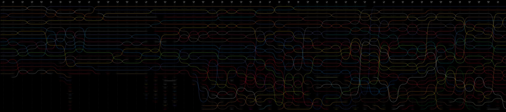
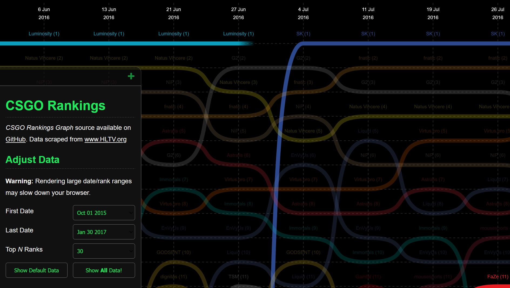

As one of my first forays into SVG graphics was to build a visualisation of CSGO team rankings over time.

To collect data to power this graph, I wrote a [small jsdom script](https://github.com/bencoveney/CsgoRankingsGraph/blob/master/loader/loader.ts) to scrape information from [HLTV's team ranking pages](https://www.hltv.org/ranking/teams/). Automating the data loading process gave me a big dataset to play around with.

Building visualisations in SVG gives you the opportunity to make the experience much richer and more tactile. I added some simple filters to make it easier to view the data. I also added some simple interactions like highlights on hover/click which really leverage the SVG implementation to let users focus on specific trends in the data.

The data in the visualisation hasn't been updated since 2017 so it's a bit out of date, and HTLV have undoubtedly changed their HTML format since so the scraper probably needs to be updated. Nevertheless at the time this was a great way to experiment with SVG, data visualisation and scraping.
