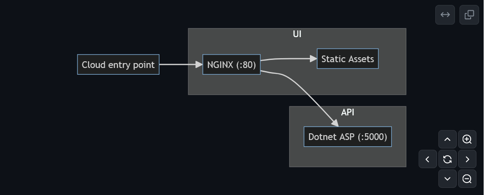
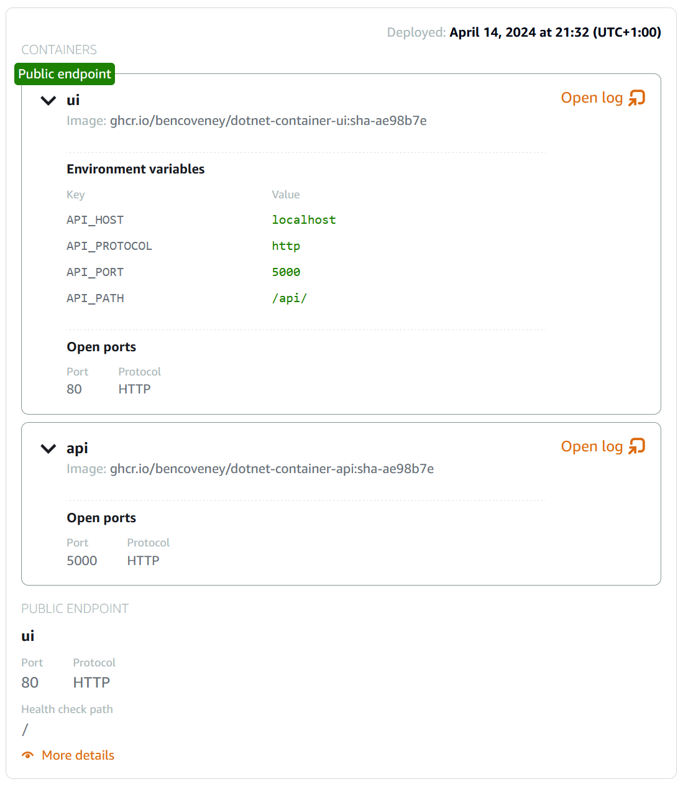

If you've seen many of the other pages on this blog, you might've noticed that I typically stick to front-end projects (TypeScript, CSS, HTML). This is less that I am unfamiliar or uncomfortable with backend technologies, and more because I find the visual/tactile nature of front-end development more rewarding. It helps that Github Pages make it easy to get a static website created and published quickly at 0 cost.

There are, however, some cases where it would be useful to have a backend component available. I have some project ideas where a server-side component would be useful, and it would've also been useful during my recent job hunt to have some evidence of familiarity with backend tools, technologies and workflows.

With this in mind, I decided I would try and create some boilerplate for a simple full-stack application. I wanted a minimal project structure, which defines just enough parts to be useful jumping off point, while allowing bits to be chopped and changed depending on whatever project I decide to build. I also wanted to demonstrate proficiency at configuring CI, containers, networking, and all the parts necessary to hook a full-stack project together. I opted to keep the list of dependencies as small as possible, in the hope that it will be easier to keep the project up-to-date without too much hassle.

## Application Architecture

On the server side I opted for C#, given it is the technology I have the most familiarity with. I think this chunk of the app best-achieves the flexibility goal: The only real requirement of container is that it starts a server listening on port 5000. This will make it really easy to swap out in the future, if I want to try out a different programming language for example.

I was less sure of how I wanted to structure the front-end of the project. I wanted to be able to support pivoting to a range of project structures:

- A single-page app where the front-end is built using a framework like React. In that case
- A server-rendered app where the a lot of the content is rendered ahead of time.
- An entirely server-driven app, using a tool like HTMX to add front-end interactivity.

I also needed to consider what the network entrypoint to my app would look like, as different cloud/PAAS providers will have different capabilities in terms of load balancers and certificate management.

Another factor to think about was how the compiled UI would be hosted. I wanted a solution that didn't use additional dependencies for now, but I know it isn't uncommon for bundled UI assets to be hosted in a simple file store like S3, or as build artifacts on a CI server.

In the end the UI container is a bit of a grab-bag of functionality. At its core there is an NGINX server acting as a server for the static assets and a proxy for the API. The upside of this is that the number of moving parts are low, and the amount of configuration I need to do for those parts is small. If, in the future on a specific project, it makes sense to migrate to a different architecture (for example using AWS S3 for assets and AWS ALBs for load balancing) then it is no great loss to throw away the UI container and start afresh.

The UI is bundled together using [ESBuild](https://esbuild.github.io/), which helps keep (transitive) dependencies down while still providing support for TypeScript, CSS and a pleasant developer experience.

The local development experience involved running the component parts (API server and UI dev server) directly on your machine, as opposed to in their containers. In the event you want to adopt, test or debug a containerised configuration, there's a `docker-compose.yml` file pre-configured and ready to run.

## Deployment

In order to prove out the cloud compatibility of the project, I wanted to get it up and running on a cloud service. I opted for AWS lightsail, because it is quick and easy to configure, and most importantly is included in AWS' free tier!

The container images are built in CI using Github Actions and automatically posted to Github Packages Container Registry, ready for deployment.

## Round Up

I think I've met my original goals for the project at this point, but time will tell how adaptable this boilerplate is for future projects.

Part of the balance I have tried to strike is delivering a good baseline without bloating the project with lots of opinionated tooling and dependency decisions. With that said, there are still some ideas for enhancements I'm considering for the future:

- Adding a database like PostgreSQL.
- Extending the app with some minimal functionality, so that the demo is a little less underwhelming.
- Adding deployment instructions for other cloud providers, to help validate that the architecture isn't tied to a single cloud host.
- Add a barebones test framework, with CI integration.
