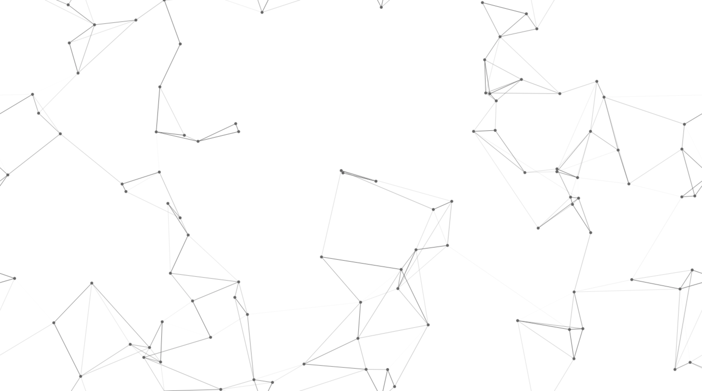

On a previous version of my personal site, I added a fancy animated background.

It is implemented using canvas and straight JavaScript. Dots fly randomly around the screen and will form "links" to any nearby dots, which fade over time. It's not even 200 lines of code, but it might be useful if you ever want to add some similar flair to a site.
