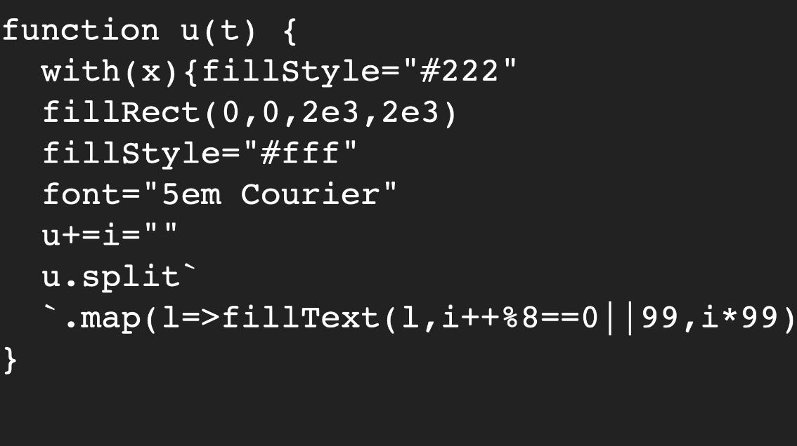
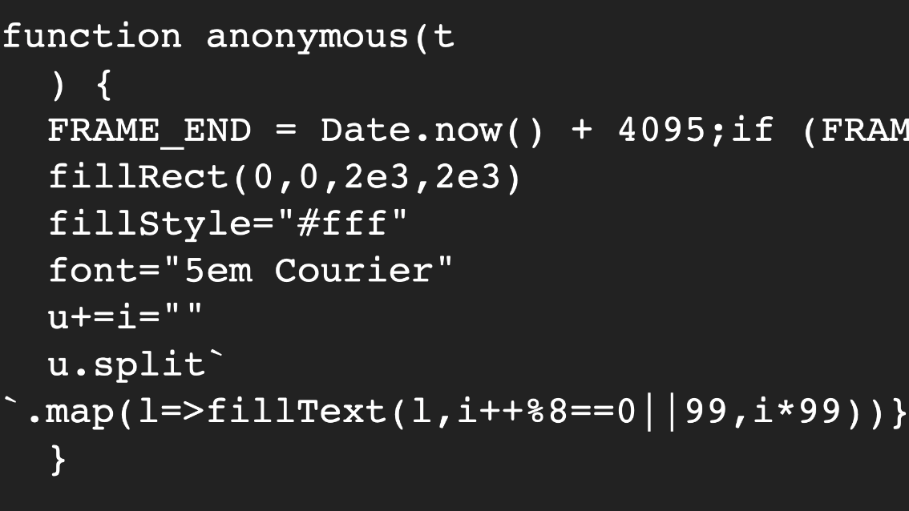

Dwitter is a code-golfing social network that gives you:

- An HTML5 canvas
- A maximum of 140 characters to write the body of a render function.
- A couple of helper variables and functions (`t` is `deltaTime`, `x` is the `CanvasRenderingContext` etc).

The goal is to try and write a minimal render function that will make something cool appear and/or animate on the canvas. To give you an idea of whats achievable, here's the default initial render function provided by the site as an example:

[./dwitter-default-preset.mov](./dwitter-default-preset.mov)

<!-- prettier-ignore-start -->
```js
function u(t) {
  c.width = 1920; // clear the canvas
  for (i = 0; i < 9; i++) x.fillRect(400 + i * 100 + S(t) * 300, 400, 50, 200); // draw 50x200 rects
} // 112/140
```
<!-- prettier-ignore-end -->

## Default Remixes

One common theme on the website is to "remix" the original default function in an interesting way - for example [here's a version I made](https://www.dwitter.net/d/16498) where the animation squashes up against the bottom of the screen:

[./dwitter-default-squashed.mov](./dwitter-default-squashed.mov)

<!-- prettier-ignore-start -->
```js
function u(t) {
  for(c.width|=i=j=k=l=0;i<9;i++,x.fillRect(910-l/2,Math.min(j,k),200+l,50))j=400+i*99+S(t)*300,k=630+i*50,l=Math.max(j-k,0),x.fillStyle=R(l)
} // 140/140 3 Nov 2019 01:35
```
<!-- prettier-ignore-end -->

You can see a few simple code-golfing tricks at play here:

- Using the syntax for declaring for loops to initialise a big wad of variables at once.
- Bolting multiple statements together using the comma operator.
- Using the [Bitwise OR assignment operator](https://developer.mozilla.org/en-US/docs/Web/JavaScript/Reference/Operators/Bitwise_OR_assignment) to assign the canvas a width of `0`, effectively clearing it ready for the next frame.

[Here's another remix](https://www.dwitter.net/d/16492) of the default function, where the animation behaves like a pen drawing on scrolling paper:

[./dwitter-default-wavy-red-lines.mov](./dwitter-default-wavy-red-lines.mov)

<!-- prettier-ignore-start -->
```js
function u(t) {
  with(x)for(a=i=0,j=200,fillStyle='#fff',fillRect(0,0,2e3,199),drawImage(c,0,1);i<j;i+=20,a=i+S(t)*60,fillStyle=R(a))fillRect(400+a*5,0,50,j)
} // 140/140 2 Nov 2019 22:25
```
<!-- prettier-ignore-end -->

To achieve the scrolling effect I am redrawing the canvas to itself each frame 1 pixel down. The top portion is then cleared to make way for the next frame of the animation.

Again, there's a couple more code-golfing techniques on show:

- The [`with`](https://developer.mozilla.org/en-US/docs/Web/JavaScript/Reference/Statements/with) statement allows shorter references to the canvas in multiple places.
- Scientific notation helps shrink down longer number literals.

## Ribbon 3D Effect

Despite having such a limited toolset, with some imagination and perseverance you can get some interesting results. I managed to create [what looks like a 3D ribbon](https://www.dwitter.net/d/16495), but in fact its just some oscillating rectangles, with the size and movement adjusted by their distance down the screen:

[./dwitter-ribbon.mov](./dwitter-ribbon.mov)

<!-- prettier-ignore-start -->
```js
function u(t) {
  for(c.width|=i=j=k=0;i<99;i++,j=i*13,k=S(i/2-t)*i+99,x.fillStyle=R(k))x.fillRect(960-j/2,j-k,j,99)
} // 98/140 3 Nov 2019 00:35
```
<!-- prettier-ignore-end -->

## Quine

> A quine is a computer program which takes no input and produces a copy of its own source code as its only output.
>
> [_Wikipedia: Quine_](<https://en.wikipedia.org/wiki/Quine_(computing)>)

Quines are another popular category of posts on dwitter. For mine I went through a few iterations before arriving at this:



<!-- prettier-ignore-start -->
```js
function u(t) {
  with(x){fillStyle="#222"
  fillRect(0,0,2e3,2e3)
  fillStyle="#fff"
  font="5em Courier"
  u+=i=""
  u.split`
  `.map(l=>fillText(l,i++%8==0||99,i*99))}
} // 140/140 2 Nov 2019 16:11
```
<!-- prettier-ignore-end -->

This takes advantage of the fact that in JavaScript you can convert functions to strings, resulting in the original function's source code.

Unfortunately this dweet has since broken as it appears Dwitter now wraps your submitted code with some boilerplate, which then shows up in the output. This could be a good example of why converting functions to strings is an unreliable way to write code!


