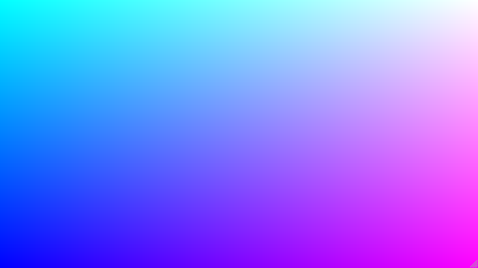
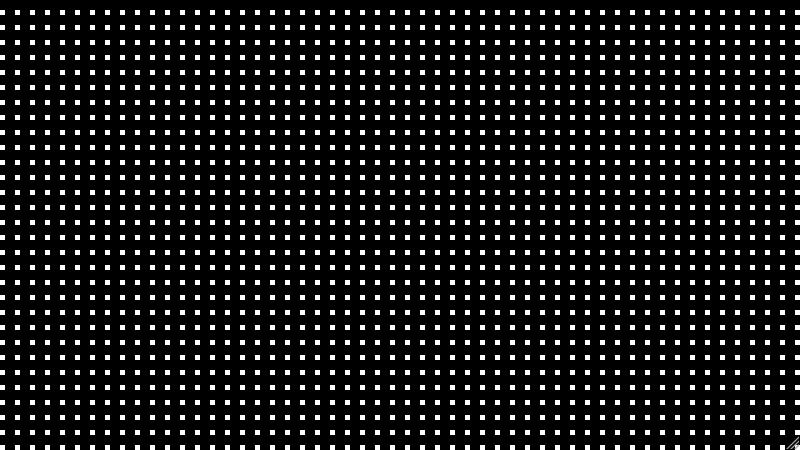
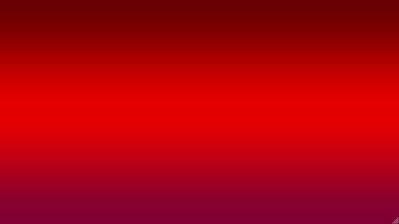
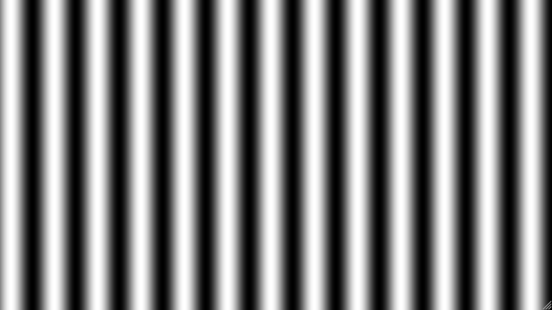
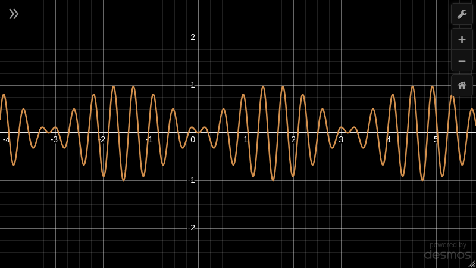
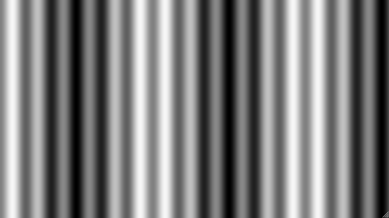

One way to add some visual flair to a web project is with a full-page animated background. We have the whole browser window to fill, so surely we can come up with something more imaginative than a flat coloured background.

You might have seen these around the web on some of the flashier websites, or in libraries like [Vanta](https://www.vantajs.com/). I made something rudimentary along these lines back in 2017 for an older version of this website.

[./fragment-shaders-dots.webm](./fragment-shaders-dots.webm)

The project, imaginatively called [dots](https://github.com/bencoveney/dots), was relatively simple: I drew some circles on a full page `<canvas>`, animated them around the screen, and gave each dot a connection to the three closest dots. I made some effort to make sure the dots and lines would wrap from one edge of the screen to the opposite side, but in the end it still looks a bit underwhelming.

There are a couple of common problems projects like this encounter. Firstly, the more exciting you make your background, the more distracting it is from whatever you display on top of it. Secondly, if the performance of these backgrounds is not carefully managed, they can seriously slow down the browser and make the website feel choppy and broken instead of sleek and advanced. My dots project suffered from both of these issues.

## Planning for performance

Most full page backgrounds will use one of a few different methods:

- A big video, sometimes played back with compression or low resolution to aid with load times.
- A `<canvas>` tag, drawn to using either:
  - The web Canvas APIs.
  - WebGL.
  - WebGL 2.
  - WebGPU.

Of these options, WebGL feels like the best option: It has been widely supported for over 10 years now, can perform well on low-powered devices, and is powerful enough to achieve some impressive visual results.

If we're using WebGL, there is a minimum set of WebGL functionality we would need to opt-in to:

- Enough geometry to fill the screen. Given the screen is a rectangle, and WebGL's primitive shape is a triange, that would mean we need at least 2 triangles.
- A vertex shader, to process each vertex of those 2 triangles. That could be a simple function which passes through each vertex without any modification.
- A fragment shader, to calculate the per-pixel colours for each of those triangles. The baseline implementation here could just return a solid colour.

> WebGL requires 2 shaders every time you draw something. A vertex shader and a fragment shader. Each shader is a function.
>
> _[WebGL Fundamentals: WebGL Shaders and GLSL](https://webglfundamentals.org/webgl/lessons/webgl-shaders-and-glsl.html)_

At that point, we can successfully apply a colour to the screen, which is a useful milestone, but not particularly visually interesting. Now we need to work out where best to extend this to make it look beautiful.

There is a risk though, because everything now that we add could potentially slow things down. To keep rendering snappy and smooth, we need to be economical in our rendering - doing as much as possible with as little as possible.

<!--
TODO: Fit in some stuff about how to make WebGL fast?

- Keep geometry simple
- Keep the number of GPU calls as low as possible, especially expensive ones like draw calls.
-->

## `gl_FragCoord`

> A Fragment Shader's job is to provide a color for the current pixel being rasterized.
>
> _[WebGL Fundamentals: WebGL Shaders and GLSL](https://webglfundamentals.org/webgl/lessons/webgl-shaders-and-glsl.html)_

With the minimal set up, the fragment shader already gives us a chance to decide what colour to display for every pixel on the screen. Typically in a fragment shader you'd be looking up values from textures or calculating lighting and shadows.

Inside the fragment shader we get a variable available to us for free: `gl_FragCoord`

> Available only in the fragment language, gl_FragCoord is an input variable that contains the window relative coordinate (x, y, z, 1/w) values for the fragment.
>
> _[gl_FragCoord - OpenGL 4 Reference Pages](https://registry.khronos.org/OpenGL-Refpages/gl4/html/gl_FragCoord.xhtml)_

As we progress across the screen, from bottom to top and left to right, the x and y components of `gl_FragCoord` will increase respectively. Manipulating these values will form the basis of everything we do inside this fragment shader.



<!--
## Fragment shader syntax

TODO: Floats
TODO: Backwards rendering vs forward rendering
TODO: Twiddling, constructors
TODO: piecewise operations
TODO: gl_FragColor
-->

## Squares

Given some XY values as input, if we wanted to draw some little boxes on the screen, a basic fragment shader implementation might look something like this:

```glsl
precision mediump float;

void main() {
  float squareGap = 10.0;
  float squareSize = 5.0;

  float wrappedXPosition = mod(gl_FragCoord.x, squareSize + squareGap);
  float wrappedYPosition = mod(gl_FragCoord.y, squareSize + squareGap);

  if (wrappedXPosition <= squareSize && wrappedYPosition <= squareSize) {
    gl_FragColor = vec4(1.0, 1.0, 1.0, 1.0);
  } else {
    gl_FragColor = vec4(0.0, 0.0, 0.0, 1.0);
  }
}
```

You can see in the simple example we are already using a built-in function: `mod(x, y)` which computes `x modulo y`, similar to the `x % y` operator in most programming langugaes. Effectively, instead of one continuous range of values crossing the screen, this gives us some smaller repeating values which wrap around, and allow us to repeat our square multiple times.



The GPU which handles our shader function will work a bit differently to a typical CPU. GPUs are built process data in a massively parallel way - instead of a handful of high powered cores you can instead expect thousands of much smaller cores.

One thing these GPU cores don't handle particularly well is brancing and conditionals. If we can find a way to express this logic without the if/else branch, and instead only use maths and GLSL built-ins then our code will perform much better.

Fortunately, there is another built-in function which can help us draw these squares without using an if/else: `step(edge, x)`.

> step generates a step function by comparing _x_ to _edge_.
>
> _[step - OpenGL 4 Reference Pages](https://registry.khronos.org/OpenGL-Refpages/gl4/html/step.xhtml)_

.")

Using a combination of `step()` and `mod()`, we can create a series along each axis which switches between `1` and `0`. By multiplying those values together, we achieve the same result as before, while avoiding any expensive if/else conditions.

```glsl
precision mediump float;

void main() {
  float squareGap = 10.0;
  float squareSize = 5.0;

  float repeatSize = squareSize + squareGap;

  // For each mod(15) pixels:
  // - Proceed 10 pixels at a value of 0.
  // - Then step up to a value of 1 for the remaining 5 pixels.
  float scaleX = step(squareGap, mod(gl_FragCoord.x, repeatSize));
  float scaleY = step(squareGap, mod(gl_FragCoord.y, repeatSize));

  // Multiply the X and Y values together, only leaving values
  // of 1 where both X and Y functions are 1.
  float isSquare = scaleX * scaleY;

  gl_FragColor = vec4(isSquare, isSquare, isSquare, 1.0);
}
```

It is worth taking a moment to recap the result here. We have only sent 1 rectangle (composed of 2 triangles) to the GPU, the ones which fill the entire screen. However, using nothing but built in functions and maths, we have managed to render a full screen of squares.

With that said, we will still need to be careful about what goes into this fragment shader. The logic does run for every pixel on the screen - which is inevitably going to be a lot of times. If our fragment shader function becomes expensive, then we could end up spoiling the performance. We should also keep an eye out for opportunities to [offload work to the vertex shader instead](https://developer.mozilla.org/en-US/docs/Web/API/WebGL_API/WebGL_best_practices#prefer_doing_work_in_the_vertex_shader), which runs much less frequently.

<!--
TODO: Backwards vs forward rendering.
-->

## Gradients

Squares are cool and all, but if we will be using this as a background then how about we add some colour? For the next challenge, lets try to create a gradient which goes from black to red to purple that covers the entire screen vertically from top to bottom.

Covering the entire screen throws a slight spanner in the works at the moment. We have the `gl_FragCoord` built-in which tells us the position of the pixel we are currently working on, but the web browser we are rendering to could be any size. We need a way to work out whether we're at the top, middle, or bottom.

As far as I know, WebGL doesn't provide a built-in which would help us here. Instead, we will need to provide some supporting data about the total size of the screen ourselves, in the form of a `u_resolution` uniform. By dividing `gl_FragCoord` by `u_resolution` we figure out how far we are along the screen on either axis, as a value from 0 to 1.

```glsl
precision mediump float;

uniform vec2 u_resolution;
 
void main() {
  vec2 screenPercentage = gl_FragCoord.xy / u_resolution.xy;

  float topToBottom = screenPercentage.y;

  gl_FragColor = vec4(topToBottom, topToBottom, topToBottom, 1.0);
}
```

 to 1 (white)")

The gradient will be laid out something like this:

| Distance along gradient | What is rendered                    |
| ----------------------- | ----------------------------------- |
| 0%                      | Only Colour A.                      |
| 0% to 50%               | Blending from Colour A to Colour B. |
| 50%                     | Only Colour B.                      |
| 50% to 100%             | Blending from Colour B to Colour C. |
| 100%                    | Only Colour C.                      |

There are 2 before-unseen built-ins that will be useful here:
- [`mix(x, y, a)`](https://registry.khronos.org/OpenGL-Refpages/gl4/html/mix.xhtml) performs linear interpolation.
- [`smoothstep(edgeA, edgeB, amount)`](https://registry.khronos.org/OpenGL-Refpages/gl4/html/smoothstep.xhtml) performs hermite interpolation.

 and hermite interpolation (green) between 0 and 1")

If we pass our stops and vertical screen position values into the `smoothstep` function, we can go from a linear gradient spanning the entire height of the page, to one which smoothly blends between our stops.

```glsl
// ...
float bottomToTop = 1.0 - topToBottom;

float stop1 = 0.0;
float stop2 = 0.5;

float stepped = smoothstep(stop1, stop2, bottomToTop)

gl_FragColor = vec4(stepped, stepped, stepped, 1.0);
```


In this top region we now have values which go from 0 up to 1, and passing them to `mix` will let us blend between the two colours. For example:
- `mix(green, blue, 0)` would return `green`.
- `mix(green, blue, 1)` would return `blue`.
- `mix(green, blue, 0.5)` would return an even mix of `green` and `blue`.

```glsl
// ...

// I went for some different colours in the end
vec3 darkRed = vec3(0.41, 0.0, 0.0);
vec3 red = vec3(0.9, 0.0, 0.0);

float stop1 = 0.0;
float stop2 = 0.5;

vec3 gradientTop = mix(darkRed, red, smoothstep(stop1, stop2, bottomToTop));

gl_FragColor = vec4(gradientTop, 1.0);
```

 to a smooth blend between our first two colours")

Now that we have figured out the first part of the gradient, we can simply repeat the process for the bottom half. One thing to look out for here is that we create the top section of the gradient first (involving the first two colours), and then pass that gradient as an input to the bottom section of the gradient.

```glsl
// The complete gradient shader:

precision mediump float;

uniform vec2 u_resolution;
 
void main() {
  vec2 screenPercentage = gl_FragCoord.xy / u_resolution.xy;

  float topToBottom = screenPercentage.y;
  float bottomToTop = 1.0 - topToBottom;

  vec3 darkRed = vec3(0.41, 0.0, 0.0);
  vec3 red = vec3(0.9, 0.0, 0.0);
  vec3 purple = vec3(0.50, 0, 0.20);

  float stop1 = 0.0;
  float stop2 = 0.5;
  float stop3 = 1.0;

  vec3 gradientPartial = mix(darkRed, red, smoothstep(stop1, stop2, bottomToTop));
  vec3 gradient = mix(gradientPartial, purple, smoothstep(stop2, stop3, bottomToTop));

  gl_FragColor = vec4(gradient, 1.0);
}
```



## The power of 0 and 1

Ranges between 0 and 1 have been popping up repeatedly so far, and they will continue to do so as we add to the fragment shader. Values within this range have a few benefits:

1. If we create some "helper" values in this range (like our screen position representation), then it is easy to reuse them in different contexts by multiplying them into the desired output range.
2. There are a lot of functions (`mix`, `smoothstep`, `step`) which work most naturally when operating on values between 0 and 1.
3. You can safely multiply values together. For inputs between 0 and 1, the output will also fall in the same range. This will come in handy later on, when we begin combining together different parts of the shader.
4. Any time you have zeroes as part of your range, you can effectively "turn off" parts of the shader, as operations on 0 frequently return 0.
5. Any time you have values clamped to 0 or 1 (like we saw in the squares) you can think of them as booleans. Multiplying them together functions like a boolean `AND` operation. `1 - X` functions like a boolean `NOT` operation. With `AND` and `NOT` available, you can create every other boolean opeation.
6. At the end of the function, we pass out values in this range out as output, representing the RGBA colour channels.

Ultimately, using values in this range helps us satisfy the constraints laid out earlier: We can have one function using simple operations which runs quickly for each pixel without branching.

## Waves Over Time

Everything we have applied to the screen so far has been quite uniform and static. We can stick a linear gradient over the whole screen, or fill the whole screen with squares. Next I'd like to add some variety, texture and movement.

Trigonometry function are one tool in the GLSL toolbox we can reach for. Simple math functions like `sin()` are periodic and repetitive, but can form the basis of some slightly more interesting patterns. In this example shows `sin(gl_FragCoord.x)`, running across the screen horizontally.

In the example below, we do some mapping on the inputs and outputs to `sin()`:
- By scaling the input, we can change the period of the sine wave.
- `sin()` returns values between -1 and 1, so these need to be remapped.

```
precision mediump float;

void main() {
  float value = sin(gl_FragCoord.x * 0.1);
  float scaledValue = (value + 1.0) * 0.5;
  gl_FragColor = vec4(scaledValue, scaledValue, scaledValue, 1.0);
}
```



A single sine wave isn't much to look at on its own, but we can solve that by adding... more sine waves. By scaling one by another, we get a more interesting pattern.



```
precision mediump float;

void main() {
  float valueA = sin(gl_FragCoord.x * 0.07);
  float valueB = sin(gl_FragCoord.x * 0.05);
  float combined = valueA * valueB;
  float scaledValue = (combined + 1.0) * 0.5;
  gl_FragColor = vec4(scaledValue, scaledValue, scaledValue, 1.0);
}
```



Now lets add some movement. I chose to do this by adding another uniform input to the shader: a `u_minute` floating point value which increases from 0 to 1 over the course of a minute. Using this to adjust the input to `sin()` creates an effect where the waves are sliding across the screen.

[./fragment-shaders-sin-animated.webm](./fragment-shaders-sin-animated.webm)

By adjusting the speed, period and direction of these sine waves, you can create an effect which looks like smooth rhythmic pulsing rather than the repetitive plain building blocks.

```glsl
precision mediump float;

uniform float u_minute;
uniform vec2 u_resolution;
 
void main() {
  vec2 screenPercentage = gl_FragCoord.xy / u_resolution.xy;

  float leftToRight = screenPercentage.x;

  float pulseSineA = sin((leftToRight - (u_minute * 10.0)) * 5.0);
  float pulseSineB = sin((leftToRight - (u_minute * -3.0)) * 20.0);
  float verticalPulseRaw = pulseSineA * pulseSineB;
  float verticalPulseScaled = (verticalPulseRaw + 1.0) * 0.5;
  gl_FragColor = vec4(verticalPulseScaled, verticalPulseScaled, verticalPulseScaled, 1.0);
}
```

Note that I've introduced another helper to support the calculation here, scaling `gl_FragCoord` to the range 0 to 1 to make the calculations a bit easier to work with.

[./fragment-shaders-sin-tuned.webm](./fragment-shaders-sin-tuned.webm)

## Combining the different parts

So far we have created a few different elements:
- A screen full of squares.
- A linear gradient.
- Some pulsating waves.

There's enough here now that we can combine it into something cohesive. This is the code I ended up with:

```glsl
float bottomSection = smoothstep(0.2, 1.0, bottomToTop);

float bottomVerticalPulse = mix(0.0, verticalPulseScaled, bottomSection);

float bottomSquares = mix(0.0, isSquare, bottomSection);
float pulseBottomSquares = bottomSquares * verticalPulseScaled;

vec3 combined = gradient + (bottomVerticalPulse * 0.2 * vec3(1.0, 0.5, 0.0)) + (pulseBottomSquares * 0.3);
```

The gist is:
- The background sits behind everything.
- The pulsing sines are strongest at the bottom of the screen, fading out towards the top. This is supported by `bottomSection`, which is effectively another vertical gradient.
- Those fading sines add a bit of colour, but they also impact the visibility of the squares.

All together, that gives us a more interesting result:

[./fragment-shaders-bg-combined.webm](./fragment-shaders-bg-combined.webm)
