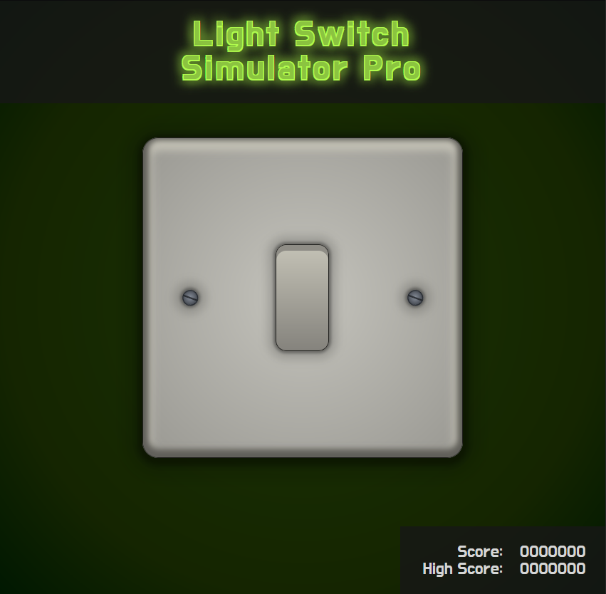
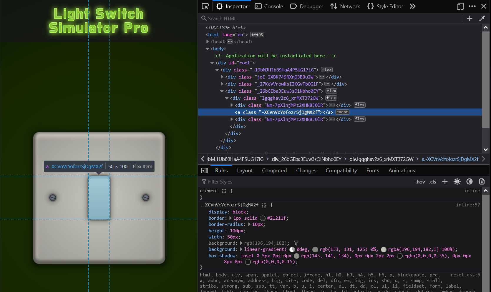

Light Switch Simulator Pro is my idea of a funny joke. From the name it sounds like an in-depth management game, but upon starting you realise the only gameplay is toggling a light switch on and off.

There is a scoring component, and the number of digits on the scoreboard indicates your score might climb into the millions. Unfortunately as you toggle the switch you realise that actually the score just flip-flops between 0 and 1.

It's had some interesting reactions from the people I have shown it to. The obvious trick is to edit the DOM and "cheat" a much higher score than you could actually achieve. The best idea to come back is that I should consider a sequel with a dimmer switch that allows the user more granular control of the score.

Despite being ridiculously small and simple, I'm please with the game as a fully formed idea. The best part in my opinion is that I was able to create a convincing lightswitch purely using thick wad of CSS drop-shadows and gradients.

