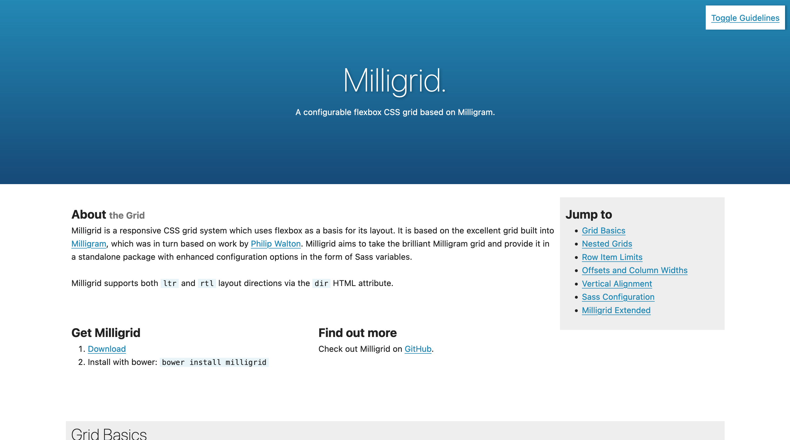

Milligrid was a responsive CSS grid system which uses flexbox as a basis for its layout. It was based on the excellent grid built into [Milligram](https://milligram.github.io/), which was in turn based on work by [Philip Walton](http://philipwalton.github.io/solved-by-flexbox/demos/grids/). Milligrid aims to take the brilliant Milligram grid and provide it in a standalone package with enhanced configuration options in the form of Sass variables.



At the time of its creation, the [modern CSS grid features](https://developer.mozilla.org/en-US/docs/Web/CSS/CSS_Grid_Layout) were not yet widely supported.

In addition to the base grid rules which spaced things horizontally, Milligrid included a couple of rules for maintaining consistent spacing vertically. This is based on a concept called "vertical flow", which is an idea that may make content more readable by making it more predictable.


Unfortunately the code to toggle those rulers on the demo has rotted in the time since release, but you can enable them manually by pasting this into your console:

```JavaScript
document.body.classList.add("demo");
```

Milligrid was built using Sass, and could be customised by overriding variables. It may have been superceeded by CSS's modern grid rules, but for its time it was a pretty useful tool.
