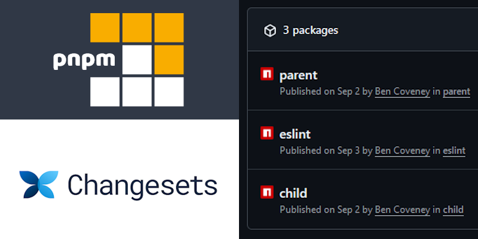

I recently explored the idea of publishing multiple NPM packages to the Github Package Registry using PNPM, Changesets and Github Actions. If you want to skip ahead and look at the codebase I'll be referencing, you can find it [here on Github](https://github.com/bencoveney/pnpm-publish-workflows).

This post gives a quick run down of why you might want to even do that in the first place, and also some of the configuration I used to get each part moving together harmoniously.



## But Why?

Imagine you have a codebase with multiple different areas of responsibility, like:

- Tooling, such as testing configuration and static code analysis.
- Libraries of reusable parts, like UI components or wrappers around commonly used APIs.
- Complete end products, like websites or applications, which pull together the parts above into something you'd want to release to users.

As programmers, our natural tendancy is often to want to split these up into small discrete chunks of functionality, in the pursuit of ideas like encapsulation, reusability or modularity.

Following this through, each bullet point above could become a repository in Github, each publishing an NPM package, which can in turn be pulled in by other NPM packages. This would give us a structure that could look something like this:

TODO Diagram: Diagram of NPM package layout.

One way that structuring your codebase like this might pay off is by letting you leverage some of the reusable parts of the codebase in different projects and applications.

For example, imagine you want to build a new site for a specific project, or customer, or promotion. It would be great if you could keep using the same tooling, libraries and components which you have already built, and spent a lot of time testing and refining.

TODO Diagram: Diagram of reusing some of the new structure.

## Friction and the Pace of Development

As with everything in life, there are tradeoffs. After working within a structure like this for a while, you might start to notice a bit of drag.

Until each package reaches maturity, you will often find that to deliver some new requirement or piece of functionality you need to make changes across multiple packages at once. This can involve making a chain of pull requests through multiple packages.

TODO Diagram: Add new component, release package, pull into website, release website.

TODO Paragraph: Need multiple changes live locally at once.

TODO Paragraph: Inability to dig through codebase.

Another example where this pops up is when you have a piece of logic (for example a component) in one of the applications or sites which you discover you want to use elsewhere. This can again result in a chain of pull requests, moving the component to one of the library packages, and updating each of the sites to now consume it from the library.

TODO Diagram: Refactoring between packages.

Another drawback to this kind of refactoring is that the history of the code we move is severed. The file disappears from one codebase and appears in the other, but the history of revisions and edits to the file do not come with it.

One lesson we can take away from this already is that, while modularity and reusability are desirable, they aren't the only things to consider. When we break apart projects into smaller pieces, there is always some cost whenever we need to work across those boundaries.

Work which could be done in one cohesive chunk gets split up into a chain of sequential pull requests, where each one doesn't tell the full story. Merging these pull requests often needs to be done serially, and there's a tax in terms of coordination between developers to pay on each one.

One benefit you might think you'd get when breaking up a codebase into smaller modules is that the codebase is better organised, and each part has a clear and correct home. When the development process involves a lot of unnecessary friction, you may find that what actually happens is that code ends up in the wrong place, because that is quicker. If a file is in the wrong place, then it is more likely to be moved to the correct place if the process of moving it is quick and easy.

Once a project is mature it might be easier to make good clear decisions about where best to make those divisions, and the tradeoffs can pan out more favourably. When a codebase is in its infancy though, it can be difficult to plan ahead, and the reusable libraries will not be fleshed out, and you can end up paying more cost for this modularity than you get as a benefit.

### TODO Section: Monorepo from the beginning

## A Monorepo of Packages

There is an alternative approach for structuring this codebase which could address some of these downsides, while still allowing us to keep a clean modular structure: Keeping the codebase structured as packages, but housing all those packages within a single repository.

TODO Diagram: Single repository structure.

The idea here is to address the biggest pain point described above: the number of pull requests. In this structure:

- Delivery of features and requirements which require changes in multiple packages can be done in a single pull request.
- A file can move from one package to another in a single change, retaining the Git history while it does so.

In addition, we still get to keep a lot of the nice properties of the previous approach. We can keep our codebase nicely organised, and we can leverage those reusable modules for other sites and applications in different repositories whenever it makes sense.

TODO Diagram: Diagram of reusing some of the new structure.

## The New World

Now that I've explained a bit _why_ you might want to structure your codebase in this way, we can look at _how_ you might put it into practice.

The main parts we need to put in place are:

1. PNPM, a replacement for NPM with great monorepo support, which we will use to work with multiple packages in a single repository.
2. Changesets, a small tool for coordinating the publish and release of our packages.
3. Github Actions workflows, for continuous integration pipelines.
4. Github's Package Registry, for hosting our published packages.

### 1. Setting up PNPM

Before you begin, you'll at least need PNPM set up on your local machine. Since v16.13, Node.js has shipped a tool called Corepack which can be used to install package managers, so if you already have node installed then all you need to run is:

```bash
corepack enable pnpm
```

For different set ups, you can check the [PNPM installation instructions](https://pnpm.io/installation).

As this will be a Node project, you can create your typical `package.json` file in the root of the repository. Like with NPM, you can create this from the command line using `pnpm init`.

One extra piece of configuration it is worth adding is the `engines` field, which will help anyone collaborating on the project ensure they have a compatible PNPM version installed:

```json
// package.json
{
  "engines": {
    "node": ">=20",
    "pnpm": ">=9"
  }
}
```

Now that we have the basic tooling in place, it is time to decide how you want to structure your packages within the repository. The typical convention here is to create a `packages/` directory, and have one sub-directory inside for each package. I've decided to be a bit more granular and break my packages up into 3 directories:

- `packages/`: Components and libraries which can be reused in multiple different sites.
- `sites/`: Complete websites which could be deployed to servers, rather than published as packages.
- `tools/`: Tooling and configuration files which will be useful for development but not included in any deployed sites.

Ultimately PNPM can support just about any structure you could want. Once you've made a decision, you can create a `.pnpm-workspace.yaml` file at the root of your repository, which will help PNPM understand the directory layout, for example mine looks like this:

```yaml
# pnpm-workspace.yaml
packages:
  - "sites/*"
  - "packages/*"
  - "tools/*"
```

```txt
Codebase/
├─ packages/
│  ├─ ...
├─ sites/
│  ├─ ...
├─ tools/
│  ├─ ...
├─ package.json
├─ pnpm-workspace.yaml
```
