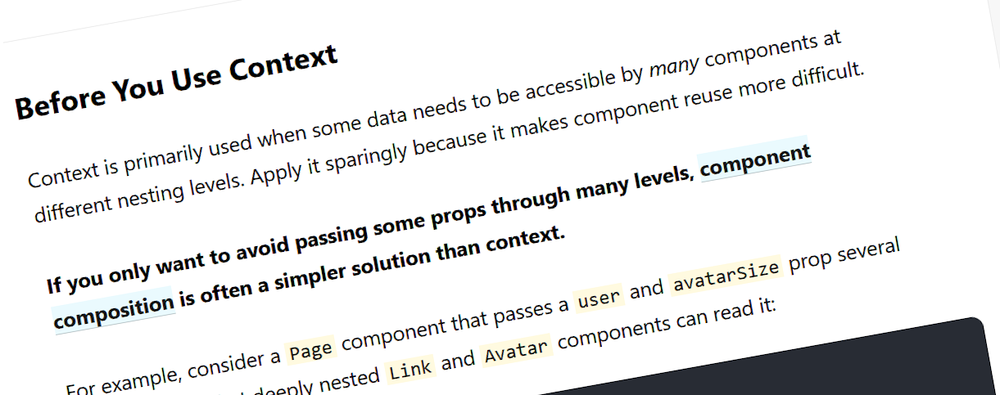

React has a concept called [Context](https://react.dev/learn/passing-data-deeply-with-context), which allows data to be "piped" through components without needing to pass it as props.

In some cases, Context can be a huge help. It can help mitigate a problem called "prop-drilling", where some common state needs to be passed down through many components in a tree to reach all the places it could be used.

Context is not without drawbacks though, in some cases it can add complexity and make your code less clear.

## Global state and dependencies

Functions depend on their parameters to do work. When a value appears in a list of required parameters, it clearly communicates to readers "I need this value to do my job or action or calculation". If you write code that doesn't provide those parameters then often tooling (like your compiler) that can tell you something has gone wrong. The same is true for the props of a React component. Props have a special name, but they are still just parameters.

When any function uses data or values and does not have them in the list of parameters, it can make the code harder to understand and reason about.

An example to illustrate this would be global variables. When a function reaches out and uses a global variable as part of its logic, the behaviour will be impacted by the state of that global variable at the time. This could result in functions giving different results even when called with identical parameters.

Global variables also make code harder to refactor and reuse. When you extract or move a function around, you get no warning that the function expects the global variables to be present and in a specific state, because those variables are not listed in the parameter list.

React Context suffers from a very similar set of problems to Global Variables. Both of them allow you to make your parameter lists look smaller, and some developers might think that makes the code look clean and tidy. But when you use Context instead of a prop, the dependency on the underlying data is still there, but it is now obfuscated.

There is another subtler implication of the way Context works: Context will be passed silently to any child components, without any visible indication in the codebase that it is happening. This makes it difficult to put constraints on where that context should/shouldn't be consumed, if that's something you'd ever want to do. This again has parallels to global state: Over time they will both inevitably spread its tendrils out throughout the codebase.

Ultimately Context hides complexity, but that it not the same as reducing complexity. In the long run, you may find that complexity increases instead.

## Increasing Context use

As the React ecosystem migrates away from Redux and towards using React tools for managing state, we might see new problems emerge from over-use of context.

One factor that could tempt developers into using React Context more than they need to is that it is considered to be an advanced React concept. Once you figure out how to use it, it is tempting to put it in more places, to flex your React skillset.

The React documentation also plays a part in which tools developers use. In the [old documentation](https://legacy.reactjs.org/docs/context.html) they had (in my opinion) much better wording in a "When to Use Context" section right at the top of the Context page:

> Context is designed to share data that can be considered “global” for a tree of React components, such as the current authenticated user, theme, or preferred language.

This was accompanied by an entire "Before You Use Context" section describing possible pitfalls and alternatives just below.

The new documentation is much softer when giving any warnings about context. They advocate using Context as a solution for "prop drilling". For me though, prop-drilling could be an indicator that the code is complex. As mentioned above though, Context doesn't address that complexity, it just hides it.

Warnings about the drawbacks of Context are [still present](https://react.dev/learn/passing-data-deeply-with-context#before-you-use-context) in the new docs, but they are given much less emphasis by being placed further down the page.

## When to use Context

I am not universally against React Context. I wouldn't even say that I am universally against global variables. I think both can be used effectively, but that developers should approach them carefully and think about whether they are really required for a given problem.

If you want to use React Context safely, there are some checks you could perform that might help you make a good decision:

- Try building the app using tools like `useState` on their own before reaching for Context. You always have the option to adopt it later without too many problems. Going the other way (removing Context after it has been added) will be harder, because the compiler cannot help identify which descendent components rely on the Context to be set.
- Try using custom hooks to tidy up complex state before reaching for Context.
- Treat Context with the same caution that you would use with global state, and ask yourself similar questions, for example:
  - Could unexpected changes to this state cause any of the dependencies to behave in weird ways?
  - Does this state really apply to the whole page?
- Consider component composition as an alternative to Context, as [recommended by the React documentation](https://react.dev/learn/passing-data-deeply-with-context#before-you-use-context).
- Be a bit less eager to treat all "prop-drilling" as a problem. Sometimes a bigger bag of props is a good warning that a piece of code is particularly complex and might benefit from being refactored.
