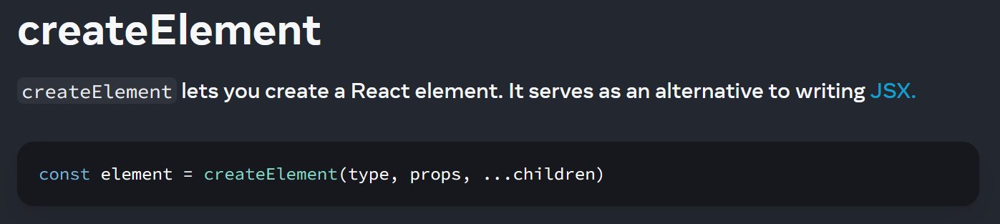

If you were to render this React component, what would you expect to see?

```TypeScript
const someValue = -1;
function MyComponent(props: {}) {
  return <div>{someValue > 0 && "Hello World"}</div>;
}
```

If you have been programming in React for a while, you're probably familiar with components like this, and you'd expect just to see an empty `<div></div>` block in your page.

But something is happening here that isn't 100% obvious. The expression inside those curly braces will evaluate to a value, `false`, so why do we not see `false` rendered inside the div?

If you throw the example into the [TypeScript playground](https://www.typescriptlang.org/play), you can see that when this JSX is compiled down to JavaScript the condition is preserved:

```JavaScript
"use strict";
const someValue = -1;
function MyComponent(props) {
    return React.createElement("div", null, someValue > 0 && "Hello World");
}
```

So when this is evaluated at run-time, the condition would be evaluated and the `false` value will be passed on to React's `createElement` function as the 3rd argument.

Looking at [the documentation for `createElement`](https://react.dev/reference/react/createElement), we can see that this 3rd argument is for the `children` of the (`div`) component:



Reading on, we can find description of the `children` parameter:

> **optional** `...children`: Zero or more child nodes. They can be any React nodes, including React elements, strings, numbers, portals, empty nodes (`null`, `undefined`, `true`, and `false`), and arrays of React nodes.

So from here we can see `false` is considered an "empty node", as will `null`, `undefined` and `true`. The first time I saw this I was slightly surprised that `true` was being treated in a similar way to `false` - I would've assumed that:

- Any falsy values are omitted from the output.
- Any truthy values are included in the output.

This is trivial to test though, for example using a [React playground](https://playcode.io/react):


This is reflected in the [TypeScript types for React](https://github.com/DefinitelyTyped/DefinitelyTyped/blob/fdd07f6b9411bb571f31759799762e690214025d/types/react/index.d.ts#L478) as well:

```TypeScript
/**
 * Represents all of the things React can render.
 *
 * Where {@link ReactElement} only represents JSX, `ReactNode` represents everything that can be rendered.
 *
 * [...]
 */
type ReactNode =
    | ReactElement
    | string
    | number
    | Iterable<ReactNode>
    | ReactPortal
    | boolean
    | null
    | undefined
    | DO_NOT_USE_OR_YOU_WILL_BE_FIRED_EXPERIMENTAL_REACT_NODES[
        keyof DO_NOT_USE_OR_YOU_WILL_BE_FIRED_EXPERIMENTAL_REACT_NODES
    ];
```

If you want even more confirmation, React is open source and you can take a look at the code yourself. I think [this](https://github.com/facebook/react/blob/7022e8d6a3222c97d287dfa0f2361acc8a30683a/packages/react/src/ReactChildren.js#L86) is the place where react handles those empty nodes. `undefined`, `true` and `false` are mapped to `null`, and then checks on subsequent lines prevent any rendering for `null` elements.
