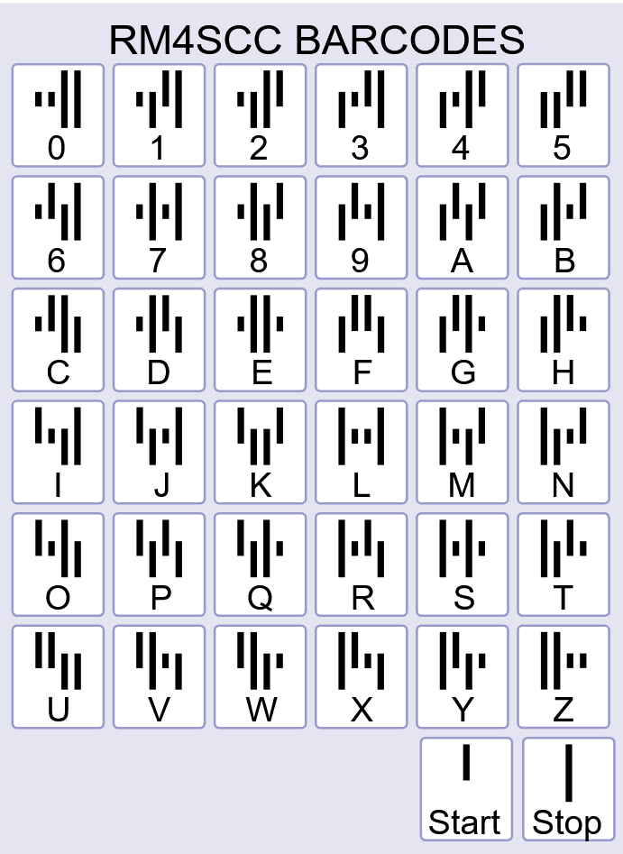

Royal Mail 4-State Customer Code barcodes (RM4SCC for short, or CBCs - Customer Bar Codes) are used by Royal Mail for post sorting in the UK, but have also been adopted and adapted by postal services in other countries. They enable post to be quickly read by a machins, which ultimately brings down the cost for businesses sending large numbers of letters.

## Building a barcode

The "4-State" part of the name refers to each individual bar, which can be:

- Short
- Extending Upwards
- Extending Downwards
- Long

Collections of 4 bars are mapped to characters covering the ranges A-Z and 0-9, which gives coverage of all UK postcodes. The mapping does not include every possible combination of 4 bars; each grouping has 2 upwards and downward extensions.



If they were to include every possible combination of bars, they might have been able to get away with fewer bars-per-character. At 3 bars, you'd have 4³ (or 64) possibilities, which comfortably covers the 36 characters required, however this would presumably come at the cost of reducing machine-readablility.

I've been looking at RM4SCC barcodes quite a bit over the last few days, to the point that I'm starting to see little pictures inside the characters. Call me crazy, but:

- `k` Looks like a bull.
- `3` and `x` look like chairs.
- `2` and `w` look like toilets.

_Anyway..._ A "complete" barcode is composed of 5 parts:

- A special start character.
- A UK postcode, which can be between 5 and 7 alphanumeric characters.
- A delivery point suffix (or DPS), which is another 2 alphanumeric characters.
- A checksum, which can be used to validate the content of the barcode.
- A special stop character.


Delivery point suffixes are not typically seen by recipients of UK post. They point to smaller areas within a postcode and help sort mail more granularly so that it is in "walk" order, ready for when the postman does his route. Not every postcode has DPS values, so `9u` to `9z` can be used as defaults.

I won't detail the complete [checksum calculation](https://en.wikipedia.org/wiki/RM4SCC#Checksum) here, but it involves:

- Calcuating weighted values for each bar extending upwards and downwards.
- Summing those weights, and taking the modulo 6 of those results.
- Taking that result, and mapping it back into the character set.

In addition to defining the data encoding, Royal Mail specifies some constrains for how the barcode should be printed. This includes the physical layout of the bars, but also the spacing around the barcode, and even the difference in reflectance between the bars and the background they are printed on.


## Generating SVG Barcodes

Having learnt a bit about these barcodes, I decided it would be interesting to try building some myself. My [RM4SCC Barcode Generator](https://bencoveney.com/RM4SCC/) is a single React page which takes input and creates an SVG barcode. The input can be a real postcode or arbitrary data, and there are controls for the sizing and rendering of the output.


One thing I didn't really appreciate about these barcodes until playing around with them in the generator is that the sizing constraints do still allow for a reasonable amount of control over the aesthetics. Its possible to have valid barcodes that are long and skinny, or short and thick.

 size configurations")

Being quite small, simple, and composed from basic geometric shapes, these barcodes can make for quite good logos.


I love things like this, where to the casual observer it just looks like a stylised barcode, but those of us "in the know" can understand the hidden content.

To support this I added an option to the playground to force the barcode into a square shape. I'm not sure you can call these valid barcodes anymore, because they break the content and display constraints defined by Royal Mail, but that tradeoff is worth it to get a nice-looking result.

## SMIL Animations

In addition to static SVG barcodes, I wanted to try adding some animation. The sequence of lines seem like a great candidate for a loading animation (or "[throbber](https://en.wikipedia.org/wiki/Throbber)") if I could get some movement in there somehow.

There's a couple of options for animating SVGs:

- CSS animations for SVGs that will displayed on a webpage.
- SMIL (Synchronized Multimedia Integration Language), which can be defined inside the SVG file as part of the markup.

I opted for SMIL because it seemed useful to have the animation embedded directly in the output without requiring additional CSS blocks. SMIL is widely supported by browsers and may also [render a bit more smoothly](https://css-tricks.com/how-i-made-a-generator-for-svg-loaders-with-sass-and-smil-options/#aa-smil-vs-css-sass) than CSS animations.

[./rm4scc-animation.mov](./rm4scc-animation.mov)

Here's the markup from one animated rectangle in a complete animation:

```xml
<rect x="13.97" y="0" width="0.38" height="3.18">
  <animate
    attributeName="height"
    from="3.18"
    to="5.34"
    values="3.18; 5.34; 3.18; 3.18"
    keyTimes="0; 0.2; 0.4; 1"
    dur="1.25s"
    begin="0.4583s"
    repeatCount="indefinite"
  ></animate>
</rect>
```

You can declare the `<animate>` element as a child of the element you want to animate, and the `attributeName` attribute specifies the attribute of the parent to be animated. The `values` and `keyTimes` attributes are declaring keyframes, which are effectively timed values that the SVG will transition between. To make the animation pulse across the barcode I offset the `begin` times based on the position.

I was able to get a reasonable result with some very basic position/scale adjustments and time offsets. It turns out SMIL is a bit painful to work with, and for any complex animations (like [easing movement in/out](https://css-tricks.com/guide-svg-animations-smil/#aa-controlling-animation-pace-with-custom-easing-calcmode-and-keysplines)) you can end up with some quite verbose syntax.

## Where next

At this point I think I've seen most of what there is to explore RM4SCC barcodes specifically, but there's still some things I'd like to look at in the future.

Any time an SVG is displayed at small resolutions, you run the risk that the pixels will be scaled in an uneven way.


I think the solution to this would be some more manual tuning of the SVG definitions for lower resolutions, which would probably be worthwhile before displaying any of these barcodes as small loading icons. For any SVG being used as a web asset, it is also good to compress down and optimise the markup as much as possible.

Royal Mail also has a set of [Mailmark](https://www.thedeliverygroup.co.uk/news/mailmark/) barcodes which I'd like to try building. From a quick glance at these, it looks like some of my RM4SCC rendering would be re-usable, but the 2D data matrix formats could be an interesting challenge.


