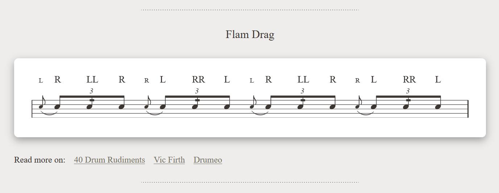
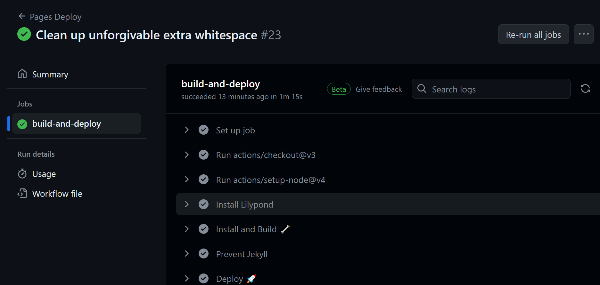
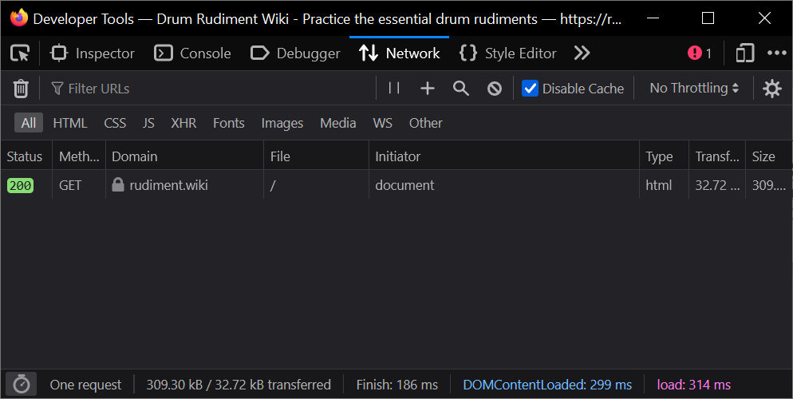
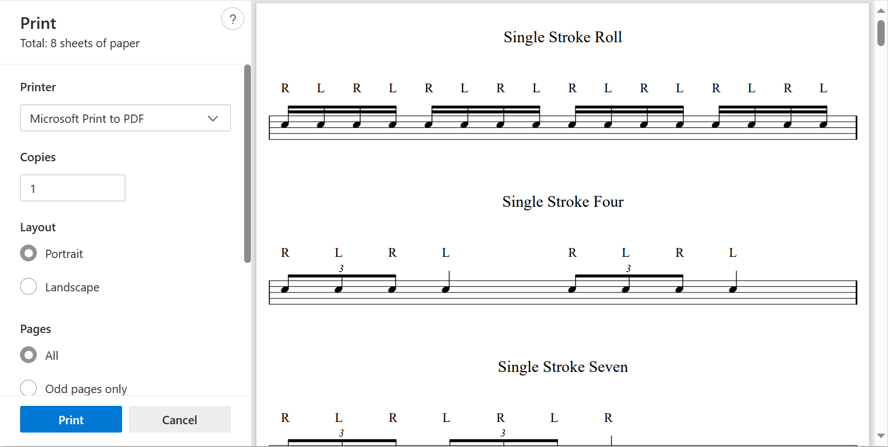

I played drums as a teenager and have been thinking about picking them back up again. Recently for christmas I received a drum practice pad which goes a lot of the way towards scratching that itch. It obviously isn't a full kit, you only have one "drum", but you still get all the satisfaction of tapping away and keeping your hands busy.


One thing these pads are great for is practising "Drum Rudiments", which are patterns of left and right strokes, sometimes doubled-up, and sometimes flammed. They are designed to be simple, to help you work on your rhythm and hand movements, and can be incorporated around the drum kit once you have the space and money for a full kit. There are many standardised sets of rudiments from different kinds of drumming, but one of the most prevalent sets is the [40 International Drum Rudiments](https://www.pas.org/resources/rudiments) organised by the Percussive Arts Society.

I decided I wanted to try and build a reference site for drum rudiments. There are plenty of good references online already, but in particular I was interested in exploring some of the tools around music notation, and building a straightforward webpage where all the rudiments could be accessed quickly and easily for streamlined practice.

## Lilypond

After looking at a few different options for manipulating music notation (including the option of building my own) I settled on using [LilyPond](https://lilypond.org/)

> LilyPond is a music engraving program, devoted to producing the highest-quality sheet music possible. It brings the aesthetics of traditionally engraved music to computer printouts. LilyPond is free software and part of the [GNU Project](https://gnu.org/).

Music notation and engraving is a massive subject, and there's a little bit of syntax to wrap your head around when writing LilyPond files, so it can take a couple of iterations to get output exactly how you want it. After churning through all 40 rudiments I had something I was pretty pleased with. As an example, here's a sample input file for one of the rudiments:

```plaintext
\version "2.22.1"

rudiment = \drummode {
  \repeat unfold 2 {
    \grace sn8^\markup { \teeny L }(\tuplet 3/2 { sn8^"R") sn8:16^"LL" sn8^"R" }
    \grace sn8^\markup { \teeny R }(\tuplet 3/2 { sn8^"L") sn8:16^"RR" sn8^"L" }
  }
}

\score {
  <<
    \new DrumStaff <<
      \new DrumVoice {
        \override Score.SystemStartBar.collapse-height = #-inf.0
        \omit Staff.TimeSignature
        \omit Staff.Clef
        \override TextScript.Y-offset = 6
        \stemUp
        \rudiment
      }
    >>
  >>

  \layout {
    ragged-last = ##f
  }
}
```

One of the recently added features of LilyPond was that it can render the output straight to SVG, which was perfect for embedding directly into my HTML page. The SVG output is a little verbose, so I do some post-processing to group repeated structures, but at the end I had some high quality and compact music notation assets:



One of the other niceties about using LilyPond is that it is available in the Ubuntu software repositories, so it is trivial to pull it into a Github Actions workflow when publishing the site.



## A single HTML file

You can often come across criticisms of modern web development online these days, discussing the complexity and size that website have grown to, and the flakiness and instability that comes with it. I decided during development that I was going to see if I could make the site a single HTML file.



The main benefit I see here is that anyone can easily save the page to their device, and open it to view later without needing a network connection. For a site that was intended to be a basic reference and doesn't need analytics, a backend or fancy supporting assets to serve its purpose.

If you're a web nerd it is kind of refreshing to be able to "view source" on a webpage and see everything it needs to work right there in a single document. It also poses an interesting technical space to work in, as it is kind of counter to the mindset and workflow of a lot of modern tooling.

For the most-part this wasn't too tricky. Many assets like SVGs (or anything you can `base64` encode) can be embedded directly into HTML files directly, including favicons. There's some basic responsive styles, including a print stylesheet, but generally I didn't add too many bells and whistles.



To build the page I have a simple TypeScript script which I (and Github Actions) execute in node. This does use React, but only as a templating tool at build time to get nicer syntax - there's no React at runtime. There's some naive minification happening on the assets, mainly stripping whitespace, but really it is just a task of clobbering a few files together into one.

## Web Audio Timing

Practising drum rudiments can be an exercise in improving your timing, so one feature I wanted to include on the page was a metronome. There are a lot of APIs available in the modern web for working with audio, but I did run into some roadbumps joining everything together.

A metronome - by definition - should be clicking at the most regular time intervals possible. There are a few basic timing options within JavaScript that are commonly used for timing (`setTimeout`, `setInterval` and `requestAnimationFrame`) but unfortunately none of these make solid promises about the exact time when they will run. To get regular timing you instead need to maintain a schedule of upcoming sounds within the audio APIs (discussed in more detail in the post [A tale of two clocks](https://web.dev/articles/audio-scheduling)).

> The worst part of the JavaScript timing APIs are that although Date.now()’s millisecond precision doesn’t sound too bad to live with, the actual callback of timer events in JavaScript (through window.setTimeout() or window.setInterval) can easily be skewed by tens of milliseconds or more by layout, rendering, garbage collection, and XMLHTTPRequest and other callbacks - in short, by any number of things happening on the main execution thread.

To get this flow working I also wasn't able to use the basic `<audio>` HTML tag, which allows easy embedding of a `base64` audio file but has a less complete API. Instead needed to do some legwork to embed and load the "click" sound to and from `base64` myself with.

None of these issues were too problematic, but I am left feeling like either these APIs either aren't wholly cohesive and "joined up", or I simply don't understand them well enough yet.

## Wrapping Up

Looking forward, there's some stuff I'd like to add in the future:

- It would be nice to add the ability to "play back" a rudiment, so that you could hear an example if you aren't familiar with it. There's a question there about if/how the left/right hands should be represented in audio. It also might involve working out a way to either embed and read MIDI data, or render some audio files from the LilyPond inputs.
- At the moment the site only includes the 40 PAS rudiments - but there's a whole world of rudiments out there I could add in. Even within the PAS set I have seen some variations, for example different resources include or exclude accents on certain beats. If the set of rudiments grows, I'd probably need to put some thought into sorting and filtering the list, and ensuring the single HTML file doesn't grow too large.

With that said, I'm pretty happy with the way the page looks now. I was able to get all the rudiments rendering nicely, in a single concise HTML file, with enough added "juice" to make it a useful practice resource.
