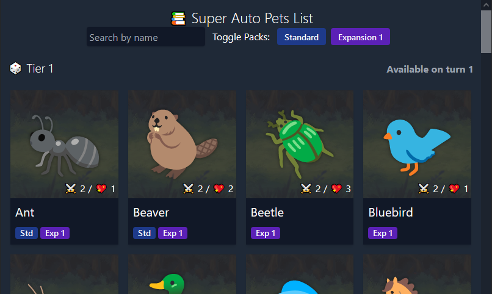

This database website is an un-official guide and reference for the pets, food and stats from the game Super Auto Pets.

Super Auto Pets is deckbuilding game from [Team Wood Games](https://teamwoodgames.com/). You select pets from the shop, feed them food to make them stronger, then proceed into the arena to see your team slog it out with an opponent.

When I came across the game it was still relatively new and there wasn't much information available online about what each of the individual pets and items did. I decided to try and build a wiki/reference style site to present some of that information in an easy-to-digest way.

[https://superauto.pet/](https://superauto.pet/) is the result of that project. The site is built using React, TypeScript and Tailwind, and I can explain a few of the interesting technical details.

I built an SSR system for the website. This means that all the pages are generated as static HTML for speedy load times, but hydrated at run-time to support fast page transitions.

Originally the animal and food assets in the game were taken from emoji fonts like [noto-emoji](https://github.com/googlefonts/noto-emoji), [twemoji](https://github.com/twitter/twemoji) and [fxemoji](https://github.com/mozilla/fxemoji). This meant I could import those emoji font projects, scrape out particular SVG source images, and include them directly on the page with some nice CSS hover effects.

Generating static lightweight HTML allowed me to make the website really performant. I improved this further using tricks like deferring the loading of any image assets. The end result is that the page performs really well on lighthouse performance tests and Google rankings.

The content of the website is driven by a big blob of JSON describing all the game items. To give back to the community, I made this JSON file easily available at [https://superauto.pet/api.json](https://superauto.pet/api.json)

The final technical aspect to mention is that I used it as a way to learn and practice Tailwind. My experience with Tailwind was generally pretty positive once you learn the syntax. The main drawback I found was that I needed to customise Tailwind's output slightly, and the tooling for doing this was very slow. Running the tailwind compile step took multiple times longer than the ESBuild run for the whole project.

The project was pretty successful overall, generating ~100000 monthly pageviews at its peak.

Ultimately though the success of the website is tied to the success of the game, and as interest dropped off so did the number of visitors.

The page has since fallen out of step with the current game, failing to track updates as I have been working on other things. Sometime soon I'll get back and update it!
