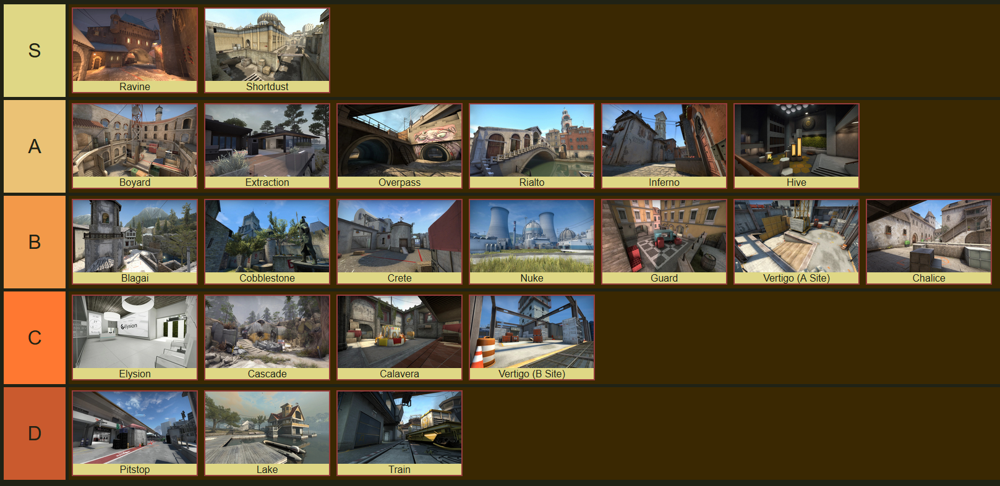

This weekend I was looking to build a tier list for maps for CSGO's Wingman gamemode. Wingman is a 2v2 format based on the typical "defusal" gamemode, but with only 1 bombsite.

[TierMaker](https://tiermaker.com/) is the most well-known site for tier lists, but when trying to create my own I found that:

- TierMaker only allows sign-ups through Twitter.
- The set of Twitter permissions TierMaker requires is absolutely absurd.

Instead, I have spent the evening creating my own tier list. It's barely a page of code and most of it came directly from MDN's excellent [drag-and-drop API documentation](https://developer.mozilla.org/en-US/docs/Web/API/HTML_Drag_and_Drop_API).

If you want to make a tier list to share with your friends but don't want to sign your life away, consider just making your own.

For reference, these are my rankings:

