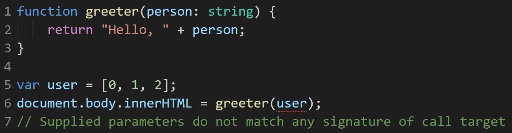
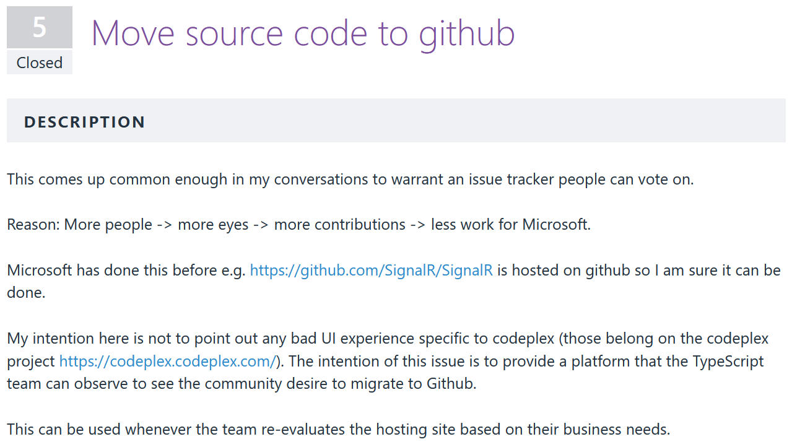
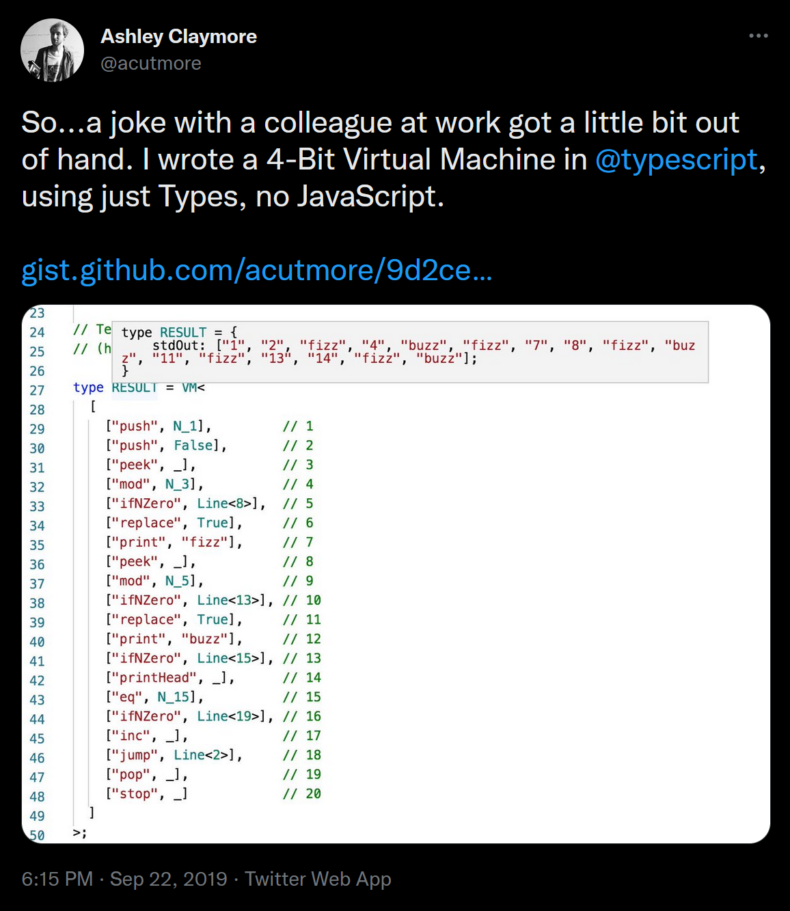

I wrote this post as the inaugural entry for YouView's engineering blog in late 2019. The original is still available [here](https://medium.com/youview-engineering/celebrating-8-years-of-typescript-e4b1482f3ba0). Thanks to my colleagues at YouView for assistance editing and refining this.

---

Today on October 1st, 2019 TypeScript is passing its 7th birthday. We get a lot of mileage out of TypeScript at [YouView](https://www.youview.com/); we’ve been using it to build the latest version of our UI for over 4 years and have amassed over a hundred thousand lines of TypeScript code. To celebrate the language’s success, what better way to look back to where it all began and at how TypeScript has grown.

## Setting The Scene

As the de facto language of the web, JavaScript (despite its marred reputation) was spreading and codebases were growing. Developers were resigning themselves to needing _some way_ of creating JavaScript. Seeing that not even the ubiquitous JQuery would save them from writing questionable code, people were open to new languages and tools that might make coding a bit more pleasant.

_JQuery code sample from “The jQuery Divide” — Rebecca Murphey ([September 25th, 2010](https://www.slideshare.net/rmurphey/the-jquery-divide-5287573/7-var_toggleHistItems_function_selTabId_consolelogSelected))_

One such example of an alternative language is Coffeescript, a compile-to-JavaScript language with nice syntactic sugars, which was beginning to [reach peak popularity](https://trends.google.com/trends/explore?date=all&geo=US&q=coffeescript). These alternatives each came with their own pros and cons, and even other teams at Microsoft were [weighing in with their 2 cents](https://blogs.msdn.microsoft.com/ie/2011/11/22/evolving-ecmascript/) (and taking a slight pot-shot at Google while they did so):

> Some examples, like Dart, portend that JavaScript has fundamental flaws and to support these scenarios requires a “clean break” from JavaScript in both syntax and runtime. We disagree with this point of view. We believe that with committee participant focus, the standards runtime can be expanded and the syntactic features necessary to support JavaScript at scale can be built upon the existing JavaScript standard.

## Enter TypeScript

After two years of internal development inside Microsoft, Version 0.8 of TypeScript was announced on 1st October, 2012, [hosted on the (now defunct) codeplex](https://web.archive.org/web/20121003001917/http://typescript.codeplex.com/). At release, the following quote was emblazoned over the [TypeScript Homepage](https://web.archive.org/web/20121004051901/http://www.typescriptlang.org/):

> TypeScript is a language for application-scale JavaScript development.
>
> TypeScript is a typed superset of JavaScript that compiles to plain JavaScript.
>
> Any browser. Any host. Any OS. Open Source.

A critical promise from the very beginning is that your JavaScript code is _already_ TypeScript. By creating a superset rather than a completely new language, Microsoft were reaching out to developers who were already knee-deep in large JavaScript codebases. Just drop this tool into your workflow, and _some_ problems will be solved.

The quickstart guide posted alongside the initial release showcases some headline features (types annotations, interfaces and ES6 classes) as well as [examples](https://web.archive.org/web/20121004003937/http://www.typescriptlang.org/tutorial/) demonstrating how it would catch bugs:

While the example above looks (and compiles) like the TypeScript you know today, the feature-set at the time was much more limited. Major type-system features were yet to appear, such as Generics which wouldn’t show up until [v0.9 in June 18th, 2013](https://www.theregister.co.uk/2013/06/18/typescript_update_0_9/) around 8 months later. For what it’s worth, the error messages have improved since then as well.

## Reception

Upon release it wasn’t immediately clear how powerful and popular TypeScript would become. You can get a cheap laugh looking back now at comments on the initial posts, such as this one posted just 12 minutes after the release [on the 53 minute introductory video](https://channel9.msdn.com/posts/Anders-Hejlsberg-Introducing-TypeScript):

> I’ll go on record as saying this is almost the dumbest idea ever. We already have a strongly typed language that can compile to idiomatic JavaScript. It’s called C#. Or Java. Or Lisp. Or C++.

There was plenty of praise for Microsoft’s new offering, but while it is funny to look back with hindsight on comments like this it does help highlight how [many were skeptical](https://arstechnica.com/information-technology/2012/10/microsoft-typescript-the-javascript-we-need-or-a-solution-looking-for-a-problem/) of _yet another_ tool professing to solve JavaScript’s woes.

Unsurprisingly for Microsoft at the time, another notable point was the lack of solid editor support outside of the Visual Studio ecosystem:

> Developers use MacOS and Linux workstations to write the bulk of the code, and deploy to Linux servers.
>
> But TypeScript only delivers half of the value in using a strongly typed language to Unix developers: strong typing. Intellisense, code completion and refactoring are tools that are only available to Visual Studio Professional users on Windows.
>
> There is no Eclipse, MonoDevelop or Emacs support for any of the language features.
>
> _[Miguel De Icaza’s blog (October 1st, 2012)](https://tirania.org/blog/archive/2012/Oct-01.html)_

## Early Steps

Coming up on a year after the initial v0.8 release, [Microsoft dropped v0.9 into our laps](https://devblogs.microsoft.com/typescript/announcing-typescript-0-9/) with generics and enums being among the big-ticket features. During this early period in TypeScript’s life, releases were sporadic and small updates often targeted areas such as compiler performance and editor improvements.

Release details for v1.0 ([released April 2nd, 2014](https://devblogs.microsoft.com/typescript/announcing-typescript-1-0/)) contain a surprising lack of language features, instead inviting community contributions to the project. In response to user feedback TypeScript’s development was migrated from the Microsoft-owned Codeplex to (then independent) GitHub around [around 3 months later](https://devblogs.microsoft.com/typescript/new-compiler-and-moving-to-github/), where it remains to this day.

## AtScript

Around this time Google had cottoned on to some of TypeScript’s growing reputation and at ng-conf Europe in October 2014 they announced a new Language of their own: [AtScript](https://en.wikipedia.org/wiki/AtScript).

In a pleasingly recursive fashion, AtScript would be a superset of TypeScript. Their goals were to add on features like annotations (later to become decorators) and introspection to help create a language that would be used to build Angular 2.0. Alas AtScript was short-lived, and on March 15th, 2015 [Microsoft and Google announced](https://sdtimes.com/angular/google-microsoft-combine-typescript-atscript-angular-2/) they would be joining forces to integrate AtScript’s features into the core TypeScript language.

## Future Features, Now

In addition to the language features added in the 1.x versions, TypeScript also began giving developers early access to future JavaScript syntax. Taking async/await as an example, initial support was included in TypeScript 1.6 ([16th September, 2015](https://www.typescriptlang.org/docs/handbook/release-notes/typescript-1-6.html)), improved in version 1.7 and fully supported in v2.1 ([8th November, 2016](https://www.typescriptlang.org/docs/handbook/release-notes/typescript-2-1.html)) ahead of its inclusion in major browsers or official release in ES2017.

Nowadays the team behind TypeScript will wait until the TC39 proposal has reached Stage 3. TC39 (short for Technical Committee 39) is the group responsible for managing which features make it into new versions of JavaScript (more formally known as ECMAScript) and the TypeScript team actively take part in the committee.

Some notable exceptions to the Stage 3 rule are some of the features promised to help replace the now abandoned AtScript. Decorators were included in v1.5 ([20th July, 2015](https://www.typescriptlang.org/docs/handbook/release-notes/typescript-1-5.html)) and improved in v1.7 ([30th November, 2015](https://www.typescriptlang.org/docs/handbook/release-notes/typescript-1-7.html)), however support for them has remained locked behind “experimental” compiler flags. The TC39 proposal has languished in Stage 2 for a while now, but has [recently received renewed](https://youtu.be/GLi37QPSOv4?t=881) focus so watch this space.

## Modern Process

[TypeScript’s v2.0 release](https://www.typescriptlang.org/docs/handbook/release-notes/typescript-2-0.html) on 22nd September, 2016 could be considered the start of TypeScript’s modern era. Following this the release cadence has sped up and evened out, with at least 5 minor releases annually in the time since.

V2.0 was accompanied by another big change, [the release of @types packages on npm](https://devblogs.microsoft.com/typescript/the-future-of-declaration-files-2/). Prior to this if you wanted type definitions (essentially header files) for a third-party library there were a couple of options: Hope that the library had been distributed with the .d.ts files inside the package; or install a tool like [TSD](https://github.com/Definitelytyped/tsd) or its successor [Typings](https://github.com/typings/typings) to in turn grab them from the [definitelytyped repository](https://github.com/DefinitelyTyped/DefinitelyTyped).

Counter to Microsoft’s past reputation, much of the process surrounding TypeScript’s development now happens in the open with community involvement. Skimming through the torrent of daily Github issues (totalling over 23000 at the time of writing) you can find meeting minutes about the language’s progress tagged under “[Design Notes](https://github.com/Microsoft/TypeScript/issues?utf8=%E2%9C%93&q=is%3Aissue+label%3A%22Design+Notes%22)” or “[Planning](https://github.com/Microsoft/TypeScript/issues?utf8=%E2%9C%93&q=is%3Aissue+label%3A%22Planning%22)”, and the roadmap and design goals are easily accessible on the wiki.

## Success and Spread

Over the years TypeScript has risen to be one of the most popular languages around. In [Github’s 2018 Octoverse](https://octoverse.github.com/projects#languages) report TypeScript ranked as the 3rd fastest growing language, and the [latest RedMonk language rankings](https://redmonk.com/sogrady/2019/07/18/language-rankings-6-19/) placed TypeScript at number 10:

> Three years ago at this time, TypeScript had just broken through to #26 after languishing in the thirties for years. This quarter […] the JavaScript superset capped off one of the more remarkable growth stories we have ever seen in these rankings, placing in the top ten for the first time after surging to #12 last quarter. […] The ubiquity of JavaScript coupled with the optional safety offered by TypeScript has proven to be a winning combination, and vaulted it directly into rare territory.

At this point TypeScript forms the foundation for a significant set of major projects: [Angular](https://github.com/angular/angular), [Redux](https://github.com/reduxjs/redux), [RxJS](https://github.com/ReactiveX/RxJS), [MobX](https://github.com/mobxjs/mobx), [InversifyJS](https://github.com/inversify/InversifyJS), [VsCode](https://github.com/Microsoft/vscode) and [GitHub’s desktop client](https://github.com/desktop/desktop) all use the language at their core; and [Deno](https://deno.land/) (a fledgling hopeful successor to node) will support it by default.

Much of TypeScript’s success can be attributed to how discreetly it can work its way into JavaScript projects. A recent Microsoft blog post outlines how developers can “[Upgrade to TypeScript Without Anybody Noticing](https://devblogs.microsoft.com/typescript/how-to-upgrade-to-typescript-without-anybody-noticing-part-1/)”. Users of the text editor VSCode will already be getting compiler hints and Intellisense for dependencies on their JavaScript without necessarily realising TypeScript is the tool powering it all (a feature which [unintentionally DDoS-ed npm](https://code.visualstudio.com/blogs/2016/11/3/rollback) upon release).

## Looking to the future

In their [latest roadmap](https://github.com/microsoft/TypeScript/issues/33118#language-design-and-innovation) the TypeScript team outline a holistic set of goals:

- Types on every desk, in every home, for every JS developer
- Productivity through strong tooling
- Approachability and UX
- Community engagement
- Infrastructure and engineering systems

For a bigger picture, the language’s [Design Goals wiki page](https://github.com/microsoft/TypeScript/wiki/TypeScript-Design-Goals) lists the goals and “non-goals” that shape the language.

In terms of language features, much of the exciting stuff entering the language will be coming by way of the TC39 group, for example optional chaining and the pipeline operator. By design, any progress in the JavaScript ecosystem feeds directly into the TypeScript language.

For the developer community there is no indication that TypeScript will stop growing in popularity. Two years ago prominent community member Basarat [posted an article](https://medium.com/@basarat/typescript-won-a4e0dfde4b08) comparing TypeScript to other JavaScript++ solutions and proclaimed “TypeScript Won”. At the time this stance attracted its fair share of critics, but as time has passed it is getting harder and harder to disagree.

## TypeScript at YouView

There are traces of TypeScript at YouView as far back as May 2015, where it was initially being used in the overhaul of the user interface on set-top boxes; the previous iteration of which was built in Flash.

At the time TypeScript certainly wasn’t the safest bet, it was in the early v1’s and alternatives were more mature. One positive that swayed our decision was how familiar the generated JavaScript code was to the original TypeScript source, compared to CoffeeScript and Dart, which made it easier to debug and understand.

YouView’s new look launched in November 2016 and since then we have continued to use TypeScript, keeping up to date with compiler releases and trying to adopt the latest best practices as they have evolved.

https://www.youtube.com/watch?v=W520_RUzwpc

Our UI runs as ES5 JavaScript in a webpage on top of a TV video feed, but in addition to running in the browser, the language has begun to spread out from our core product and begun infiltrating cloud services, test tools and build tools; bringing some additional reliability to our other projects running on node.

An often overlooked benefit of adding types to the codebase is the metadata that it adds. We have leveraged this in tooling like codemods and our own homegrown compile-time dependency injection system. One of our engineers has even managed to implement a 4-bit VM using the type system alone.

_From [@acutmore on twitter](https://twitter.com/acutmore/status/1175820877566492673)_

If you love TypeScript, TV or Technology check us out at [youview.com](https://www.youview.com/)!
