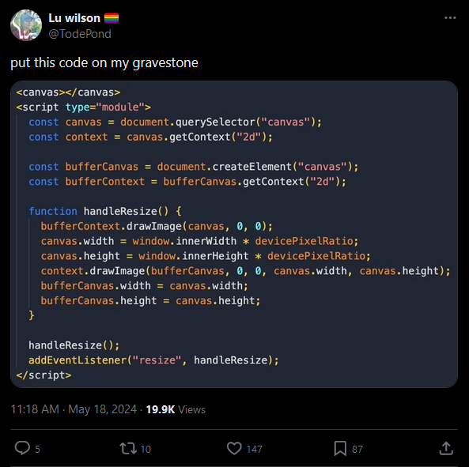
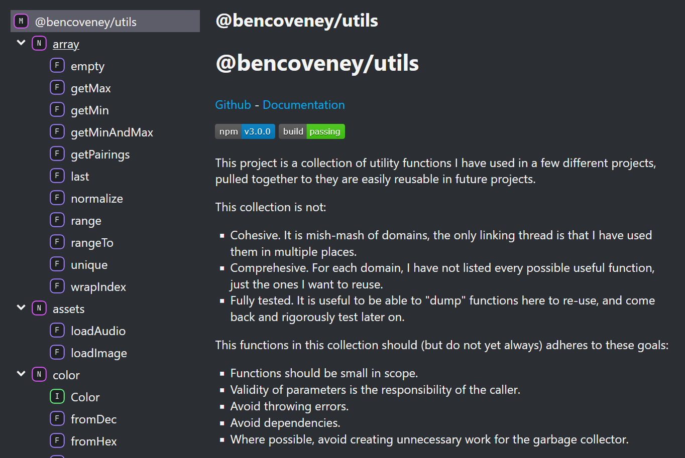

If you've come to JavaScript from another language, one thing you might find lacking is the breadth of JavaScript's standard library. There's a set of incantations you often need to recite to implement common functionality in project-after-project.



## Finding a Maximum

Take, for example, finding the maximum value in an array of numbers.

If you've previously used C#, you'll be familiar with the suite of extension methods available on [IEnumerable\<T\>](https://learn.microsoft.com/en-us/dotnet/api/system.collections.generic.ienumerable-1?view=net-8.0#extension-methods) and [IList\<T\>](https://learn.microsoft.com/en-us/dotnet/api/system.collections.generic.ilist-1?view=net-8.0#extension-methods). You can call `.Max()` on anything and get exactly what you'd expect, without needing to give it any extra thought.

The same is not true in JavaScript. The core set of functionality is growing, but there are still plenty of gaps. There are a quite a few functions [available on arrays](https://developer.mozilla.org/en-US/docs/Web/JavaScript/Reference/Global_Objects/Array#instance_methods), but if you want to find a maximum, you'll need to figure that out yourself.

```JavaScript
const inputArray = [1, 2, 3, 100];

// One possible solution. What happens though if there's
// nothing in the array?
const maxA = inputArray.reduce(
  (a, b) => Math.max(a, b),
  inputArray[0]
);

// This looks logical, but it returns 3, because
// the default sort behaviour converts everything to a string.
const maxB = inputArray.sort().reverse()[0];

// This is probably what I want. Notice how it:
// - Handles the empty array case.
// - Doesn't create any work for the garbage collector.
let maxC;
if (inputArray.length === 0) {
  maxC undefined;
} else {
  maxC = inputArray[0];
  for (let i = 1; i < inputArray.length; i++) {
    maxC = Math.max(maxC, inputArray[i]);
  }
}
```

This is not a _big_ problem. Some of the simpler solutions you could come up with could have some hidden bugs, but I'm not saying that writing this code is a big intellectual challenge, or that it takes a lot of time. Implementing this functionality is the smallest possible side-quest you could have, but is still a side-quest.

## _Someone Else_ Has Solved This

One common route to backfilling the standard library is to use a package from NPM. After a quick search I was able to find many, all with their own functions for finding a maximum:

- [Underscore `max(array)`](https://underscorejs.org/#max)
- [Lodash `max(array)`](https://lodash.com/docs/4.17.15#max)
- [Stdlib ` max(...array)`](https://stdlib.io/docs/api/latest/@stdlib/math/base/special/max)
- [Lazy.js `Lazy(array).max()`](http://danieltao.com/lazy.js/docs/#Sequence-max)
- [Sugar.js `array.max()`](https://sugarjs.com/docs/#/Array/max)
- [array-bounds `getBounds(array)`](https://www.npmjs.com/package/array-bounds)

This route to solving the problem brings with it many questions of its own though:

1. How big are these? Am I going to end up shipping large redundant chunks of code to users?
2. Are any of these options trustworthy? Are they actively maintained or have they been left fallow? Are they going to stay trustworthy and maintained in the future?
3. How opinionated are these libraries? Are they going to fit in seamlessly with my existing code?
4. Given JavaScript's long history of inventing and reinventing module system and bundling tools, which of these libraries will fit in most smoothly with the project structure I already have?

In the face of these questions, you might decide just to stick your fingers in your ears, pick one based on Github Stars or some other useless method, hammer `npm install whatever` into your terminal, and move on. This is a good way of _getting things done_, but hopefully you can appreciate why I don't think it is a great approach.

## _I_ Have Solved This

The approach I have finally settled on is to start accumulating these common utilities in [my own repository](https://github.com/bencoveney/utils). Now I only have to implement these helpers once myself, and then they will be available to easily pull in on any future projects. They are typically small enough that I can literally just copy-and-paste them if I want, but I'm also publishing [a package to NPM](https://www.npmjs.com/package/@bencoveney/utils).

The main difference between this approach and using a third party package is that _I don't have to trust anyone else_. I can also decide for myself the scope, what does and doesn't get included, and I know (and/or can document) any tradeoffs.

As of right now, the package includes functions for working with:

- JavaScript primitives like arrays, strings and falsy values.
- DOM functionality like event handlers and asset loaders.
- Common game structures like colours, vectors and matrices.

I've tried to make the library as easy to add to as possible. The goal is to avoid implementing these functions repeatedly, rather than to build a comprehensive and complete standard library. This idea extends as far as keeping a messy `temp.ts` file in the repository, that I can drive-by dump code into at the end of the project, to clean up and refine later on.

When I do get around to cleaning up those functions though, there's plenty of development niceties pre-configured. The utilities can be written in TypeScript, and tested using `jest`. I have Github Action pipelines configured to build the project, run any tests, [build documentation](https://bencoveney.com/utils/) and publish to NPM automatically.



I don't expect anyone else to use my utilities library, it exists there _for me_ to use in _my projects_, and it is serving that purpose quite well. What others might want to think about though, if this sounds useful, is building their own collection of utilities to save themselves time in the future.
