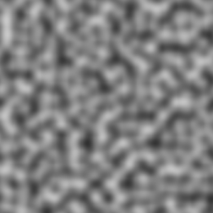
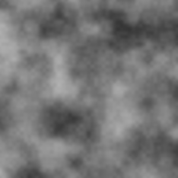
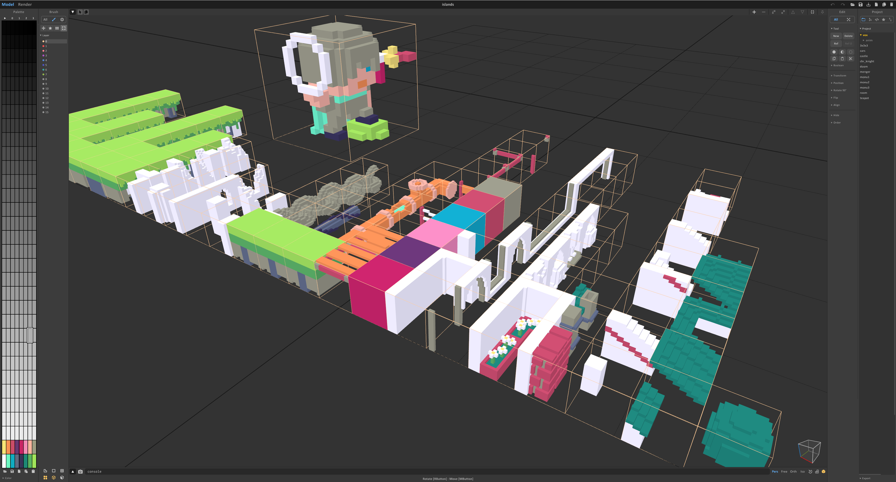
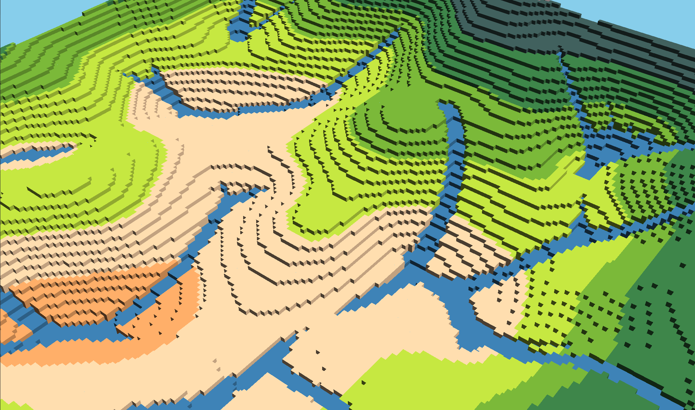
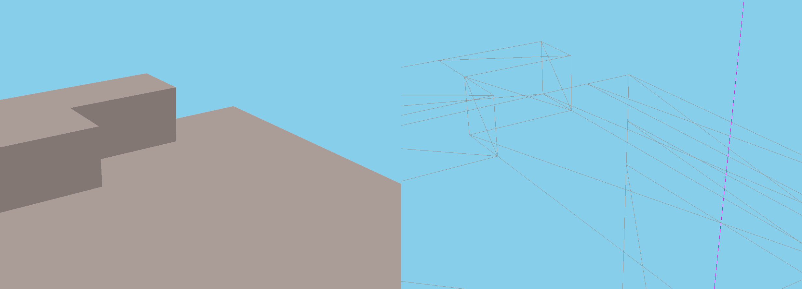

Voxels are like the pixels of a 2D image, except applied to 3 dimensions. They are points in a 3d grid often rendered as cubes - much like how pixels are points in a 2d grid often rendered as squares.

Voxels have been popularized as a game development technology by titles like Minecraft and Teardown. The 3d cubey appearance of voxels give game worlds a pixel-art aesthetic, and the grid-aligned co-ordinate system can simplify a number of algorithms (like collision detection and response) that are typically challenging to implement in 3d titles.

WebGL is a rendering technology for the web. It gives browsers (and the JavaScript running in them) access to the device's graphics card, letting them render fully realised 3d worlds and visualisations. Writing 3d graphics code directly can be fairly heavy in terms of maths and complexity, so many people opt to use a wrapper library like [Three.js](https://www.npmjs.com/package/three), which provides an easier API to work with directly.

Over the years I have experimented a number of times with voxels, using them to explore 3d graphics, terrain generation and game development techniques.

## Experiment 1: Three.js cubes

[My first experiment](https://github.com/bencoveney/voxel-terrain) was relatively simple. First, 3d perlin noise is used to generate a a 3d grid of densities that will serve as the terrain. Then, for each cell in the grid, I use Three.js to render a cube if the density is greater than 0.

Perlin noise is different to normal noise because it ramps smoothly between values. This can give the appearance of undulating terrain, that looks realisticly bumpy and unpredictable.

This can be improved by scaling and multiplying multiple layers of the noise. This is sometimes referred to as fractals or octaves of noise. Noise with a large scale contributes larger sweeping terrain shapes, whereas smaller scaled noise creates roughness and detail.

For this experiment I used a single pass of 3d perlin noise, with the density being also influenced by the height above the ground, so that it gradually shifts from solid ground at the bottom up to clear air at the top. The benefit of using 3d perlin noise is that it is capable of generating overhangs and cave features. If you use a 2d noise function then you can only really treat each value as a "height" - so overhangs are not possible.

You're welcome to check out [the code](https://github.com/bencoveney/voxel-terrain) and [demo](https://bencoveney.com/voxel-terrain/) for this experiment. It didn't get developed too much further, but it served as a useful jumping off point for later experiments.

## Experiment 2: Three.js isometric voxels

Now that I had some basic knowledge of how to put together a Three.js scene, I decided to try and make something with a slightly more cohesive design. I began by creating some voxel models in MagicaVoxel, a free voxel editor made by Ephtracy.

These models can be exported as PNGs, where each layer or slice of the model appears as a different sprite within the overall image. I then wrote a script using [pngjs](https://www.npmjs.com/package/pngjs) to walk through those image files and map each pixel to a voxel in a 3d array. Finally I could use those 3d arrays to work out the set of faces required to model each voxel as a 3d cube.

There's some optimisations that can be performed at this stage. Given a model containing multiple voxel cubes, it is likely that many of the faces of those cubes will be not be outward facing, and can be culled. You can also combine any faces which span neighbouring cubes of matching colours, in a process called "greedy meshing".

These meshes can be further optimised by grouping multiple models into "chunks" prior to running those steps, so that the culling and meshing steps can run across mutliple models at once and potentially reduce the number of faces even further.

At the end of this process I had some optimised model information that I could throw into Three.js with some simple lighting to get a basic 3d scene.

At this point I was quite interested in seeing how I could make the scene a bit more stylized. Voxel art is loosely related to pixel art. In both forms the viewer sees the granularity of the underlying image. Pixels are large enough to be visible in pixel art, and voxels are large enough to be visible in voxel art.

I decided to try and reinforce this parallel by making the camera orthographic and lock it to a camera perspective that produces the angles seen in isometric pixel art.

Another feature I decided to add was simple A* pathfinding for the character, so that they would wander around the world. At this point I was representing the world as a simple 2d CSV map file, so it was simple to pass that into a library called [ngraph](https://www.npmjs.com/package/ngraph.graph), which offered an easy A* implementation.

You're welcome to check out [the code](https://github.com/bencoveney/webgl-voxel) or [demo](https://bencoveney.com/webgl-voxel/) for this experiment. This video shows off some walking and the camera spinning between multiple angles. This is roughly the final state where I left this experiment, and moved on to the next one...

[./voxels-isometric.mp4](./voxels-isometric.mp4)

## Experiment 3: WebGL terrain

For my third experiment with voxels, I decided I would try and skip using Three.js and instead write the WebGL graphics code myself. I also wanted to be able to walk around the voxel world in first-person, rather than watch a model being animated along a path.

I returned to perlin noise for terrain generation for this project. The world you walk around is split into chunks 64 voxels wide. The terrain in those voxels is populated with 5 octaves of perlin noise.

I run a naive river generation process on the voxels after generating the world, which simulates raindrops falling on the world and running downhill. I then check which parts of the world have had multiple raindrops flowing over them, and mark those points as rivers, with the width of the river determined by the number of raindrops.

By splitting the world into chunks and using the greedy meshing methods described before, the world still renders at 60fps, which is typically the upper limit for browser-based WebGL tools.

By opting to write all the graphics and rendering code myself, I was able to get a much better understanding of the pipeline from end-to-end. My matrix and vector knowledge from school isn't perfect, but it was enough to get collision, camera controls and movement around the world using a scenegraph.

[./voxels-terrain.mp4](./voxels-terrain.mp4)

If you view this project [on Github](https://github.com/bencoveney/octree-webgl) you'll notice it is named after "Octrees". Octrees are a data structure often used for efficiently storing voxels. I was hoping to play around with them more in this project, however I found that they complicated many of the neighbour checks I was running during the greedy meshing step, so I ended up falling back to a simpler 3d array for each chunk. This would perhaps be something worth revisiting in the future.

If you'd like to wander around the world you can try it out [here](https://bencoveney.com/octree-webgl/). A quick note though - you spawn in the air and will need to wait to fall down to earth before you can start wandering around.
