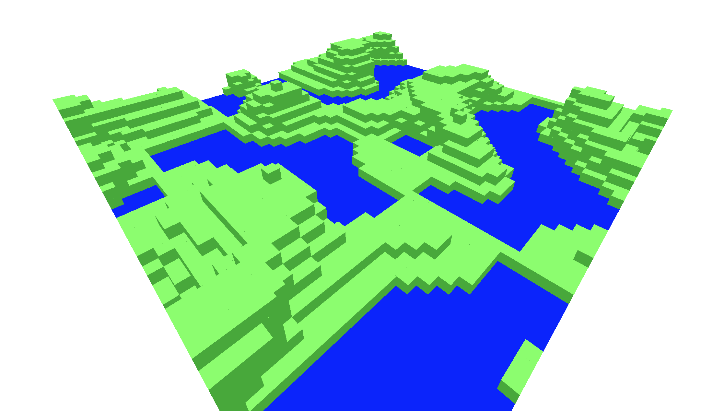
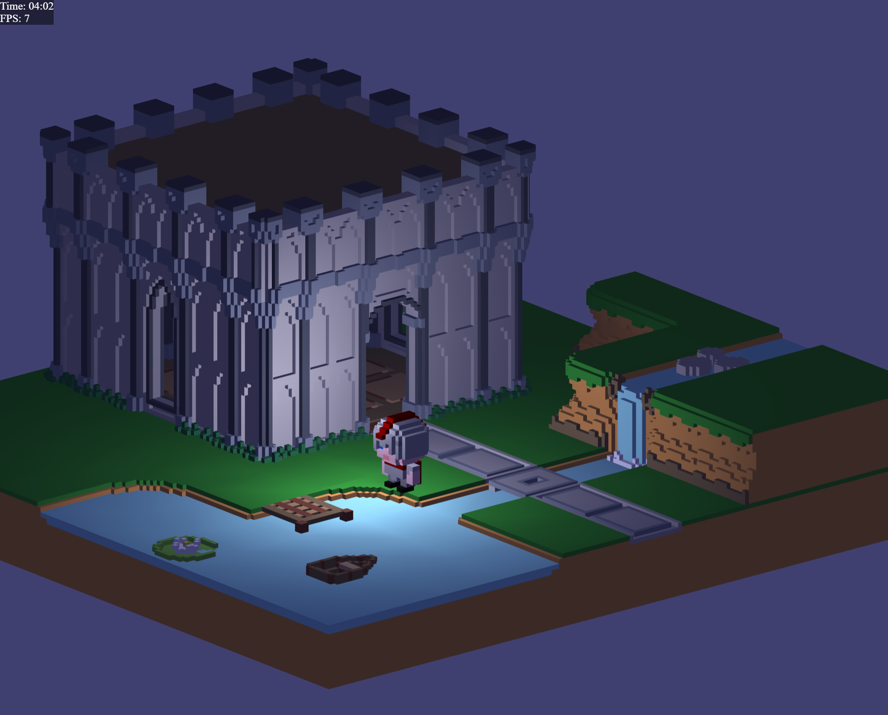
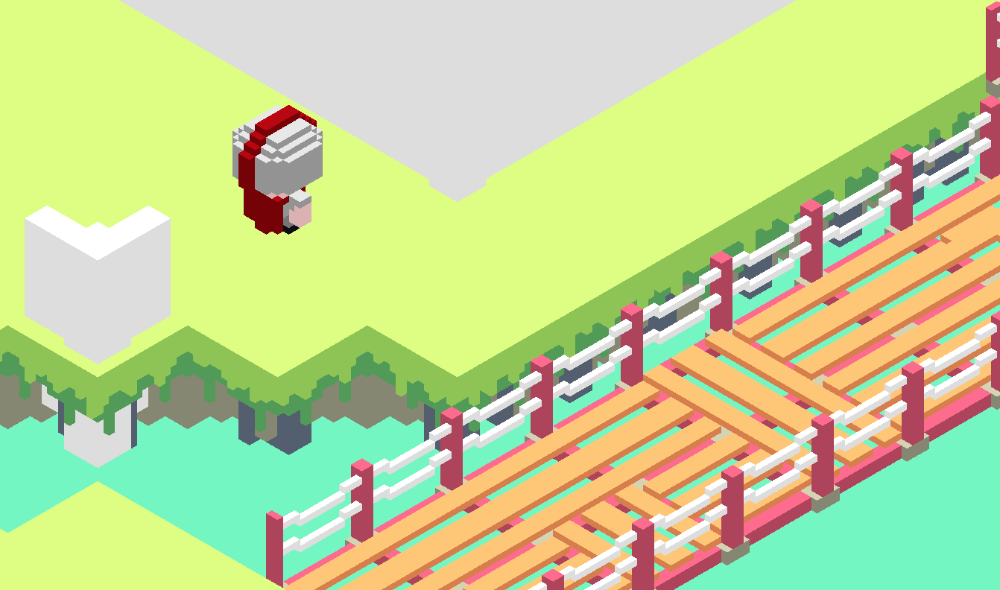

Voxels are like the pixels of a 2d image, except applied to 3d dimensions. They have been popularized as a game development technology by titles like Minecraft and Teardown. The 3d cubey appearance of voxels give game worlds a pixel-art aesthetic, and the grid-aligned co-ordinate system can simplify a number of algorithms (like collision detection and response) that are typically challenging to implement in 3d titles.

WebGL is a rendering technology for the web. It gives browsers (and the JavaScript/TypeScript running in them) access to the device's graphics card, letting them render fully realised 3d worlds and visualisations. Writing WebGL 3d graphics code directly can be fairly heavy in terms of maths and complexity, so many people opt to use a wrapper like Three.js, which provides an easier API to work with directly.

Over the years I have

## Experiment 1

https://github.com/bencoveney/voxel-terrain

## Experiment 2

https://github.com/bencoveney/webgl-voxel

## Experiment 3

https://github.com/bencoveney/octree-webgl
